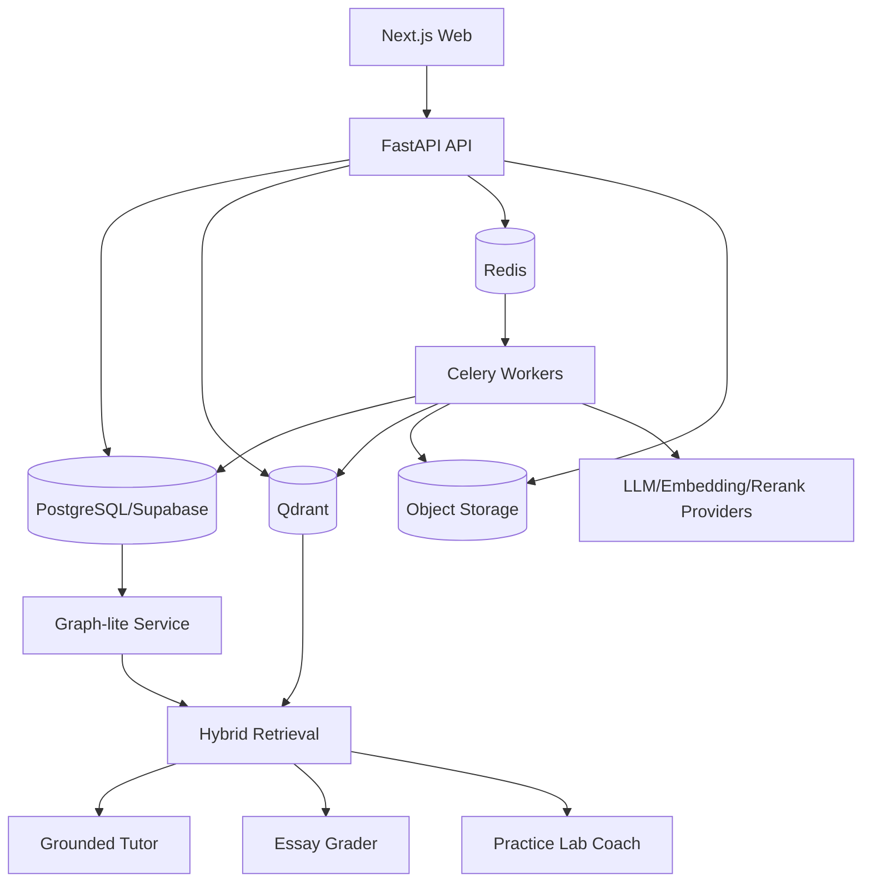

# CHIRON AI - Implementation Plan

Tài liệu nguồn: [`Plan.md`](./Plan.md)

Product: **Chiron AI**  
Product descriptor: AI Adaptive Learning & Intensive Exam Preparation Platform  
Trạng thái: Ready for implementation planning  
Phạm vi: MVP cho một course/phạm vi thi, sau đó mới mở rộng đa môn  
Giả định nhân sự: 1 frontend, 1 backend/AI, 0.5 content/domain QA  
Thời gian mục tiêu: 8 tuần; solo developer dự kiến 13-16 tuần

## 0. Cách sử dụng tài liệu

`Plan.md` mô tả product/architecture direction. File này chuyển các quyết định đó thành thứ tự triển khai, task có dependency, deliverable, test và exit gate.

Quy ước:

- `P0`: chặn release hoặc chặn workstream khác.
- `P1`: cần có trong MVP nhưng có thể làm sau vertical slice.
- `P2`: nâng cấp sau pilot.
- Một task chỉ được `Done` khi code, migration, test, telemetry và documentation liên quan đã hoàn thành.
- Không batch-ingest toàn bộ tài liệu trước khi vertical slice vượt retrieval/citation/graph gates.
- Không dùng kết quả AI chưa review làm dữ liệu published/high-stakes.

## 1. Outcome và release gates

MVP phải chứng minh được một closed learning loop:

```text
Ingest PDF/HTML
  -> Knowledge map + grounded retrieval
  -> Diagnostic
  -> Personalized 3-4 day plan
  -> Lesson/practice lab/tutor
  -> 100-question mock exam + web essay
  -> Grading + root-cause analysis
  -> Mastery update + re-plan
```

### 1.1 Non-negotiable constraints

- Không OCR, handwriting recognition hoặc essay-from-image.
- Essay được nhập trực tiếp trên web, có autosave và revision history.
- PostgreSQL/Supabase là source of truth; Qdrant là retrieval index.
- Chunk/source span là evidence; concept mới là knowledge node.
- Graph-lite chỉ mở rộng graph theo query intent, tối đa 1-2 hop.
- Course PDF/HTML là authoritative source; web research chỉ là tham khảo bổ sung.
- Không để answer key, hidden rubric hoặc đáp án essay chuẩn xuống client trước submit.
- Không cho chạy arbitrary code trên API/worker chính.

### 1.2 Release gates

| Gate              | Điều kiện qua gate                                                   | Nếu fail                                      |
| ----------------- | -------------------------------------------------------------------- | --------------------------------------------- |
| G0 Contract       | Product glossary, exam blueprint, source tiers, schemas được chốt    | Không bootstrap feature work                  |
| G1 Vertical slice | 1 PDF + 1 HTML chạy end-to-end, citation mở đúng source              | Không batch ingest                            |
| G2 Retrieval      | Hybrid tốt hơn dense-only; Graph-lite tăng chất lượng nhóm multi-hop | Tuning ingestion/retrieval trước UI expansion |
| G3 Assessment     | Exam autosave/resume; grader đạt calibration tối thiểu               | Không pilot high-stakes                       |
| G4 Adaptive       | Recommendation nằm trong time budget và giải thích được              | Chỉ hiển thị static review plan               |
| G5 Lab            | 6 labs có save/resume, scoring, transfer check                       | Không dùng lab evidence cập nhật mastery      |
| G6 Production     | Security, reliability, observability, accessibility gates pass       | Không mở pilot                                |

## 2. Target architecture và ownership



| Component              | Ownership                                             | Source of truth                |
| ---------------------- | ----------------------------------------------------- | ------------------------------ |
| `apps/web`             | UI, auth session, exam/essay state, map/lab rendering | Không giữ business truth       |
| `services/api`         | API contracts, authorization, orchestration nhẹ       | PostgreSQL                     |
| `services/worker`      | ingestion, embedding, grading, eval, reconciliation   | Job state trong PostgreSQL     |
| `packages/domain`      | shared enums/contracts/formulas                       | Versioned code                 |
| `packages/lab-runtime` | lab scene engine, events, deterministic scoring       | Lab definitions/attempt events |
| PostgreSQL             | relational state, graph, evidence, audit, outbox      | Canonical                      |
| Qdrant                 | dense/sparse indexes và retrieval payload             | Rebuildable                    |
| Redis                  | broker, short-lived cache, rate limit, breaker        | Disposable                     |
| Object storage         | source files, previews, exports, lab artifacts        | Versioned object keys          |

## 3. Repository bootstrap

Tạo project mới trong một thư mục độc lập, không chỉnh trực tiếp hai prototype cũ trước khi hoàn tất reuse audit.

```text
adaptive-learning/
├── apps/
│   └── web/
├── services/
│   ├── api/
│   ├── worker/
│   └── sandbox-runner/
├── packages/
│   ├── domain/
│   ├── ui/
│   ├── lab-runtime/
│   └── eval-contracts/
├── content/
│   ├── manifests/
│   └── lab-definitions/
├── eval/
│   ├── rag/
│   ├── graph/
│   ├── grading/
│   ├── adaptive/
│   └── question-bank/
├── infra/
│   ├── docker/
│   └── terraform/
└── docs/
```

### 3.1 Bootstrap decisions

- Node workspace: `pnpm` workspaces.
- Web: Next.js 15, React 19, TypeScript strict mode.
- Python: `uv`, FastAPI, Pydantic, SQLAlchemy/Alembic, Celery.
- Local infra: Docker Compose cho PostgreSQL, Qdrant, Redis và object storage emulator nếu cần.
- Contract generation: OpenAPI -> typed TypeScript client trong CI.
- Formatting/lint: ESLint + Prettier; Ruff + mypy/pyright tùy team.
- Tests: Vitest/Testing Library/Playwright; pytest/testcontainers.
- Migration: Alembic là owner duy nhất của application schema.

### 3.2 Environment contract

Tạo `.env.example`, không commit secret:

```text
APP_ENV
APP_BASE_URL
API_BASE_URL
DATABASE_URL
QDRANT_URL
QDRANT_API_KEY
REDIS_URL
STORAGE_ENDPOINT
STORAGE_BUCKET
STORAGE_ACCESS_KEY
STORAGE_SECRET_KEY
LLM_PROVIDER
GROQ_API_KEY
GROQ_BASE_URL
LLM_TUTOR_MODEL
LLM_EXTRACTION_MODEL
LLM_GRADER_MODEL
LLM_RESEARCH_MODEL
LLM_FALLBACK_ENABLED
LLM_FALLBACK_ON_QUOTA
LLM_FALLBACK_ON_UNAVAILABLE
LLM_FALLBACK_ALLOWED_SENSITIVITIES
GEMINI_API_KEY
GEMINI_BASE_URL
GEMINI_TUTOR_MODEL
GEMINI_EXTRACTION_MODEL
GEMINI_GRADER_MODEL
GEMINI_RESEARCH_MODEL
LLM_REQUEST_TIMEOUT_SECONDS
EMBEDDING_PROVIDER
EMBEDDING_MODEL
EMBEDDING_BENCHMARK_MODEL
SPARSE_RETRIEVAL_PROVIDER
RERANK_PROVIDER
RERANK_MODEL
LANGFUSE_HOST
LANGFUSE_PUBLIC_KEY
LANGFUSE_SECRET_KEY
OTEL_EXPORTER_OTLP_ENDPOINT
```

Startup phải fail-fast nếu production thiếu biến bắt buộc. Log không được in secret hoặc raw essay mặc định.

Luồng provider bắt buộc đi qua `LLMRouter -> LLMProvider`. Groq là primary; Gemini chỉ là quota fallback cho dữ liệu `public`/`synthetic`. Unit test phải ép lỗi `429` để kiểm chứng route, còn E2E gọi thật cả Groq và Gemini mà không cần đốt quota Groq.

Rate-limit implementation đọc `retry-after` và `x-ratelimit-*` để tạo metric/cảnh báo. Không retry nóng khi `429`; chỉ fallback một lần, không tạo vòng lặp provider. Với Qwen Preview, model ID là environment configuration và phải có smoke test phát hiện deprecation trước demo.

### 3.3 CI baseline

Mỗi pull request chạy:

```text
lint -> typecheck -> unit -> schema contract -> migration test
     -> API integration -> web component tests -> smoke eval subset
```

Main/release branch chạy thêm Playwright, full golden eval, security scan và migration dry-run.

## 4. Data implementation

### 4.1 Database conventions

- UUID/ULID thống nhất; không trộn nhiều ID strategies.
- Mọi business table có `tenant_id`, timestamps và audit actor khi phù hợp.
- Soft-delete hoặc publication status cho authored content; không hard-delete evidence đã dùng chấm điểm.
- Timestamps lưu UTC; UI chuyển timezone.
- JSONB chỉ dùng cho versioned payload/rubric/config, không thay relational constraints cốt lõi.
- Mọi attempt/event có idempotency key.
- RLS được test bằng role matrix, không chỉ cấu hình thủ công.

### 4.2 Migration order

| Migration group | Tables chính                                                           | Dependency    |
| --------------- | ---------------------------------------------------------------------- | ------------- |
| M001 Identity   | organizations, profiles, memberships, roles                            | Supabase Auth |
| M002 Course     | courses, enrollments, course_versions                                  | M001          |
| M003 Sources    | documents, document_versions, source_spans, chunks                     | M002          |
| M004 Graph-lite | concept_nodes, concept_edges, chunk_concepts, graph_versions           | M003          |
| M005 Assessment | objectives, rubrics, questions, question_options, exams, exam_items    | M004          |
| M006 Attempts   | exam_attempts, answers, essay_revisions, grades, criterion_scores      | M005          |
| M007 Learning   | evidence_ledger, mastery_states, study_plans, plan_items               | M004/M006     |
| M008 Labs       | lab_definitions, lab_versions, lab_attempts, lab_events, lab_artifacts | M004          |
| M009 Tutor      | chat_threads, chat_messages, citations, research_sources               | M003/M004     |
| M010 Ops        | jobs, outbox_events, eval_runs, audit_logs                             | M001          |

Mỗi migration phải có upgrade, downgrade khi an toàn, fixture nhỏ và test trên database sạch lẫn database từ revision trước.

### 4.3 Graph-lite schema

```sql
concept_nodes(
  id, tenant_id, course_id, graph_version_id,
  canonical_name, normalized_name, node_type,
  summary, learning_objective, status,
  created_at, updated_at
)

concept_edges(
  id, tenant_id, course_id, graph_version_id,
  source_concept_id, target_concept_id, relation_type,
  weight, confidence, evidence_source_span_id,
  extraction_method, review_status,
  created_at, updated_at
)

chunk_concepts(
  chunk_id, concept_id, relevance_score, is_primary,
  extraction_method, review_status
)
```

Required constraints/indexes:

- Unique concept theo `(course_id, graph_version_id, normalized_name, node_type)` sau canonicalization.
- Unique edge theo `(graph_version_id, source_concept_id, target_concept_id, relation_type, evidence_source_span_id)`.
- Foreign key edge không được tự trỏ khi relation không cho phép.
- Index hai chiều `(source_concept_id, relation_type)` và `(target_concept_id, relation_type)`.
- Partial index cho active/reviewed edges.
- Trigger hoặc service validator chặn prerequisite cycle trước activation.
- Edge không có provenance không được chuyển `active`.

### 4.4 Qdrant collections

#### `course_chunks`

- Named vector `dense`.
- Named sparse vector `sparse`.
- Optional late-interaction vector chỉ thêm sau benchmark.
- Point ID ổn định theo chunk identity/version.

Payload indexes tối thiểu:

```text
tenant_id: keyword
course_id: keyword
document_id: keyword
document_version: keyword
source_span_id: keyword
concept_ids: keyword[]
source_type: keyword
source_tier: keyword
language: keyword
acl_scope: keyword[]
is_active: bool
page_number: integer
```

#### `concept_search`

- Embedding canonical name + aliases + summary + objectives.
- Payload trỏ về `concept_id`, `graph_version_id`, course và ACL.
- Không lưu canonical edge state trong Qdrant.

#### `research_chunks`

- Collection tách biệt.
- Bắt buộc có URL, publisher, retrieved timestamp, source tier và verification status.
- Không merge vào course corpus nếu chưa review/publish.

### 4.5 Transactional outbox

State machine:

```text
pending -> processing -> succeeded
                   \-> retryable_failed -> pending
                   \-> terminal_failed -> review
```

Worker requirements:

- Claim job bằng row lock/lease.
- Idempotent upsert vào Qdrant.
- Lưu embedding model, dimension, sparse config và checksum.
- Exponential backoff có jitter.
- Dead-letter/review sau retry limit.
- Reconciliation job so PostgreSQL active chunks với Qdrant points.
- Document/graph version chỉ active khi sync và validation pass.

## 5. API và async contracts

### 5.1 API conventions

- Prefix `/api/v1`.
- Request/response có typed schema và stable error codes.
- Mutation quan trọng nhận `Idempotency-Key`.
- Cursor pagination; không offset pagination cho event/message streams lớn.
- Authorization ở service boundary và query scope, không dựa vào UI.
- Long jobs trả `202 + job_id`; client poll hoặc dùng SSE cho progress.
- Citation luôn trả `source_span_id`, display locator và signed/open route.

Error envelope:

```json
{
  "error": {
    "code": "DOCUMENT_VERSION_NOT_READY",
    "message": "Document version has not passed validation",
    "request_id": "...",
    "details": {}
  }
}
```

### 5.2 Endpoint delivery order

| Order | Endpoint group                            |   P | Điều kiện hoàn thành                          |
| ----- | ----------------------------------------- | --: | --------------------------------------------- |
| 1     | `/healthz`, `/readyz`, `/jobs`            |  P0 | readiness kiểm tra DB/Qdrant/Redis có timeout |
| 2     | `/courses`, `/documents`, `/admin/review` |  P0 | upload PDF/HTML, version, publish workflow    |
| 3     | `/concepts`, `/knowledge-map`             |  P0 | graph version, nodes/edges/source drawer      |
| 4     | `/retrieval`, `/tutor`                    |  P0 | citations + trace ID + calibrated refusal     |
| 5     | `/question-bank`, `/exams`, `/attempts`   |  P0 | blueprint, autosave, submit idempotent        |
| 6     | `/grading`                                |  P0 | async essay grading và criterion results      |
| 7     | `/mastery`, `/study-plans`                |  P0 | evidence ledger và explainable priority       |
| 8     | `/labs`, `/lab-attempts`                  |  P1 | definition version, events, artifact, score   |
| 9     | `/research`                               |  P1 | source policy, audit và isolated citations    |

### 5.3 Async jobs

| Job                  | Input identity           | Idempotent key                           | Result                        |
| -------------------- | ------------------------ | ---------------------------------------- | ----------------------------- |
| `ingest_document`    | document version         | checksum + parser version                | source spans/chunks           |
| `extract_graph`      | document + graph version | content checksum + extractor version     | candidates/edges/review items |
| `sync_vectors`       | chunk batch              | chunk checksum + embedding version       | Qdrant points                 |
| `validate_retrieval` | course version           | eval dataset version + retriever version | eval run                      |
| `grade_exam`         | attempt                  | final submission version                 | section grades                |
| `grade_essay`        | answer revision          | rubric + grader version                  | criterion scores              |
| `update_mastery`     | evidence event           | evidence event ID                        | mastery posterior             |
| `build_plan`         | learner state snapshot   | snapshot checksum + planner version      | study plan version            |
| `run_lab_eval`       | lab artifact             | attempt + artifact checksum + rubric     | lab score/evidence            |

### 5.4 AI structured contracts

Mỗi AI workflow phải trả JSON Schema/Pydantic model, không parse prose:

- `ConceptCandidate`
- `EdgeCandidate`
- `QuestionCandidate`
- `TutorAnswer`
- `CitationSupportResult`
- `EssayCriterionResult`
- `LabRubricResult`
- `ResearchResult`

Mỗi output lưu model, prompt version, input checksum, latency, token/cost và validation status.

## 6. Vertical slice đầu tiên

Mục tiêu: chứng minh kiến trúc trước khi mở rộng UI và toàn corpus.

### 6.1 Dataset

- 1 PDF có text và page boundaries rõ.
- 1 HTML diễn giải cùng chủ đề.
- 20-40 canonical concepts.
- 30-80 reviewed typed edges.
- 20 diagnostic questions.
- 1 practice lab: Chunking Arena hoặc Qdrant Hybrid Search.
- Dev golden set: tối thiểu 30 queries, cân bằng direct/prerequisite/multi-hop.
- Gate golden set: mở rộng lên 100 queries trước khi kết thúc Phase 2.

### 6.2 End-to-end slice

```text
Admin upload
  -> parser/source preview
  -> chunk review
  -> concept/edge review
  -> activate document + graph version
  -> Qdrant hybrid retrieval
  -> Graph-lite routed expansion
  -> knowledge map node drawer
  -> grounded tutor answer + citation
  -> diagnostic
  -> mastery state
  -> one-day plan
  -> practice lab
  -> recheck + mastery update
```

### 6.3 Slice exit criteria

- Tất cả citation sample mở đúng PDF page/HTML section.
- Qdrant payload filter tenant/course/version/ACL chạy trước retrieval.
- Hybrid benchmark tốt hơn dense-only trên golden set.
- Graph-lite không làm giảm direct-fact quality và tăng nhóm prerequisite/multi-hop.
- Không active prerequisite cycle.
- Tutor từ chối hoặc research-route khi evidence không đủ.
- Lab save/resume và transfer check hoạt động.
- Evidence ledger giải thích được thay đổi mastery.
- P95 được ghi nhận theo từng stage; chưa cần đạt production SLO nhưng không có stage mù telemetry.

## 7. Work breakdown structure

### 7.1 Foundation and developer experience

| ID      |   P | Task                                  | Output                           | Dependency |
| ------- | --: | ------------------------------------- | -------------------------------- | ---------- |
| FND-001 |  P0 | Bootstrap monorepo và version pinning | web/api/worker chạy local        | G0         |
| FND-002 |  P0 | Docker Compose local                  | PostgreSQL/Qdrant/Redis healthy  | FND-001    |
| FND-003 |  P0 | Config/secrets validation             | typed settings + `.env.example`  | FND-001    |
| FND-004 |  P0 | CI baseline                           | lint/type/unit/migration jobs    | FND-001    |
| FND-005 |  P0 | Request ID + structured logging       | correlation xuyên web/API/worker | FND-001    |
| FND-006 |  P1 | Seed/demo command                     | reproducible course fixture      | M004       |

Tests: clean setup, missing-env fail-fast, readiness degradation, CI cache correctness.

### 7.2 Identity, course and authorization

| ID      |                         P | Task                                  | Output                                                | Dependency |
| ------- | ------------------------: | ------------------------------------- | ----------------------------------------------------- | ---------- |
| IAM-001 | P0 - baseline implemented | Auth boundary + web BFF session       | login/logout/rotating refresh; OIDC replacement-ready | FND-001    |
| IAM-002 |                        P0 | organization/course membership        | learner/editor/admin roles                            | IAM-001    |
| IAM-003 |          P0 - implemented | RLS policies + non-owner runtime role | tenant/course isolation                               | IAM-002    |
| IAM-004 |  P0 - backend implemented | Authorization integration tests       | API/direct-role deny-by-default matrix                | IAM-003    |
| IAM-005 |                        P1 | Audit viewer                          | admin-filtered audit trail                            | OPS-002    |

Tests phải thử cross-tenant access bằng cả API và direct database role.

### 7.3 Sources and ingestion

| ID      |   P | Task                      | Output                              | Dependency      |
| ------- | --: | ------------------------- | ----------------------------------- | --------------- |
| ING-001 |  P0 | Document/version schema   | immutable versions/checksums        | IAM-002         |
| ING-002 |  P0 | PDF text parser           | text/table/page locators; OCR offline fallback cho trang thiếu text, có QA/provenance | ING-001         |
| ING-003 |  P0 | HTML structural parser    | headings/code/table/anchors         | ING-001         |
| ING-004 |  P0 | Source span builder       | stable span IDs và preview locators | ING-002/003     |
| ING-005 |  P0 | Hierarchical chunker      | parent/child chunks, token bounds   | ING-004         |
| ING-006 |  P0 | Ingestion job/state UI    | progress/retry/error review         | FND-002/ING-001 |
| ING-007 |  P0 | Admin source/chunk review | diff/version/activate flow          | ING-005         |
| ING-008 |  P1 | Duplicate detection       | checksum + near-duplicate report    | ING-005         |

Parser golden fixtures phải bao gồm paragraph, heading, table, formula/code và page/section boundary.

### 7.4 Graph-lite ingestion and storage

| ID      |   P | Task                               | Output                                | Dependency |
| ------- | --: | ---------------------------------- | ------------------------------------- | ---------- |
| GRF-001 |  P0 | Graph migrations + indexes         | nodes/edges/mapping/version tables    | ING-001    |
| GRF-002 |  P0 | Controlled relation registry       | direction, inverse, traversal policy  | GRF-001    |
| GRF-003 |  P0 | Concept candidate extractor        | structured candidates + provenance    | ING-005    |
| GRF-004 |  P0 | Canonicalizer/deduplicator         | aliases, merge suggestions, conflicts | GRF-003    |
| GRF-005 |  P0 | Typed edge extractor               | evidence-backed edge candidates       | GRF-004    |
| GRF-006 |  P0 | Graph validators                   | cycle, orphan, duplicate, conflict    | GRF-005    |
| GRF-007 |  P0 | Concept/edge review workflow       | approve/reject/edit/version activate  | GRF-006    |
| GRF-008 |  P0 | Recursive traversal service        | relation whitelist, hop/fan-out caps  | GRF-007    |
| GRF-009 |  P1 | Neighborhood cache/materialization | only after profiling                  | GRF-008    |

Graph tests:

- Directed/undirected relation semantics.
- Inverse-edge resolution nếu registry yêu cầu.
- Cycle fixture cho prerequisite.
- Cross-version/cross-course edges bị chặn.
- Traversal kết thúc ở hop/degree/candidate limits.
- Mọi active edge resolve được về source span.

### 7.5 Qdrant and hybrid retrieval

| ID      |   P | Task                      | Output                              | Dependency  |
| ------- | --: | ------------------------- | ----------------------------------- | ----------- |
| RET-001 |  P0 | Collection/config manager | reproducible collection setup       | FND-002     |
| RET-002 |  P0 | Embedding adapters        | dense/sparse versioned interface    | ING-005     |
| RET-003 |  P0 | Outbox + sync worker      | idempotent Qdrant upsert/delete     | RET-001/002 |
| RET-004 |  P0 | Hybrid Query API          | dense+sparse prefetch + RRF         | RET-003     |
| RET-005 |  P0 | Metadata/ACL pre-filter   | tenant/course/version/source policy | IAM-003     |
| RET-006 |  P0 | Reranker adapter          | bounded candidate rerank            | RET-004     |
| RET-007 |  P0 | Citation assembler        | source spans and display locator    | RET-006     |
| RET-008 |  P0 | Retrieval trace           | route/stage/candidate telemetry     | RET-004     |
| RET-009 |  P1 | Query rewrite/multi-query | intent-controlled, eval-gated       | RET-008     |
| RET-010 |  P1 | Reconciliation worker     | PostgreSQL-Qdrant drift report/fix  | RET-003     |

Không thêm reranker/multi-query vào default route nếu eval không chứng minh uplift lớn hơn latency/cost tăng thêm.

### 7.6 Graph-lite online retrieval

| ID      |   P | Task                           | Output                               | Dependency      |
| ------- | --: | ------------------------------ | ------------------------------------ | --------------- |
| GLR-001 |  P0 | Query intent classifier        | direct vs graph-required vs research | RET-004         |
| GLR-002 |  P0 | Seed concept resolver          | chunk payload + concept search       | RET-004/GRF-004 |
| GLR-003 |  P0 | Bounded graph expansion        | recursive CTE 1-2 hop                | GRF-008         |
| GLR-004 |  P0 | Candidate fusion               | channel ranks + provenance           | GLR-002/003     |
| GLR-005 |  P0 | Graph-aware reranking          | bounded pool, typed relation context | GLR-004/RET-006 |
| GLR-006 |  P0 | Hybrid-only vs Graph-lite eval | per-query-class report               | EVAL-002        |
| GLR-007 |  P1 | Adaptive routing thresholds    | config selected by eval              | GLR-006         |

Runtime pseudocode:

```python
seeds = hybrid_search(query, filters, limit=20)
intent = classify_retrieval_intent(query)

if intent.requires_graph:
    concept_ids = resolve_seed_concepts(seeds)
    neighbors = traverse_graph(
        concept_ids,
        relation_whitelist=intent.relations,
        max_hops=min(intent.max_hops, 2),
        max_degree=GRAPH_MAX_DEGREE,
        max_candidates=GRAPH_MAX_CANDIDATES,
    )
    graph_chunks = resolve_concepts_to_chunks(neighbors)
else:
    graph_chunks = []

candidates = rank_fuse(seeds, graph_chunks)
return rerank(query, candidates[:RERANK_POOL_SIZE])
```

### 7.7 Knowledge map and grounded tutor

| ID      |   P | Task                     | Output                              | Dependency |
| ------- | --: | ------------------------ | ----------------------------------- | ---------- |
| MAP-001 |  P0 | Knowledge-map API        | versioned nodes/edges/status        | GRF-007    |
| MAP-002 |  P0 | Cytoscape/ELK canvas     | pan/zoom/layout/filter              | MAP-001    |
| MAP-003 |  P0 | Node detail drawer       | source, mastery, prerequisite, lab  | MAP-001    |
| MAP-004 |  P0 | Accessible fallback      | list/table + textual path           | MAP-002    |
| TUT-001 |  P0 | Tutor orchestration      | explain/Socratic/compare/quiz modes | GLR-005    |
| TUT-002 |  P0 | Grounded answer contract | claims + citations + confidence     | TUT-001    |
| TUT-003 |  P0 | Citation verifier        | support/locator validation          | TUT-002    |
| TUT-004 |  P0 | Calibrated refusal       | insufficient-evidence result        | TUT-003    |
| TUT-005 |  P1 | Research tool            | isolated source tier + audit        | TUT-004    |

Tutor không tự cập nhật mastery từ hội thoại. Chỉ quiz, explain-back rubric hoặc lab/exam evidence mới tạo evidence event.

### 7.8 Question bank and exam engine

| ID      |   P | Task                            | Output                                | Dependency |
| ------- | --: | ------------------------------- | ------------------------------------- | ---------- |
| ASM-001 |  P0 | Exam blueprint schema/editor    | quota concept/type/difficulty/Bloom   | GRF-007    |
| ASM-002 |  P0 | Question author/review workflow | draft/review/published/retired        | ASM-001    |
| ASM-003 |  P0 | Question generator              | candidates có source/rationale        | ASM-002    |
| ASM-004 |  P0 | Quality validators              | leakage/duplicate/distractor/coverage | ASM-003    |
| ASM-005 |  P0 | Exam assembler                  | reproducible 100-item form            | ASM-002    |
| ASM-006 |  P0 | Exam runner                     | timer/nav/flag/keyboard               | ASM-005    |
| ASM-007 |  P0 | Autosave and resume             | version/conflict/offline retry        | ASM-006    |
| ASM-008 |  P0 | Idempotent submit               | immutable final submission            | ASM-007    |
| ASM-009 |  P0 | Deterministic objective grading | per-item score/evidence               | ASM-008    |
| ASM-010 |  P1 | Item analytics                  | difficulty/discrimination after pilot | ASM-009    |

Security test phải chứng minh client bundle/network response trước submit không chứa answer key hoặc hidden rubric.

### 7.9 Essay workspace and grading

| ID      |   P | Task                      | Output                               | Dependency |
| ------- | --: | ------------------------- | ------------------------------------ | ---------- |
| ESS-001 |  P0 | Web essay editor          | autosave, count, outline, focus mode | ASM-006    |
| ESS-002 |  P0 | Revision persistence      | conflict-safe revision history       | ESS-001    |
| ESS-003 |  P0 | Rubric authoring          | criteria, bands, weights, anchors    | ASM-002    |
| ESS-004 |  P0 | Criterion graders         | independent structured results       | ESS-003    |
| ESS-005 |  P0 | Evidence/coherence pass   | claims, evidence, logic flags        | ESS-004    |
| ESS-006 |  P0 | Critic/cross-check pass   | inconsistency and confidence         | ESS-005    |
| ESS-007 |  P0 | Deterministic aggregation | final score from criterion weights   | ESS-006    |
| ESS-008 |  P0 | Feedback UI               | rubric bands, evidence, next actions | ESS-007    |
| ESS-009 |  P0 | Human-review queue        | low confidence/high stakes           | ESS-007    |
| ESS-010 |  P1 | Practice Socratic hints   | logged usage affects evidence weight | ESS-001    |

Không có OCR endpoint hoặc image-answer workflow. Exam mode không có AI autocomplete.

### 7.10 Mastery and adaptive planning

| ID      |   P | Task                           | Output                             | Dependency           |
| ------- | --: | ------------------------------ | ---------------------------------- | -------------------- |
| ADP-001 |  P0 | Evidence ledger                | immutable typed evidence events    | ASM-009/ESS-007      |
| ADP-002 |  P0 | Bayesian/Beta updater          | mean/variance/confidence           | ADP-001              |
| ADP-003 |  P0 | Forgetting/misconception state | recency and repeated-error tags    | ADP-002              |
| ADP-004 |  P0 | Root-cause traversal           | reverse prerequisite analysis      | ADP-002/GRF-008      |
| ADP-005 |  P0 | Priority scorer                | explainable score-gain/minute      | ADP-003/004          |
| ADP-006 |  P0 | Capacity scheduler             | 3-4 day plan within free time      | ADP-005              |
| ADP-007 |  P0 | Re-plan trigger                | after exam/lab/recheck/time change | ADP-006              |
| ADP-008 |  P1 | Calibration dashboard          | Brier/ECE and segment views        | ADP-002 + pilot data |

Planner phải lưu input snapshot, component scores, chosen/rejected items và planner version để recommendation giải thích được.

### 7.11 Practice Lab Engine

| ID      |   P | Task                    | Output                              | Dependency      |
| ------- | --: | ----------------------- | ----------------------------------- | --------------- |
| LAB-001 |  P0 | Versioned lab schema    | typed definition validator          | GRF-007         |
| LAB-002 |  P0 | Scene/runtime engine    | deterministic transitions           | LAB-001         |
| LAB-003 |  P0 | Event log + save/resume | replayable attempts                 | LAB-002         |
| LAB-004 |  P0 | Hint ladder             | policy and hint-use events          | LAB-003         |
| LAB-005 |  P0 | Deterministic scorer    | formula/config tasks                | LAB-002         |
| LAB-006 |  P0 | AI rubric scorer        | explanation/artifact tasks          | TUT-003         |
| LAB-007 |  P0 | Transfer challenge      | new seeded scenario                 | LAB-005/006     |
| LAB-008 |  P0 | Evidence emitter        | weighted mastery evidence           | ADP-001/LAB-007 |
| LAB-009 |  P1 | Worker/Pyodide sandbox  | resource/network controls           | OPS-005         |
| LAB-010 |  P0 | Port first three labs   | chunking, retrieval filter, breaker | LAB-008         |
| LAB-011 |  P1 | Complete six MVP labs   | advanced template coverage          | LAB-010         |

Lab completion không tự động đồng nghĩa mastery. Chỉ transfer challenge, explain-back và delayed recheck có evidence weight cao.

### 7.12 Design system and frontend shell

| ID     |   P | Task                       | Output                                 | Dependency |
| ------ | --: | -------------------------- | -------------------------------------- | ---------- |
| UX-001 |  P0 | Tokens/typography/theme    | cinematic black + focus surfaces       | FND-001    |
| UX-002 |  P0 | App shell/navigation       | role-aware routes                      | IAM-001    |
| UX-003 |  P1 | Landing                    | cinematic media + poster fallback      | UX-001     |
| UX-004 |  P0 | Dashboard/timeline         | next action + score gain + capacity    | ADP-006    |
| UX-005 |  P0 | Loading/error/empty states | all core screens                       | API groups |
| UX-006 |  P0 | Accessibility baseline     | keyboard/focus/contrast/reduced motion | UX-001     |
| UX-007 |  P1 | Responsive/polish          | mobile map/list/lab tabs               | core UI    |

Liquid glass chỉ dùng nav, overlay, drawer và lab controls. Exam/essay/citation surfaces phải solid, không video hoặc animated background.

### 7.13 Reliability, security and observability

| ID      |   P | Task                       | Output                                       | Dependency      |
| ------- | --: | -------------------------- | -------------------------------------------- | --------------- |
| OPS-001 |  P0 | OpenTelemetry              | traces/metrics/log correlation               | FND-005         |
| OPS-002 |  P0 | Audit log                  | auth/content/grade/research actions          | IAM-002         |
| OPS-003 |  P0 | Timeout/retry/breaker      | provider-specific policies                   | OPS-001         |
| OPS-004 |  P0 | Rate/cost limits           | user/course/provider budgets                 | OPS-001         |
| OPS-005 |  P0 | Input/tool security policy | injection defense, SSRF and sandbox controls | TUT-001/LAB-001 |
| OPS-006 |  P0 | Backup/restore drill       | DB/storage restore evidence                  | staging         |
| OPS-007 |  P0 | Dashboards/alerts/runbooks | actionable SLO alerts                        | OPS-001/003     |
| OPS-008 |  P1 | Chaos suite                | timeout/429/outage/stale cache               | OPS-003         |

## 8. Evaluation implementation

### 8.1 Version every eval artifact

Mỗi eval run lưu:

```text
dataset_version
course_version
graph_version
retriever_version
embedding_version
reranker_version
prompt/model_version
grader/planner/lab_version
git_sha
started_at/completed_at
metrics
bottom_cases
cost
latency
```

### 8.2 Eval task list

| ID       |   P | Suite                      | Gate                                   |
| -------- | --: | -------------------------- | -------------------------------------- |
| EVAL-001 |  P0 | Dense-only baseline        | comparison baseline                    |
| EVAL-002 |  P0 | Hybrid retrieval + rerank  | Recall@10, precision, latency          |
| EVAL-003 |  P0 | Graph-lite per query class | direct regression + multi-hop uplift   |
| EVAL-004 |  P0 | Citation/faithfulness      | support and correct locator            |
| EVAL-005 |  P0 | Adaptive simulation        | capacity, prerequisite and calibration |
| EVAL-006 |  P0 | Essay grader golden set    | MAE, kappa, criterion calibration      |
| EVAL-007 |  P0 | Question bank validators   | coverage, duplicate, leakage           |
| EVAL-008 |  P0 | Lab deterministic/replay   | scoring and event replay               |
| EVAL-009 |  P1 | Research source policy     | allowed sources and separation         |

### 8.3 Graph-lite experiment design

Golden query classes:

- `direct_fact`
- `keyword_identifier`
- `prerequisite`
- `root_cause`
- `comparison`
- `causal`
- `multi_hop`

Arms:

```text
A: dense only
B: dense + sparse RRF
C: B + reranker
D: C + always-on graph
E: C + intent-routed Graph-lite
```

Primary decision:

- Chọn E chỉ khi direct-fact không regression đáng kể.
- Prerequisite/root-cause/multi-hop có uplift thực tế so với C.
- P95 latency, tokens và cost/query nằm trong budget.
- Dùng confidence interval/bootstrap khi dataset đủ; trước đó công bố sample size và không khẳng định hệ số tiết kiệm.

### 8.4 CI eval tiers

```text
PR:       schema + unit + 10-20 case smoke set
Main:     100-query retrieval/citation suite + grader/adaptive subset
Release:  full golden sets + pairwise vs current production
Nightly:  drift, bottom-case replay, cost/latency trend
```

## 9. Delivery sequence

### Phase 0 - Contract and audit, 3-4 ngày

Deliver:

- Course/exam blueprint và source authority policy.
- Glossary/controlled relation ontology.
- Reuse audit cho `EdTech`, hackathon prototype và 13 detailed HTML.
- ADR cho PostgreSQL + Qdrant + Graph-lite.
- Initial golden query/question/grading dataset contracts.

Exit: G0 pass; không còn quyết định schema lớn chưa có owner.

### Phase 1 - Foundation, Tuần 1

Critical path:

```text
FND-001 -> FND-002/003/004 -> IAM-001/002/003 -> M001-M004
```

Deliver app shell, auth/RLS, core migrations, local infra, request tracing và design tokens.

Exit: clean clone chạy được; role isolation tests pass; health/ready đúng dependency state.

### Phase 2 - Vertical ingestion and hybrid RAG, Tuần 2

Critical path:

```text
ING-001..007 -> RET-001..008 -> EVAL-001/002/004
```

Deliver 1 PDF + 1 HTML, source preview, hierarchical chunks, Qdrant hybrid, rerank, citation và 100-query gate set.

Exit: G1/G2 retrieval portion pass; cho phép batch ingest có kiểm soát.

### Phase 3 - Graph-lite, map and tutor, Tuần 3

Critical path:

```text
GRF-001..008 -> GLR-001..006 -> MAP-001..004 -> TUT-001..004
```

Deliver typed/provenance graph, review flow, bounded traversal, knowledge map và grounded tutor.

Exit: Graph-lite tốt hơn hybrid-only ở nhóm cần graph; direct queries không regression; no prerequisite cycle.

### Phase 4 - Assessment and adaptive loop, Tuần 4

Parallel tracks:

```text
ASM-001..009
ESS-001..009
ADP-001..007 after grading contracts stabilize
```

Deliver 100-question exam, web essay, grading, evidence ledger, root-cause và 3-4 day planner.

Exit: G3/G4 pass; refresh/network interruption không làm mất answer.

### Phase 5 - Practice Lab Engine, Tuần 5

Deliver LAB-001..010, gồm chunking, retrieval filter/Qdrant và circuit-breaker labs.

Exit: end-to-end lab attempt -> artifact -> transfer check -> evidence -> mastery update.

### Phase 6 - Content and advanced labs, Tuần 6

- Hoàn thành tối thiểu 6 labs.
- Batch ingest phần corpus còn lại theo từng course version.
- Mở rộng question bank candidates và review coverage.
- Chạy regression sau mỗi content batch.

Exit: G5 pass; content coverage và blueprint report không có gap P0.

### Phase 7 - Production hardening, Tuần 7

Deliver OPS-001..008, accessibility, responsive/polish, full eval gates, backup/restore và load test.

Exit: G6 pass; có dashboard, alert và runbook cho critical journeys.

### Phase 8 - Pilot, Tuần 8

- Pilot 20-50 learners.
- Không thay thuật toán giữa pilot nếu không version/flag.
- Thu completion, learning gain, time-on-task, abandonment và qualitative feedback.
- Mọi failure quan trọng thành regression case.
- Review go/no-go cho multi-course expansion.

## 10. Dependency-aware parallelization

Sau Foundation, team có thể chạy song song:

| Frontend                    | Backend/AI                        | Content/QA                   |
| --------------------------- | --------------------------------- | ---------------------------- |
| Source preview/admin review | parsers/chunker/outbox            | chọn vertical-slice sources  |
| Knowledge map shell         | graph schema/extraction/traversal | review concept/edge ontology |
| Tutor UI/citation drawer    | hybrid/Graph-lite/tutor contracts | golden queries/citations     |
| Exam/essay shell            | question/grade APIs               | rubric/golden essays         |
| Lab runtime UI              | lab scoring/evidence              | port/check lab scenarios     |

Không parallelize sớm các phần sau khi contract chưa chốt:

- Mastery updater trước evidence schema.
- Study planner trước exam blueprint/time model.
- Graph UI trước graph version/API contract.
- AI grader trước rubric schema và human golden set.
- Batch ingestion trước vertical slice gates.

## 11. Definition of Done

Một backend task `Done` khi:

- Migration/contract được review.
- Authorization và idempotency được test.
- Unit + integration tests pass.
- Error/timeout/retry behavior rõ.
- Trace/metric/log có request/job correlation.
- Không log secret, raw essay hoặc sensitive content ngoài policy.
- OpenAPI và generated client cập nhật.

Một frontend task `Done` khi:

- Loading/error/empty/success states đầy đủ.
- Keyboard, focus, screen-size và reduced-motion được test.
- Không chứa hidden answer/rubric.
- Analytics event có schema và không chứa sensitive text.
- Playwright happy path và failure path pass.

Một AI/RAG task `Done` khi:

- Structured output validation và fallback hoạt động.
- Prompt/model/dataset version được lưu.
- Golden eval chạy và so baseline.
- Bottom cases được phân loại theo pipeline stage.
- Citation/provenance không bị mất.
- Cost/latency được ghi nhận.

Một content/lab task `Done` khi:

- Có learning objective, concept mapping và source spans.
- Human review pass.
- Rubric/success criteria/hint policy rõ.
- Transfer/recheck chứng minh hơn completion click-through.
- Version/rollback được hỗ trợ.

## 12. First implementation backlog

Thứ tự 15 ticket đầu tiên:

1. `ADR-001`: Chốt monorepo, service boundaries và PostgreSQL/Qdrant ownership.
2. `ADR-002`: Chốt source span/chunk/concept/edge identity và versioning.
3. `FND-001`: Bootstrap Next.js/FastAPI/worker/packages.
4. `FND-002`: Local Compose cho PostgreSQL/Qdrant/Redis.
5. `FND-003`: Typed config, `.env.example`, fail-fast startup.
6. `FND-004`: CI lint/type/unit/migration.
7. `IAM-001/002`: Auth, memberships và role contract.
8. `M001-M004`: Identity/course/source/Graph-lite migrations.
9. `ING-001/004`: Document version và immutable source spans.
10. `ING-002/003`: PDF text + HTML structural parsers; OCR chỉ là offline fallback có QA/provenance.
11. `ING-005`: Hierarchical chunker với fixtures.
12. `RET-001/002`: Qdrant collections + embedding adapters.
13. `RET-003`: Transactional outbox vector sync.
14. `EVAL-001`: Dense-only baseline dataset/run.
15. `RET-004/005`: Hybrid RRF với ACL/course/version pre-filter.

Ticket 16 bắt đầu Graph-lite candidate extraction sau khi source spans/chunks ổn định.

## 13. Decision log cần giữ trong quá trình build

Tạo ADR cho các quyết định sau:

- ADR-001: Monorepo và service boundaries.
- ADR-002: PostgreSQL source of truth, Qdrant rebuildable index.
- ADR-003: Source span/chunk/concept identity và versioning.
- ADR-004: Graph-lite relation ontology và bounded traversal.
- ADR-005: Embedding/sparse/rerank provider abstraction.
- ADR-006: Evidence ledger và mastery update.
- ADR-007: Essay grader orchestration và human-review threshold.
- ADR-008: Lab runtime/sandbox boundaries.
- ADR-009: Research source policy.
- ADR-010: Telemetry, retention và privacy policy.

Mỗi ADR phải ghi context, decision, alternatives, consequences, rollback/migration path và eval evidence.

## 14. Scope deferred until after pilot

- OCR, handwriting hoặc image-answer grading.
- Neo4j/managed graph database.
- Full Microsoft GraphRAG community/global pipeline.
- Always-on graph expansion.
- Fine-tuning trước khi eval chứng minh RAG/grader không đủ.
- Arbitrary remote code execution.
- Peer review/social features.
- Native mobile app.
- Multi-course scheduling ở quy mô lớn.
- Automatic persistence của unreviewed web research.

## 15. Final implementation success criteria

Implementation hoàn thành MVP khi:

- Clean environment deploy được bằng documented procedure.
- Một learner đi được toàn bộ closed loop mà không cần chỉnh database thủ công.
- PDF/HTML citations mở đúng locator.
- Qdrant hybrid tốt hơn dense-only; Graph-lite tốt hơn hybrid-only ở query class cần graph.
- Graph active có provenance, version, review state và không có prerequisite cycle.
- Exam 100 câu autosave/resume/submit idempotent.
- Essay làm trực tiếp trên web và được chấm theo criterion rubric có confidence.
- Recommendation 3-4 ngày giải thích được và không vượt time capacity.
- Ít nhất 6 labs có save/resume, scoring, transfer check và source grounding.
- RLS/ACL, answer leakage, prompt injection và job idempotency tests pass.
- RAG, grading, adaptive và lab eval gates chạy trong CI/release workflow.
- Pilot có telemetry đủ để ra quyết định bằng evidence thay vì cảm tính.

## 16. Nguyên tắc bắt đầu code

Không bắt đầu bằng landing page hoàn chỉnh hoặc ingest toàn bộ tài liệu. Bắt đầu bằng một walking skeleton:

```text
auth
  -> one course
  -> one PDF + one HTML
  -> source spans/chunks
  -> Qdrant hybrid retrieval
  -> one cited answer
  -> 20-40 concept Graph-lite map
  -> one diagnostic
  -> one mastery update
  -> one recommended action
  -> one practice lab
```

Khi walking skeleton vượt G1/G2, mở rộng từng capability theo dependency graph trong tài liệu này.

## 17. Kế hoạch triển khai tiếp theo từ trạng thái hiện tại

Thứ tự dưới đây tối ưu cho một vertical slice chạy được, đo được và tránh xây UI/agent trước khi retrieval có chất lượng.

| Bước                          | Ưu tiên                             | Phạm vi                                                                                                                                                                  | Phụ thuộc                  | Exit criteria                                                                                                                                                                                   |
| ----------------------------- | ----------------------------------- | ------------------------------------------------------------------------------------------------------------------------------------------------------------------------ | -------------------------- | ----------------------------------------------------------------------------------------------------------------------------------------------------------------------------------------------- |
| 1. Provider hardening         | P0 - core implemented               | Model registry, availability probe, rate-limit headers, retry budget, circuit breaker, Qwen Preview -> GPT-OSS intra-Groq fallback, degraded mode/queue cho private data | ProviderAdapter hiện tại   | Core router/tutor degraded mode đã pass; durable grading/extraction queue chờ persistence modules                                                                                               |
| 2. Ingestion walking skeleton | P0 - complete for current corpus    | PDF/HTML structured parse, source span bất biến, hierarchical chunks; OCR offline fallback có QA/provenance                                                               | Data schema/source storage | 69 canonical documents, 2.817 spans, 2.817 parent chunks và 5.069 child chunks đã persist idempotently                                                                                           |
| 3. Qdrant hybrid RAG          | P0 - hybrid/citation implemented    | Local multilingual embedding, Qdrant dense + BM25, RRF, bounded reranker, ACL/course/version pre-filter                                                                   | Bước 2                     | Auth/enrollment/tenant/course-filtered RRF và citation E2E đã pass; reranker/cold-start deployment và golden metrics còn mở                                                                    |
| 4. Graph-lite knowledge map   | P0                                  | Concept/edge tables trong PostgreSQL, extraction candidates, provenance/review, bounded traversal, node drawer                                                           | Bước 2-3                   | 20-40 nodes; 100% active edges có source; prerequisite DAG không cycle; multi-hop tốt hơn hybrid-only                                                                                           |
| 5. Diagnostic + adaptive loop | P0 - core + persistence implemented | 20 câu diagnostic trước, mastery evidence ledger, planner 3-4 ngày, weak-area recommendation                                                                             | Bước 4                     | Memory/PostgreSQL cùng contract; JWT learner identity, tenant filter/RLS, atomic evidence -> mastery -> priority -> plan -> outbox và restart-safe idempotency đã pass; còn mở rộng bank 20 câu |
| 6. Exam engine 100 câu        | P0                                  | Blueprint coverage, MCQ + essay editor trên web, autosave/resume, timed attempt, question review pipeline                                                                | Bước 4-5                   | Đủ dễ-khó và recall-reasoning; submit idempotent; không lộ answer key                                                                                                                           |
| 7. Essay grading              | P0                                  | Criterion rubric, evidence spans, grader + critic, confidence/calibration, human-review threshold                                                                        | Bước 6                     | Golden-set MAE <= 0.75/10; QWK >= 0.75; private essay không đi Gemini Free                                                                                                                      |
| 8. Practice Lab Engine        | P1                                  | React lab definitions, save/resume, deterministic scoring, transfer checks, adaptive evidence                                                                            | Bước 3-5                   | Ít nhất 2 lab hoàn chỉnh trong slice đầu và 6 lab trước pilot                                                                                                                                   |
| 9. Evaluation/operations      | P0 xuyên suốt                       | RAG/grading/adaptive eval, OTel traces, privacy redaction, quota dashboard, deployment runbook                                                                           | Tất cả bước                | CI quality gates pass; không log raw essay/key; pilot telemetry đủ ra quyết định                                                                                                                |

### Hai sprint gần nhất

**Sprint A - Provider + grounded RAG vertical slice**

1. Hoàn thiện provider hardening, grounded degraded mode và durable queue cho private workload; không deploy Ollama.
2. Ingest 1 PDF + 1 HTML thành source spans/chunks.
3. Tạo Qdrant collection, dense + BM25 + RRF + reranker.
4. Nối `/retrieval` và `/tutor` vào Qdrant thật, giữ citation contract.
5. Tạo golden set 30-50 queries và chạy dense-only vs hybrid vs hybrid+rerank.

**Sprint B - Graph-lite + adaptive closed loop**

1. Extract/review 20-40 concepts và relationship edges có provenance.
2. Dựng knowledge map + node detail/source drawer.
3. Tạo diagnostic 20 câu có blueprint và concept mapping.
4. Ghi evidence/mastery update và sinh kế hoạch học 3-4 ngày.
5. Thêm 2 practice labs từ HTML hiện có và đo learning evidence.

Không bắt đầu full question bank 100 câu hoặc essay grader trước khi Sprint A vượt retrieval/citation gates; nếu không, lỗi grounding sẽ lan sang generation, grading và recommendation.

## 18. Execution checkpoint — 2026-08-30

| Capability | Trạng thái thực thi | Evidence |
| --- | --- | --- |
| Structured corpus | Done | 69 canonical docs; 2.817 immutable spans; OCR fallback có QA |
| Hierarchical chunking | Done | 2.817 parent + 5.069 child; deterministic IDs/checksums |
| PostgreSQL import | Done | Alembic 0005; runtime RLS role; re-import tạo 0 duplicate event |
| Vector outbox | Done | 196/196 batch v2 processed; max 32 chunks/event; active-version claim |
| Qdrant payload/citation | Done | locator/title/source path/parent metadata; stable point IDs |
| Hybrid retrieval | Done baseline | dense + BM25 + RRF; tenant/course filter; bearer + enrollment |
| Live E2E | Pass | login 200, retrieval 200, source title + page locator đúng; warm query ~0,91 s |
| Local reranker | Review gate | `bge-reranker-v2-m3` chưa có FastEmbed ONNX artifact; runtime flag đang off |
| Index reconciliation | Pass | PostgreSQL 5.070 IDs = Qdrant 5.070 IDs; missing 0; extra 0 |
| Golden retrieval eval | P0.1 locked | 35 development + 15 frozen holdout; RAGAS gates PASS; source-span dedup trước top-k; single-query production default |
| Graph-lite extraction | Architecture approved; record sign-off pending | 34 nodes, 29 edges, 102 chunk links; exact idempotent sync; DAG cycle-free; status joins hardened; 10 items được khuyến nghị approve nhưng DB vẫn candidate; dev multi-hop gate FAIL -0.033 |

Không bật reranker chỉ để khớp cấu hình. Chỉ bật khi artifact/license/deployment path rõ ràng và golden eval chứng minh uplift. Với hạ tầng một host CPU, tách indexing thành maintenance window là default rẻ nhất; worker online riêng hoặc model nhỏ hơn là quyết định cần review nếu yêu cầu concurrent-ingest SLO.

## 19. Quyết định document/query embedding và reranker — 2026-08-30

### 19.1 Baseline được duyệt cho Railway

```text
laptop maintenance job
  -> parse/chunk full corpus
  -> local intfloat/multilingual-e5-large document embeddings
  -> Qdrant chiron_chunks_v1 + BM25 index
  -> reconcile IDs/count/checksum
  -> Qdrant snapshot + embedding manifest
  -> restore snapshot into Railway Qdrant volume

production request
  -> same local E5 model/version query encoder
  -> dense_e5 + BM25
  -> RRF
  -> top cited chunks
```

Corpus PDF/HTML không được gửi tới OpenAI. Nếu E5-large quá đắt trên Railway, benchmark local model nhỏ hơn rồi re-embed toàn corpus trên laptop; không thay query provider đơn lẻ.

`RERANK_ENABLED=false` không làm mất document vectors, BM25, RRF, metadata filter hay citations. Trade-off là bỏ cross-encoder scoring trên candidate set, do đó top results có thể kém chính xác ở query tiếng Việt có paraphrase, phủ định, so sánh hoặc nhiều passages gần nghĩa. Lợi ích là giảm RAM, cold start và query latency.

### 19.2 Railway capacity và cost gate

- Hardware quan sát trên máy build: Intel i7-8850H 6C/12T, RAM 15,76 GB, Quadro P1000 4 GB; Docker có khoảng 7,63 GB và worker dùng khoảng 3,64 GB trong lúc indexing.
- Railway tính khoảng USD 10/GB RAM/tháng và USD 20/vCPU/tháng theo mức dùng. Worker E5 quan sát 3,64 GB có thể riêng RAM đã xấp xỉ USD 36/tháng nếu luôn warm, chưa tính CPU.
- Production cần một query embedding service dùng đúng local model/version của document index. Giữ model warm và bounded concurrency; bulk indexing không chạy trên Railway.
- Trước deploy phải benchmark local E5-large vs local multilingual base/small candidate. Quyết định giảm model chỉ hợp lệ sau full local re-index, reconciliation và golden quality gate.
- Railway Free (0,5 GB RAM, 1 replica, 0,5 GB volume) không đủ cho full stateful stack. Dùng Hobby trở lên, tách web/API/worker/PostgreSQL/Redis/Qdrant thành services và giao tiếp qua private network.
- Qdrant mount persistent volume tại `/qdrant/storage`; PostgreSQL/Redis/Qdrant không bật Serverless. Web/API chỉ bật Serverless nếu chấp nhận cold boot và first-request 502, đồng thời đã xử lý DB connection keepalive.

### 19.3 Privacy guard và provider invariant

Dense retrieval yêu cầu document và query cùng vector space. Theo quyết định của chủ dự án, toàn bộ tài liệu lớn được embedding local và không gửi tới OpenAI.

```text
private corpus
  -> local document embedding only
  -> same local query embedding in production
  -> Qdrant dense + BM25 + RRF

local encoder unavailable
  -> BM25-only degraded retrieval
  -> never substitute an incompatible dense provider
```

Configuration contract đã implement ở worker:

```ini
EMBEDDING_PROVIDER=local
EMBEDDING_MODEL=intfloat/multilingual-e5-large
EMBEDDING_VERSION=multilingual-e5-large-mean-batch32-v2
QDRANT_COLLECTION=chiron_chunks_v1
OPENAI_DOCUMENT_EMBEDDING_ALLOWED=false
```

Invariant khởi động/deploy: `EMBEDDING_PROVIDER`, `EMBEDDING_MODEL`, `EMBEDDING_VERSION`, dimension và `QDRANT_COLLECTION` phải cùng manifest. OpenAI adapter vẫn tồn tại cho synthetic/public opt-in nhưng document path fail-fast khi `OPENAI_DOCUMENT_EMBEDDING_ALLOWED=false`. 196 pending OpenAI outbox events đã được xóa; không có corpus chunk nào được gửi tới API.

### 19.4 Reranker activation gate

Không chỉ đổi `RERANK_ENABLED=true` với cấu hình hiện tại: adapter FastEmbed 0.8 chưa hỗ trợ trực tiếp `BAAI/bge-reranker-v2-m3`, nên worker sẽ fail khi khởi tạo.

Để bật đúng model này:

1. Implement `Reranker` interface và `FlagEmbeddingReranker` adapter cho `BAAI/bge-reranker-v2-m3`.
2. Chỉ rerank top 12-24 candidates sau RRF, rồi trả top 3-5 chunks.
3. Benchmark RRF vs RRF+rerank trên golden set bằng MRR@10, nDCG@10, Hit@3, citation correctness và P95 latency.
4. Chỉ bật production nếu uplift đủ rõ và host đáp ứng RAM/latency; nếu không tiếp tục RRF-only.

Reranking là query-time workload nên không được loại khỏi production bằng cách precompute document embeddings. Với host RAM thấp, có thể giữ `RERANK_ENABLED=false` hoặc dùng reranker API/service riêng sau này.

Official references:

- [OpenAI embeddings guide](https://developers.openai.com/api/docs/guides/embeddings)
- [OpenAI `text-embedding-3-small`](https://developers.openai.com/api/docs/models/text-embedding-3-small)
- [OpenAI `text-embedding-3-large`](https://developers.openai.com/api/docs/models/text-embedding-3-large)
- [Qdrant FastEmbed rerankers](https://qdrant.tech/documentation/fastembed/fastembed-rerankers/)
- [FlagEmbedding reranker usage](https://github.com/FlagOpen/FlagEmbedding/blob/master/examples/inference/reranker/README.md)
- [Railway pricing plans](https://docs.railway.com/pricing/plans)
- [Railway volumes](https://docs.railway.com/volumes/reference)
- [Railway cost controls](https://docs.railway.com/pricing/cost-control)
- [Railway Serverless](https://docs.railway.com/deployments/serverless)

## 20. Next execution plan after full local index

### N1 — Golden retrieval baseline

Deliverables:

- `eval/retrieval/golden_v1.jsonl`: 50 câu đầu, cân bằng direct fact, prerequisite/root-cause và multi-hop/comparison.
- Mỗi query có tenant/course, expected source span IDs, acceptable alternate spans, query class và rationale.
- Eval runner cho dense-only, BM25-only và RRF; lưu raw run artifact và summary metrics.
- Báo cáo Recall@10, MRR@10, nDCG@10, Hit@3, citation correctness và P50/P95 latency theo từng query class.

Exit gate:

- Không có tenant/course leakage.
- Citation mở đúng locator.
- RRF không regression đáng kể ở direct facts và tốt hơn single retriever trên aggregate hoặc lớp query mục tiêu.

Review cần chủ dự án: duyệt 15-20 câu mẫu và expected citations trước khi mở rộng từ 50 lên 100.

### N2 — Local embedding/reranker decision

Deliverables:

- Benchmark E5-large hiện tại với ít nhất một local multilingual model nhỏ hơn trên cùng golden set.
- Đo peak RAM, cold/warm latency và Railway cost projection cho query encoder.
- RRF-only là control; chỉ thử reranker trên top 12-24 candidates sau khi baseline ổn định.

Exit gate:

- Không đổi embedding model nếu quality giảm vượt budget đã duyệt.
- Nếu đổi model, full corpus phải re-embed local vào collection/version mới rồi reconciliation pass trước cutover.
- `RERANK_ENABLED` vẫn `false` nếu uplift không bù RAM/P95 latency.

Review cần chủ dự án: chọn quality/cost trade-off sau khi có bảng số liệu, không chọn theo tên model.

### N3 — Graph-lite vertical slice

Deliverables:

- Migration/schema cho concept nodes, typed edges, chunk-concept links và graph versions nếu chưa có trong runtime schema.
- Structured extraction candidates có source-span provenance và review state.
- 20-40 reviewed concepts; relation ontology ưu tiên `PREREQUISITE_OF`, `PART_OF`, `CONTRASTS_WITH`, `CAUSES`, `APPLIES_TO`.
- Cycle validation cho prerequisite DAG và bounded traversal 1-2 hop.

Exit gate:

- 100% active node/edge có provenance.
- Không có prerequisite cycle.
- Graph-lite tăng chất lượng prerequisite/multi-hop so với hybrid-only và không làm giảm direct-fact route.

Review cần chủ dự án: duyệt taxonomy và 20-40 node/edge đầu trước khi auto-extract phần còn lại.

### N4 — Grounded tutor, map và adaptive loop

Deliverables:

- `/tutor` gọi retrieval thật, citation bắt buộc, calibrated refusal và BM25 degraded mode.
- Knowledge-map node drawer hiển thị giải thích, source locators, weak/mastery state và recommended next action.
- Diagnostic 20 câu đầu cập nhật evidence/mastery và sinh kế hoạch 3-4 ngày.
- Hai Practice Labs đầu tiên dùng content đã parse, save/resume và scoring deterministic.

Exit gate:

- Một learner đi được closed loop login -> diagnostic -> weak concept -> source/tutor/lab -> mastery update -> revised plan.
- Không log raw private answer và không gửi corpus sang OpenAI.

Review cần chủ dự án: UX/content review sau vertical slice, trước khi mở rộng question bank 100 câu.

### N5 — Railway deployment preparation

Deliverables:

- Qdrant snapshot + manifest/checksum/version; restore rehearsal trên môi trường sạch.
- Railway service topology cho web, API, worker/query encoder, PostgreSQL, Redis và Qdrant volume.
- Readiness probes, private networking, replica limits, cost alerts, backup/restore và smoke test runbook.
- Load test query encoder và retrieval P95 trước pilot.

Exit gate:

- Fresh Railway environment restore được không cần sửa DB thủ công.
- `/readyz`, login, retrieval citation và degraded fallback pass.
- Cost cap và rollback path được ghi rõ.

Thao tác cần chủ dự án: tạo/link Railway project, cấu hình secrets và duyệt budget cap khi N1-N4 đã qua gate.

### N4 implementation checkpoint — 2026-08-30

Phần grounded tutor backend đã tiến thêm một slice: authenticated multi-turn threads, durable short-term messages, append-only episodic events, adaptive direct/multi-hop hybrid retrieval và RRF normalization đã được implement/migrate/test. Knowledge-map drawer, assessed tutor evidence và full adaptive closed loop vẫn là phần còn lại của N4.

Raw conversation history chưa được gửi tới external LLM. Nếu bật contextual memory cho Groq/Gemini, phải bổ sung explicit private-data policy, redaction/consent và regression tests cho prompt-injection từ lịch sử trước.
## 20. Execution plan update — 2026-08-31

The audit confirms that the repository has a working vertical slice, but the full MVP and
pilot gates are not complete. The following backlog is the active implementation order.

### P0-A — Verification and CI hygiene

Status: completed for repository checks and CI wiring, including a disposable PostgreSQL
integration job for the previously skipped persistence/runtime-security suite.

1. Fix the import ordering error in `services/worker/scripts/generate_pilot_review_pack.py`.
2. Add worker ruff and pytest to `.github/workflows/ci.yml`.
3. Configure a disposable PostgreSQL integration job so the seven previously skipped API
   persistence/runtime-security tests run in CI.

Exit criteria: API, worker and web checks run from a clean checkout; no required test is
silently skipped; CI covers every service that ships in Docker Compose.

### P0-B — Data-connected and protected Knowledge Map

Status: completed and verified on 2026-08-31. The API/BFF path serves the 34-node/29-edge active
PostgreSQL graph. Citations resolve through a dedicated, authenticated source-locator endpoint
that verifies active enrollment, tenant, course and graph before returning the exact PDF page or
HTML file/heading/section. PostgreSQL isolation passed with the `chiron_runtime` role; frontend
adapter/component regressions and browser E2E passed for both HTML and PDF locators with no
client console errors.

1. Require an access token for `GET /api/v1/courses/{course}/knowledge-map` and enforce active
   tenant/course enrollment in PostgreSQL mode.
2. Add the Next.js BFF route and map the snake_case API contract to the frontend domain type.
3. Remove direct `demo-data.ts` usage from the map page; show loading and authenticated error
   states instead of serving learner data from a demo fallback.
4. Add API and frontend regression coverage for unauthenticated access, tenant isolation and
   citation rendering.

Exit criteria: an enrolled learner sees the active graph for the enrolled course only, and
every displayed node can open its real source locator.

### P0-C — Assessment foundation and exam runtime

Status: deferred by user for this execution; the question bank and exam form are intentionally
not being implemented. No candidate/published question data was changed.

1. Approve `course-spec-v1.yaml` and freeze the 65/12/23 distribution and cognitive/difficulty
   blueprint.
2. Import and review the P0 diagnostic pool of 20–30 questions.
3. Add learner-facing exam attempt, form and response persistence without exposing answer keys.
4. Implement the 100-question exam: MCQ plus constructed response, timer, autosave/resume,
   review navigation and idempotent submit.
5. Add blueprint coverage, answer-leakage, duplicate and exposure checks to the release gate.

Exit criteria: a learner can complete, reload and submit a 100-question form; the server can
replay a submit safely; the published form meets blueprint coverage.

### P0-D — Essay grading

Status: partially completed. Versioned rubric, durable outbox, worker callback/retry,
provider-policy enforcement, learner UI, criterion audit fields and instructor review endpoint
are wired; SLA escalation, real-provider calibration and instructor review UI remain open.

1. Create versioned rubrics per constructed-response type, including partial credit and
   acceptable alternatives.
2. Add the web editor and API persistence for private responses.
3. Queue durable `PENDING_AI_GRADING` jobs with retry/idempotency and provider policy checks.
4. Persist criterion scores, confidence, provider/model, evidence and audit metadata.
5. Add human-review escalation for low-confidence or SLA-expired grading.

Exit criteria: private essays survive provider outages, never route to an unapproved provider,
and every released score is explainable and auditable.

### P0-E — Practice-lab catalogue and evidence

Status: partially completed. Six grounded definitions, authenticated catalogue/submit paths,
autosave/idempotent resume and evidence-to-mastery/revised-plan persistence are wired; five
scenario-specific editors/scorers and richer transfer checks remain open.

1. Keep the hybrid-search lab as the reference implementation.
2. Add chunking, dense/sparse retrieval, RRF, metadata filtering, RAG evaluation and Graph-lite
   routing labs.
3. Standardize save/resume, deterministic checks, transfer questions and evidence events.
4. Connect lab evidence to mastery updates and revised study plans.

Exit criteria: at least six labs are available, each has source grounding and deterministic
scoring, and one learner can complete the diagnostic-to-lab-to-revised-plan loop.

### P0-F — Graph-lite activation gate

Status: active on the local deployment after the approved 34-node/29-edge/102-link graph passed
both the fresh 35-case development gate and the one-time 15-case holdout gate. Stable RRF tie
ordering and additive graph merge keep direct, prerequisite and multi-hop recall deltas at zero;
overall MRR/nDCG improved slightly and graph P95 remained below 500 ms.

1. Review the 34 candidate nodes, 29 edges and 102 chunk links.
2. Approve only taxonomy items with valid provenance and prerequisite DAG integrity.
3. Re-run the multi-hop golden evaluation and compare against hybrid-only retrieval.
4. Activate Graph-lite only when the multi-hop gate passes without direct-fact regression.

Exit criteria: active graph version, 100% active edge provenance, no prerequisite cycle and
measurable uplift on the target query class.

### P0-G — Production readiness and pilot operations

Status: locally operational. PostgreSQL/Qdrant reconciliation passes at 5,070/5,070 indexed child
chunks; API and worker metrics, scheduled retention enforcement, OIDC discovery/JWKS plus web PKCE,
dead-letter replay, deployment compose and backup/restore/migration rollback rehearsal are wired and
verified. Live IdP tenant/client provisioning and production provider/cost decisions remain external
configuration work.

1. Replace local credentials with the selected OIDC issuer and add account recovery,
   email verification, refresh-family replay detection and multi-instance refresh locking.
2. Add PostgreSQL/Qdrant reconciliation and reviewed dead-letter inspection/replay. The
   existing enriched-index verifier covers reconciliation, and
   `services/worker/scripts/replay_dead_letters.py` now requires explicit event IDs and an
   audit reason for replay.
3. Add audit, retention and redaction policies for learner data and provider traces.
4. Add outbox, retrieval, LLM quota/circuit and grading queue metrics plus operations views.
5. Rehearse clean deployment, Qdrant restore, backups, rollback and `/readyz`/login/retrieval/
   tutor smoke tests.

Exit criteria: the documented pilot runbook succeeds in a clean environment, operational
failures are observable and recoverable, and the pilot go/no-go checklist is green.

### Dependency order

```text
P0-A -> P0-B -> P0-C -> P0-D
                  \\-> P0-E
P0-B + P0-C -> P0-F
P0-A..P0-F -> P0-G
```

The deferred non-goals remain unchanged: OCR/handwriting grading, arbitrary remote code
execution, native mobile, peer/social features, Neo4j and automatic persistence of unreviewed
web research.
