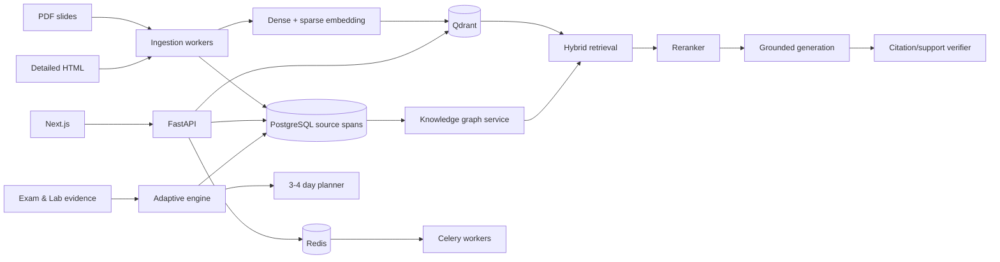

# CHIRON AI - Product Plan

**Product descriptor:** AI Adaptive Learning & Intensive Exam Preparation Platform  
**Official product name:** Chiron AI

## 1. Executive summary

Chiron AI là một web application hỗ trợ học viên tổng hợp tài liệu thành knowledge map, xác định lỗ hổng kiến thức và ôn thi cấp tốc trong 3-4 ngày. Tên Chiron lấy cảm hứng từ người thầy và người dẫn đường của các anh hùng trong thần thoại Hy Lạp. Nguồn chính là slide PDF và các bài HTML diễn giải chi tiết. Trải nghiệm cốt lõi gồm:

- Knowledge map trực quan, có quan hệ prerequisite, related concept, application và misconception.
- AI tutor dùng Production RAG, trả lời có citation đến đúng trang slide hoặc section HTML.
- Đề thi 100 câu hỗn hợp trắc nghiệm và tự luận, được thiết kế theo exam blueprint.
- Bài tự luận được nhập trực tiếp trên web; không có OCR hoặc upload ảnh bài làm.
- Adaptive engine cập nhật mastery, confidence và đề xuất lộ trình tối ưu điểm số trong 3-4 ngày.
- Practice Lab Engine phát triển từ các module tương tác HTML hiện có, nhưng có lưu tiến độ, chấm rubric, adaptive branching, sandbox và AI coach.
- Research tool chỉ bổ sung kiến thức khi corpus chính không đủ; nguồn web luôn được phân tầng và không được ghi đè nội dung khóa học.

Quyết định dữ liệu quan trọng:

> Qdrant được dùng làm vector database cho dense/sparse retrieval, metadata filtering và hybrid search. PostgreSQL vẫn là transactional database và source of truth cho user, khóa học, knowledge graph, đề thi, bài làm, rubric, mastery, lab attempts và audit log. Không dùng Qdrant làm database duy nhất. Knowledge retrieval áp dụng Graph-lite RAG: Qdrant tìm seed chunks/concepts, PostgreSQL mở rộng typed relationships 1-2 hop khi query thật sự cần.

## 2. Product principles

1. Exam-first: mọi nội dung, node, bài tập và lộ trình phải nối được với exam blueprint.
2. Evidence before confidence: hệ thống tách mastery score khỏi confidence; thiếu bằng chứng thì trả về "chưa đủ dữ liệu".
3. Course sources are authoritative: slide và HTML là nguồn chuẩn cho kỳ thi.
4. AI explains; code decides: scoring, scheduling, permission và publication status là logic deterministic.
5. Retrieval quality before prompt polish: ưu tiên ingestion, hybrid retrieval, reranking và citation verification.
6. Practice before passive reading: mỗi concept quan trọng phải có retrieval practice, lab hoặc recheck.
7. Production quality is measurable: mọi thay đổi RAG, prompt, grader và adaptive logic đều có golden set và eval gate.

## 3. Scope and non-goals

### 3.1 MVP scope

- Một course hoặc một phạm vi thi cụ thể.
- Toàn bộ PDF/HTML thuộc phạm vi thi được ingest, version và gắn citation.
- 50-150 concept nodes có cạnh prerequisite và related.
- Một full mock exam 100 câu cùng mini quiz/recheck reserve.
- Tối thiểu 300-400 câu hỏi ứng viên; chỉ câu đã duyệt mới được publish.
- Trắc nghiệm, short answer và essay nhập trực tiếp trên web.
- 10 practice lab templates; tối thiểu 6 lab hoàn chỉnh cho course đầu tiên.
- AI tutor có citation và research fallback.
- Lộ trình 3-4 ngày dựa trên exam weight, mastery, urgency và thời gian rảnh.

### 3.2 Non-goals của MVP

- Không OCR, không nhận diện chữ viết tay, không chấm bài từ ảnh.
- Không fine-tune model trước khi RAG/eval baseline chứng minh là cần thiết.
- Không dùng Neo4j hoặc Microsoft GraphRAG ngay từ đầu.
- Không xây multi-agent system cho mọi tính năng.
- Không cho chạy code tùy ý trên hạ tầng chính mà chưa có sandbox isolation.
- Không mở rộng đa môn trước khi vertical slice đầu tiên đạt quality gates.

## 4. Learner journey trong 3-4 ngày

### 4.1 Onboarding và diagnostic

1. Chọn course, ngày thi, mục tiêu điểm và thời gian rảnh.
2. Làm diagnostic ngắn, stratified theo concept, độ khó và Bloom level.
3. Hệ thống tạo mastery posterior và confidence cho từng concept.
4. Knowledge map hiển thị: mạnh, đang phát triển, yếu, chưa đủ bằng chứng.
5. Hệ thống tạo plan theo expected score gain per minute.

### 4.2 Daily loop

```text
Review plan
  -> Learn one concept
  -> Interact with a practice lab
  -> Complete retrieval practice
  -> Ask grounded AI tutor if needed
  -> Recheck
  -> Update mastery/confidence
  -> Re-optimize remaining schedule
```

### 4.3 Sau full mock exam

- Phân tích sai theo concept, misconception, difficulty, Bloom level và thời gian làm.
- Truy ngược prerequisite để tìm root cause.
- Tách lỗi kiến thức, lỗi đọc đề, lỗi lập luận và lỗi quản lý thời gian.
- Đề xuất lesson, source span, practice lab và recheck cụ thể.
- Re-plan phần thời gian còn lại, không tạo lại lịch từ đầu nếu không cần.

## 5. Core product modules

### 5.1 Content ingestion and authoring

- Nhập PDF và HTML.
- Parse text, heading, table, code block, image caption và page boundary.
- OCR không thuộc learner-facing product flow và không dùng để chấm bài từ ảnh. Riêng ingestion offline được phép dùng OCR có kiểm soát cho trang PDF thiếu text, phải giữ page locator, checksum, visual fallback và QA manifest.
- Chuẩn hóa thành immutable source spans.
- Version document bằng checksum và effective date.
- Chunk theo section/hierarchy, không chỉ theo số ký tự.
- Gắn concept, learning objective, misconception và source tier.
- Có admin review queue trước khi index/publish.

### 5.2 Knowledge map

Các relation types ban đầu:

- `PREREQUISITE_OF`
- `PART_OF`
- `RELATED_TO`
- `CONTRASTS_WITH`
- `APPLIES_TO`
- `COMMONLY_CONFUSED_WITH`
- `ASSESSED_BY`
- `SUPPORTED_BY_SOURCE`

Khi click node, learner thấy:

- Tóm tắt và learning objectives.
- Mastery, confidence và evidence count.
- Prerequisite path và downstream concepts.
- Nguồn slide/HTML chính xác.
- Misconceptions và lỗi gần đây.
- Practice labs, quiz và recommended next action.
- Tài liệu tham khảo bổ sung được phân tầng nguồn.

### 5.3 Grounded AI tutor

Tutor hỗ trợ:

- Explain simply / explain deeply.
- Socratic questioning.
- Worked example.
- Compare two concepts.
- Explain a wrong answer.
- Generate a recheck question.
- Feynman/explain-back review.
- Research missing knowledge under policy.

Mọi câu trả lời từ course corpus phải có citation. Tutor không được tự nhận học viên đã hiểu chỉ dựa trên hội thoại; phải có quiz, lab evidence hoặc explain-back rubric.

### 5.4 Exam engine

- Exam blueprint định nghĩa quota theo concept, type, difficulty và Bloom level.
- Full exam hỗ trợ 100 câu, section navigation, timer, flag, autosave và resume.
- Question types: single choice, multiple choice, ordering, matching, short answer và essay.
- Không trả đáp án hoặc rubric bí mật xuống client trước khi submit.
- Sau submit, grading jobs chạy theo từng section; learner vẫn xem được progress.

### 5.5 Essay workspace and grading

Essay được làm trực tiếp trên web:

- Plain/rich text editor có autosave, word count, outline, timer và revision history.
- Focus mode, keyboard shortcuts và accessibility đầy đủ.
- Không dùng AI autocomplete trong exam mode.
- Practice mode có thể bật Socratic hint nhưng mọi hint được log và ảnh hưởng evidence weight.

Grading pipeline:

1. Validate answer completeness và format.
2. Extract thesis, claims, evidence và counterarguments.
3. Score độc lập từng rubric criterion.
4. Kiểm tra coherence, logical consistency và source use.
5. Chạy critic pass để phát hiện điểm không nhất quán.
6. Aggregate score bằng deterministic rubric weights.
7. Trả evidence-backed feedback và confidence.
8. Confidence thấp hoặc high-stakes mode chuyển human review.

Không chấm bằng một prompt duy nhất. Mỗi criterion phải lưu score, rationale, evidence spans, grader version và confidence.

### 5.6 Adaptive planning

State của một concept gồm:

- `mastery_mean`
- `mastery_variance`
- `confidence`
- `effective_evidence`
- `last_practiced_at`
- `forgetting_risk`
- `misconception_tags`
- `source_coverage`

Điểm ưu tiên:

```text
priority =
  expected_score_gain
  * exam_weight
  * knowledge_gap
  * prerequisite_centrality
  * urgency
  * uncertainty_bonus
  * forgetting_risk
  / estimated_minutes
```

Adaptive engine bắt đầu từ Bayesian/Beta mastery, sau đó mở rộng item difficulty và discrimination. EMA đơn giản chỉ dùng cho UI preview, không dùng làm source of truth.

## 6. Practice Lab Engine

### 6.1 Tài sản hiện có

Kho HTML hiện có đã cung cấp 39 interactive modules, bao gồm:

- Token/context/cost simulators.
- Precision-recall và asymmetric error cost.
- Agentic-fit và automation threshold.
- ANN memory, post-filter recall và retrieval economics.
- Multi-agent routing, Amdahl, LoRA/VRAM/alignment.
- LangGraph reducer/checkpoint/retry/trace simulator.
- RAGAS cost, Cohen kappa và latency budget.
- Circuit breaker, cache và SLO/error budget.

Các module này là formula/scenario seeds tốt, nhưng không được nhúng nguyên iframe vào sản phẩm. Chúng sẽ được viết lại thành React components và typed lab definitions.

### 6.2 Lab maturity model

| Level         | Trải nghiệm                                               | Evidence sinh ra                           |
| ------------- | --------------------------------------------------------- | ------------------------------------------ |
| L1 Explore    | Slider, toggle, chart, prediction-observation-explanation | events, state changes, checkpoint question |
| L2 Guided     | Nhiệm vụ theo bước, hint ladder, success criteria         | step scores, hint use, retry count         |
| L3 Challenge  | Scenario biến thể, không chỉ dẫn, time/cost constraint    | artifact, rubric score, trace              |
| L4 Production | Sandbox, dataset thật/giả lập, eval và failure injection  | reproducible report, metrics, config       |

Mỗi concept quan trọng nên có ít nhất L1 hoặc L2. Các chủ đề kỹ thuật trọng tâm có L3-L4.

### 6.3 Lab definition schema

```ts
type LabDefinition = {
  id: string;
  version: number;
  courseId: string;
  conceptIds: string[];
  learningObjectives: string[];
  prerequisites: string[];
  estimatedMinutes: number;
  level: "explore" | "guided" | "challenge" | "production";
  sourceSpanIds: string[];
  initialState: Record<string, unknown>;
  scenes: LabScene[];
  scoringRubric: Rubric;
  hintPolicy: HintPolicy;
  successCriteria: SuccessCriterion[];
  artifactSchema?: Record<string, unknown>;
  accessibilityNotes: string[];
};
```

### 6.4 Runtime capabilities

- Save/resume theo lab version.
- Event sourcing cho mỗi interaction quan trọng.
- Prediction before action, observation after action và explanation after observation.
- Deterministic scoring cho simulator/configuration tasks.
- AI rubric scoring cho explanation/architecture artifacts.
- Hint ladder: conceptual hint -> source link -> partial scaffold -> worked answer.
- Adaptive branch theo misconception và confidence.
- Scenario randomization có seed để tái lập kết quả.
- Compare mode: baseline vs learner configuration.
- Export artifact: JSON config, chart, trace, report hoặc code snapshot.
- Peer/mentor review hooks ở phase sau.

### 6.5 Sandbox strategy

| Loại lab                | Runtime                                                                |
| ----------------------- | ---------------------------------------------------------------------- |
| Formula/chart simulator | React + Web Worker, chạy hoàn toàn trên client                         |
| Python cơ bản           | Pyodide/WebAssembly, không network và giới hạn CPU/time                |
| RAG/Qdrant lab          | Dataset sandbox server-side, namespace riêng theo attempt              |
| LangGraph/agent lab     | Predefined node library + controlled execution worker                  |
| Reliability/chaos lab   | Synthetic provider, fake latency/error injection; không phá production |

Remote code execution không thuộc MVP nếu chưa có container isolation, network denylist, resource quota và automatic teardown.

### 6.6 Ten advanced lab templates

1. Context Budget Studio
   - Thử system prompt, history, tools, retrieved chunks và output budget.
   - Learner phải đạt quality target trong token/cost cap.

2. Prompt & Tool Calling Debugger
   - Sửa schema, validation và retry policy.
   - Quan sát trace và phân biệt prompt error với tool error.

3. Chunking Arena
   - So sánh fixed, semantic, hierarchical và parent-child chunking.
   - Đo Context Recall/Precision trên cùng golden queries.

4. Qdrant Hybrid Search Lab
   - Dense + sparse retrieval, metadata pre-filter, RRF và weighted RRF.
   - Tune top-k, filter và fusion weight trên train/validation split.

5. Reranking Lab
   - Retrieve top-20, rerank, keep top-3.
   - So latency/precision/cost giữa bi-encoder, cross-encoder và late interaction.

6. Knowledge Map / GraphRAG Explorer
   - Semantic search tìm seed node, traversal 1-2 hop tìm prerequisite/related nodes.
   - So flat RAG với graph-augmented context trên multi-hop questions.

7. LangGraph State Machine Studio
   - Kéo/thả predefined nodes, conditional edges, retry, fallback và checkpoint.
   - Crash-resume và trace replay trên scenario có seed.

8. RAG Evaluation Lab
   - Chạy Faithfulness, Answer Relevancy, Context Precision và Context Recall.
   - Phân tích bottom cases và đề xuất đúng fix cho đúng pipeline stage.

9. Reliability Chaos Lab
   - Inject timeout, 429, stale cache và provider outage.
   - Tune circuit breaker, fallback ladder, TTL và cost cap.

10. Explain-back / Feynman Lab
    - Learner giải thích concept bằng lời của mình.
    - AI đánh giá coverage, misconception và causal reasoning dựa trên rubric/source.
    - Sinh recheck khác dạng để xác minh hiểu thật.

### 6.7 Lab evidence -> mastery

Không dùng completion như bằng chứng hiểu bài. Evidence weight phụ thuộc:

- Task difficulty.
- Số hint đã dùng.
- Số lần retry.
- Learner có giải thích được causal mechanism hay không.
- Kết quả trên scenario mới, không chỉ scenario đã hướng dẫn.
- Recheck sau delay.

Một lab hoàn thành chỉ tăng mastery mạnh khi learner vượt transfer challenge hoặc explain-back rubric.

## 7. Technology stack

### 7.1 Frontend

- Next.js 15 App Router, React 19, TypeScript.
- Tailwind CSS và shadcn/ui/base primitives.
- Framer Motion cho cinematic transitions và micro-interactions.
- Lucide icons.
- Cytoscape.js + ELK layout cho knowledge map.
- TipTap hoặc Lexical cho essay editor.
- TanStack Query cho server state; Zustand chỉ cho transient lab/editor state.
- Web Worker cho simulator computations.
- Playwright, Vitest và Testing Library.

File design reference có yêu cầu Vite, nhưng đây chỉ là recreation prompt của một landing page. Product giữ Next.js để tái sử dụng `EdTech`, SSR/auth routing và triển khai hiện tại.

### 7.2 Backend and AI

- FastAPI + Pydantic.
- LangGraph chỉ cho workflow có loop, conditional routing, research, checkpoint hoặc grading orchestration.
- Plain functions/services cho ingestion tuyến tính, scoring và scheduling.
- Celery + Redis cho ingestion, embedding, exam grading, lab provisioning và async eval.
- Provider adapter để tách domain code khỏi một LLM vendor cụ thể.
- Structured outputs với JSON Schema cho concept extraction, question generation và grading.

### 7.3 Data stores

#### PostgreSQL / Supabase - source of truth

Lưu:

- users, profiles, roles, organizations.
- courses, exams, documents, source spans và versions.
- concepts, concept edges, learning objectives và misconceptions.
- question bank, rubrics, exams và publication workflow.
- attempts, answers, essay revisions và grades.
- mastery state, study plans và evidence ledger.
- lab definitions, versions, attempts, events, artifacts và scores.
- chat threads, research sources, citations và audit trail.
- outbox/vector sync jobs.

#### Qdrant - retrieval index

Collections ban đầu:

1. `course_chunks`
   - Named dense vector.
   - Sparse/BM25 vector.
   - Payload trỏ về `source_span_id` và `concept_ids`.

2. `concept_search`
   - Summary embedding cho concept/node discovery.
   - Canonical node và edges vẫn ở PostgreSQL.

3. `research_chunks`
   - Tách hoàn toàn khỏi course corpus.
   - Payload bắt buộc có URL, retrieved date, source tier và verification status.

Payload quan trọng:

```text
tenant_id
course_id
document_id
document_version
source_span_id
source_type
page_number
section_path
concept_ids
source_tier
language
acl_scope
checksum
is_active
```

Mọi query Qdrant phải pre-filter `tenant_id`, `course_id`, ACL và active version. Không post-filter quyền sau ANN.

#### Redis

- Job broker/result backend.
- Rate limiting.
- Circuit breaker state.
- Short-lived session/cache.
- Không là source of truth.

#### Object storage

- PDF, HTML source, rendered preview, lab artifacts và exports.
- Signed URLs; không public bucket cho tài liệu khóa học riêng tư.

### 7.4 Why Qdrant

Qdrant phù hợp vì:

- Dense, sparse và multivector/named vector support.
- Hybrid/multi-stage query và RRF.
- Rich payload filtering.
- Per-tenant filtering và payload indexes.
- HNSW, quantization, on-disk options và managed cloud.
- Có thể dùng reranking/late interaction ở retrieval stage.

Qdrant không phù hợp để thay PostgreSQL vì app cần relational constraints, joins, transactions, RLS/auth integration, reporting và durable business workflows.

## 8. Data architecture



PostgreSQL -> Qdrant sync dùng transactional outbox:

1. Commit document/source changes trong PostgreSQL.
2. Ghi `vector_sync_job` cùng transaction.
3. Worker tạo embeddings và upsert Qdrant.
4. Lưu embedding model/version và sync status.
5. Chỉ activate document version sau khi validation pass.

### 8.1 Graph-lite knowledge model

Quyết định mô hình:

> Chunk không phải knowledge node. Chunk/source span là bằng chứng và đơn vị citation; concept mới là node tri thức. Graph nối concept với concept, còn bảng trung gian nối chunk với concept.

```text
Document -> Source span -> Chunk -> Qdrant point
                              |
                              v
                        Chunk-Concept
                              |
                              v
                    Concept <- Edge -> Concept
```

Canonical graph được lưu trong PostgreSQL:

```sql
concept_nodes(
  id, tenant_id, course_id, canonical_name, node_type,
  summary, learning_objective, status, graph_version
)

concept_edges(
  id, tenant_id, course_id,
  source_concept_id, target_concept_id, relation_type,
  weight, confidence, evidence_source_span_id,
  extraction_method, review_status, graph_version
)

chunk_concepts(
  chunk_id, concept_id, relevance_score, is_primary
)

source_spans(
  id, document_id, document_version,
  page_number, section_path, content, checksum
)
```

Controlled relation ontology:

- `PREREQUISITE_OF`
- `PART_OF`
- `APPLIES_TO`
- `CAUSES`
- `CONTRASTS_WITH`
- `COMMONLY_CONFUSED_WITH`
- `ASSESSED_BY`
- `SUPPORTED_BY_SOURCE`

`RELATED_TO` chỉ dùng khi không thể gán relation cụ thể và bị giảm trọng số khi retrieval. Mỗi active edge bắt buộc có provenance đến `evidence_source_span_id`, confidence, extraction method và review status.

Graph integrity rules:

- `PREREQUISITE_OF` phải vượt cycle detection trước khi activate.
- Directed/undirected semantics được khai báo theo relation type, không suy diễn tùy ý ở runtime.
- Canonicalization/deduplication concept chạy trước edge activation.
- Mọi node/edge gắn `tenant_id`, `course_id` và `graph_version`.
- Re-index embedding không thay đổi identity của concept, edge hoặc source span.
- Edge confidence thấp hoặc xung đột giữa nguồn phải vào review queue.

## 9. Production RAG design

### 9.1 Offline pipeline

```text
Parse -> Clean -> Immutable source spans -> Structural chunking
     -> Concept candidate extraction -> Canonicalize/deduplicate
     -> Typed edge extraction -> Provenance/cycle validation
     -> Human review when required -> Concept/source linking
     -> Dense+sparse embeddings -> Qdrant upsert
     -> Retrieval validation -> Activate document + graph version
```

Yêu cầu:

- Parent-child/hierarchical chunks.
- Source span không đổi theo embedding model.
- Table/code/formula không bị tách khỏi heading/context.
- Duplicate detection và content checksum.
- Re-embedding không làm mất citation hoặc business identity.
- Chunking và graph extraction là hai stage riêng: chunker bảo toàn cấu trúc; graph stage tạo/canonicalize concept và typed edges.
- Ưu tiên rule/heading/HTML anchors trước; chỉ gọi LLM cho concept hoặc relationship không giải quyết chắc chắn bằng cấu trúc.

### 9.2 Online pipeline

```text
Intent classify
  -> ACL/course filter
  -> Query rewrite/multi-query when needed
  -> Qdrant dense+sparse prefetch
  -> RRF/weighted RRF
  -> Concept seed + 1-2 hop graph expansion
  -> Cross-encoder rerank
  -> Context assembly
  -> Grounded generation
  -> Claim/citation verification
  -> Answer or calibrated refusal/research
```

Không áp dụng graph augmentation cho mọi query. Semantic/keyword fact lookup đi đường retrieval ngắn để giảm latency/cost.

### 9.3 Graph-lite RAG

Graph-lite RAG giữ phần có giá trị cao của GraphRAG cho EdTech nhưng bỏ community detection, community reports nhiều tầng và global map-reduce trong MVP.

Query routes:

| Query type                                                 | Route                                                                            |
| ---------------------------------------------------------- | -------------------------------------------------------------------------------- |
| Definition, direct fact, keyword/code lookup               | Qdrant hybrid -> rerank -> answer                                                |
| Prerequisite, causal, comparison, misconception, multi-hop | Qdrant seeds -> PostgreSQL graph expansion -> rerank -> answer                   |
| Tổng quan toàn môn                                         | Curated/course summary trước; chỉ tạo summary offline có version nếu thật sự cần |

Graph-augmented retrieval:

```text
1. Qdrant dense+sparse prefetch và RRF
2. Chọn top seed chunks, lấy concept_ids từ payload
3. Intent router quyết định có graph expansion hay không
4. PostgreSQL recursive CTE duyệt relation whitelist, tối đa 1-2 hop
5. Áp dụng hop decay, edge confidence, direction và candidate cap
6. Resolve neighbor concepts về source spans/chunks
7. Gộp vector, sparse và graph candidates theo rank channel
8. Cross-encoder rerank trên candidate pool đã giới hạn
9. Generate answer và verify claim/citation
```

Runtime guardrails:

- Không traversal không giới hạn; mặc định 1 hop, tối đa 2 hop.
- Whitelist relation theo intent; không dùng tất cả loại edge cho mọi query.
- Không cộng trực tiếp raw vector score với edge weight khi chưa calibration; fuse theo rank rồi rerank.
- Giới hạn seed count, degree/node fan-out và tổng graph candidates.
- Cache/version neighborhood phổ biến trong Redis hoặc materialized view chỉ khi profiling chứng minh cần.
- PostgreSQL là đủ cho course graph nhỏ-vừa; chỉ đánh giá graph database chuyên dụng khi traversal/query load thực tế vượt SLO.

Cost strategy:

- Extract/canonicalize graph một lần theo document version, không chạy lại mỗi query.
- Không tạo community report/embedding nếu chưa có use case và eval chứng minh lợi ích.
- Dùng model nhỏ/structured output cho candidate extraction; model mạnh chỉ xử lý conflict/low-confidence batch.
- Theo dõi riêng ingestion cost/document version, graph expansion latency/query và token saved/answer.
- Không tuyên bố rẻ hơn theo một hệ số cố định trước khi benchmark trên corpus thật.

Graph-lite phải được benchmark với `hybrid-only` trên ba nhóm golden query: direct fact, prerequisite/root-cause và multi-hop/comparison. Chỉ bật route nếu tăng retrieval/answer quality mà vẫn nằm trong latency và cost budget.

### 9.4 Research fallback

Trigger khi:

- Course retrieval confidence thấp.
- Corpus xác nhận không có dữ kiện cần thiết.
- Learner yêu cầu tài liệu mở rộng hoặc kiến thức cập nhật.

Policy:

- Domain allowlist/blocklist.
- Read-only tools.
- Giới hạn số query, time và cost.
- Không đưa web content thô vào persistent knowledge base nếu chưa review.
- Hiển thị rõ `Nguồn khóa học` và `Tham khảo thêm`.
- Citation gồm URL, title, publisher và retrieval date.

## 10. Question bank and assessment design

Question metadata:

```text
question_type
concept_ids
learning_objective_ids
bloom_level
difficulty
discrimination
misconception_tags
estimated_seconds
source_span_ids
answer_key / rubric_id
generation_model_version
review_status
```

Publication states:

```text
generated -> validator_passed -> expert_reviewed -> approved -> published -> retired
```

Question generation chỉ tạo candidate. Validator kiểm tra:

- Answerability từ source.
- Citation support.
- Không lộ đáp án trong stem/options.
- Một đáp án đúng rõ ràng với MCQ.
- Distractors map được vào misconception.
- Không trùng semantic với item đã publish.
- Blueprint coverage sau khi thêm item.

## 11. Design direction

### 11.1 Visual concept

Design reference được diễn giải thành:

> Cinematic black learning environment + restrained liquid glass + editorial serif typography + precise scientific/data visualization.

Không sao chép tên `Asme`, copywriting hoặc video URL từ recreation prompt. Video trong file chỉ là mood reference; production phải dùng asset có quyền sử dụng hoặc asset do dự án tạo.

### 11.2 Design tokens

| Token         | Giá trị định hướng            | Vai trò                                     |
| ------------- | ----------------------------- | ------------------------------------------- |
| Canvas        | `#050505`                     | Nền toàn app                                |
| Surface solid | `#0C0C0E`                     | Exam/editor, nội dung cần đọc lâu           |
| Surface glass | white 1-4% + blur             | Nav, floating panel, modal, command palette |
| Primary text  | `#F4F4F0`                     | Nội dung chính                              |
| Muted text    | `#9B9B98`                     | Metadata                                    |
| Divider       | white 8-12%                   | Cấu trúc                                    |
| Accent        | acid-lime hoặc spectral green | CTA/progress, dùng tiết chế                 |
| Danger        | warm coral                    | Incorrect/high-risk                         |
| Warning       | amber                         | Developing/uncertain                        |
| Mastered      | cool mint                     | Mastery cao                                 |

### 11.3 Typography

- Instrument Serif cho hero và display headings.
- Sans-serif hỗ trợ tiếng Việt tốt cho body, đề thi và dữ liệu: Be Vietnam Pro, Inter hoặc Geist Sans.
- Không dùng Instrument Serif cho paragraph dài, bảng, answer options hoặc code.
- Code/trace dùng Geist Mono hoặc JetBrains Mono.

### 11.4 Liquid glass usage

Liquid glass dùng cho:

- Floating navbar.
- Hero email/CTA.
- Command palette.
- AI tutor overlay.
- Knowledge-map node detail drawer.
- Lab control panels.

Không dùng glass trong:

- Essay writing canvas.
- Exam question/answer surface.
- Bảng dữ liệu dài.
- Citation text cần độ tương phản cao.

Các vùng học/thi dùng solid dark surface để tránh blur, video và background làm giảm khả năng tập trung.

### 11.5 Motion and media

- Background video chỉ dùng landing/transition, không chạy trong exam hoặc study focus mode.
- Fade loop có poster fallback và lazy loading.
- Framer Motion cho section reveal, map transitions và micro-feedback.
- Tôn trọng `prefers-reduced-motion`.
- Không animation layout trong lúc learner đang nhập essay.
- Mọi motion phải giải thích state/change, không chỉ trang trí.

### 11.6 Core screen direction

#### Landing

- Full-viewport cinematic hero.
- Floating glass navigation.
- Editorial headline cỡ lớn.
- Product proof bằng knowledge-map/lab footage thay cho số liệu marketing chưa kiểm chứng.

#### Dashboard

- "What should I study next?" là hành động chính.
- Countdown, expected score gain, time capacity và confidence.
- Kế hoạch 3-4 ngày trình bày như timeline rõ ràng.

#### Knowledge map

- Dark infinite canvas.
- Node không biến thành hàng trăm glass cards; dùng shape/line/status rõ.
- Glass detail panel mở bên cạnh.
- Filter theo mastery, confidence, exam weight và source coverage.

#### Exam

- Solid, distraction-free, high contrast.
- Sticky section navigator, autosave status và keyboard navigation.
- Essay editor full-width/focus mode.

#### Practice lab

- Desktop: brief/source bên trái, interactive workspace ở giữa, AI coach/metrics bên phải.
- Mobile: ba tab `Brief`, `Lab`, `Coach`.
- Before/after comparison và trace/evidence luôn dễ mở.

### 11.7 Accessibility and performance

- WCAG AA contrast cho body/UI text.
- Full keyboard support.
- Visible focus rings.
- Graph có list/table fallback và screen-reader summaries.
- Charts có textual interpretation.
- Video có poster và không bắt buộc để hiểu nội dung.
- Landing LCP không phụ thuộc video hoàn tất tải.

## 12. API boundaries

API groups dự kiến:

```text
/auth
/courses
/documents
/concepts
/knowledge-map
/retrieval
/tutor
/research
/question-bank
/exams
/attempts
/grading
/mastery
/study-plans
/labs
/lab-attempts
/admin/review
/healthz
/readyz
```

Long-running endpoints trả `job_id`, không giữ HTTP request quá lâu:

- Document ingestion.
- Re-embedding.
- Full exam grading.
- Essay grading batch.
- Lab sandbox provisioning.
- Evaluation suite.

## 13. Repository structure

```text
adaptive-learning/
├── apps/
│   └── web/                    # Next.js product
├── services/
│   ├── api/                    # FastAPI
│   ├── worker/                 # Celery jobs
│   └── sandbox-runner/         # optional phase 2
├── packages/
│   ├── domain/                 # shared contracts
│   ├── ui/                     # design system
│   ├── lab-runtime/            # React lab engine
│   └── eval-contracts/
├── content/
│   ├── manifests/
│   └── lab-definitions/
├── eval/
│   ├── rag/
│   ├── grading/
│   ├── question-bank/
│   └── adaptive/
├── infra/
│   ├── docker/
│   └── terraform/
└── docs/
```

## 14. Deployment topology

### Local development

Docker Compose:

- PostgreSQL/Supabase local.
- Qdrant.
- Redis.
- FastAPI.
- Celery worker.
- Next.js chạy local ngoài Compose hoặc trong container tùy team.

### MVP/staging

- Web: Vercel.
- PostgreSQL/Auth/Storage: Supabase.
- Vector DB: Qdrant Cloud.
- API/worker: Railway hoặc Render để ship nhanh.
- Redis: managed Redis.

### Production target

- Web: Vercel.
- API và workers: Cloud Run services + jobs/worker pool.
- Qdrant Cloud production cluster.
- Supabase production project hoặc managed PostgreSQL tương đương.
- OTel Collector + Langfuse/Phoenix.

## 15. Reliability, security and observability

### 15.1 Reliability

- Timeout per provider/task.
- Bounded retry với exponential backoff và jitter.
- Circuit breaker theo provider/model/task.
- Fallback ladder có feature compatibility check.
- Exact/tool cache trước semantic answer cache.
- Semantic cache có allowlist, TTL, threshold, invalidation và false-hit tracking.
- Idempotency key cho grading, ingestion và attempt submission.
- Autosave essay/exam offline queue và conflict handling.

### 15.2 Security

- Supabase RLS cho transactional records.
- Qdrant query bắt buộc tenant/course/ACL filter.
- Signed URLs cho source documents.
- Prompt injection defense phân biệt user input, retrieved content và tool output.
- Research tool read-only, allowlisted và rate-limited.
- Secrets manager, không commit API keys.
- Audit log cho publication, grading override và research source approval.
- Sandbox egress deny-by-default.

### 15.3 Observability

- OpenTelemetry cho traces, metrics và logs.
- Correlation ID xuyên suốt web -> API -> worker -> model/Qdrant.
- Không log raw essay/prompt mặc định; redaction và sampling.
- Metrics: P50/P95/P99, TTFT, Qdrant latency, rerank latency, token/cost, cache hit, fallback, grading confidence, eval score.
- Langfuse hoặc Phoenix cho LLM traces/eval; giữ OTel để tránh lock-in.
- Actionable alerts và runbook.

### 15.4 Quyết định LLM provider và fallback

- **Quyết định: Groq Free là main, Gemini Free là backup có điều kiện.** Mọi model đi qua `LLMProvider`/`LLMRouter`, không import SDK provider trong domain logic.
- Groq Free công bố quota rõ theo model. Tại thời điểm chốt plan: `qwen/qwen3.8-27b` có 30 RPM, 1.000 RPD, 8K TPM và 2M TPD; `gpt-oss-20b/120b` có 30 RPM, 1.000 RPD, 8K TPM và 200K TPD; `compound-mini` có 30 RPM, 250 RPD và 70K TPM. Quota tài khoản thực tế luôn được đối chiếu từ response headers/console.
- Gemini Free miễn phí input/output và có 1M context ở dòng Flash hiện hành, nhưng limit phụ thuộc project/tier, capacity không được bảo đảm và phải đọc trực tiếp trong AI Studio. Nội dung Free Tier có thể được Google dùng để cải thiện sản phẩm; vì vậy không chọn làm main cho learner data.
- Tutor main: `qwen/qwen3.8-27b` vì multilingual, reasoning/tool/JSON support, khoảng 450+ token/giây và quota 2M TPD. Vì model đang ở trạng thái Preview, registry/config phải cho phép đổi model không sửa domain code.
- Extraction main: `openai/gpt-oss-20b`; grading/critic main: `openai/gpt-oss-120b`, tận dụng strict JSON Schema. Research main: `groq/compound-mini` nhưng phải budget theo giới hạn 250 RPD.
- Gemini backup: stable `gemini-3.7-flash` cho tutor/grading/research và stable `gemini-3.5-flash-lite` cho extraction nhẹ. Cả hai đã được smoke-test trực tiếp với API key của dự án, có 1M input context, structured output, tool calling và multimodal input. Model 2.5 có thể còn xuất hiện trong `/models` nhưng trả `404` cho tài khoản mới nên không dùng làm default.
- Khi Groq trả `429`, router được phép chuyển sang Gemini (`gemini-3.7-flash` hoặc `gemini-3.5-flash-lite`) nếu `LLM_FALLBACK_ENABLED=true`.
- Gemini Free chỉ nhận workload được phân loại `public` hoặc `synthetic`; learner question, bài tự luận và tài liệu riêng mặc định là `private` và không fallback.
- Lỗi xác thực/schema không fallback. Lỗi timeout/5xx chỉ fallback khi chủ động bật `LLM_FALLBACK_ON_UNAVAILABLE=true`.
- Embedding chạy cùng backend/worker bằng `intfloat/multilingual-e5-large`, benchmark với `BAAI/bge-m3`; sparse retrieval dùng Qdrant BM25; reranker `BAAI/bge-reranker-v2-m3`. Không deploy Ollama do giới hạn hạ tầng. Khi Groq không khả dụng, private workload chuyển sang degraded response hoặc durable retry queue, không sang Gemini Free.
- Mọi response LLM ghi provider/model/used_fallback vào trace metadata nhưng không log raw prompt, essay hoặc API key.
- Nguồn quyết định: `https://console.groq.com/docs/rate-limits`, `https://console.groq.com/docs/model/qwen/qwen3.8-27b`, `https://console.groq.com/docs/structured-outputs`, `https://ai.google.dev/gemini-api/docs/rate-limits`, `https://ai.google.dev/gemini-api/docs/pricing`, `https://ai.google.dev/gemini-api/docs/models/gemini-3.7-flash`, `https://ai.google.dev/gemini-api/docs/models/gemini-3.5-flash-lite`.

## 16. Evaluation and quality gates

### 16.1 RAG

- Retrieval Recall@10 >= 0.90 trên golden set.
- Citation precision >= 0.95.
- Faithfulness target >= 0.85; minimum acceptable 0.75 trong pilot.
- Answer Relevancy >= 0.80.
- Context Precision >= 0.70.
- Context Recall >= 0.75.
- Mọi citation sample mở đúng source span/page.
- Graph-lite được so với hybrid-only theo từng query class; direct fact không được regression, còn prerequisite/multi-hop phải có quality uplift có ý nghĩa thực tế.
- 100% active concept edges có provenance; không có cycle trong active `PREREQUISITE_OF` graph.
- Graph expansion tuân thủ relation whitelist, hop limit, degree cap và latency budget.
- Theo dõi ingestion cost/document version và P95 graph expansion latency; chưa cam kết hệ số tiết kiệm trước benchmark.

### 16.2 Question bank

- 100% published item có concept, learning objective, source và answer/rubric.
- 100% mock exam đạt blueprint coverage.
- Không candidate AI chưa review trong đề chính thức.
- Semantic duplicate và answer leakage tests pass.

### 16.3 Essay grading

- Golden set được ít nhất hai human graders chấm.
- MAE mục tiêu <= 0.75 trên thang 10 cho pilot.
- Quadratic weighted kappa >= 0.75.
- Cohen kappa theo criterion đạt mức substantial hoặc có human review.
- Calibration theo score band và answer length.
- Không dùng cùng một model làm generator và judge duy nhất mà không cross-check.

### 16.4 Practice labs

- Formula/scoring deterministic có unit tests.
- Save/resume không mất events/artifacts.
- Mỗi lab có source citations, objective, success criteria, hint policy và transfer check.
- Scenario seed tái lập được.
- Lab không cập nhật mastery mạnh chỉ vì learner click hết bước.
- Sandbox security tests pass trước khi mở code execution.

### 16.5 Adaptive engine

- Mastery calibration được theo dõi bằng Brier score/ECE khi có dữ liệu thật.
- Không recommend node mastered với confidence cao trừ spaced review.
- Không bỏ qua prerequisite yếu khi downstream concept có lỗi lặp lại.
- Plan luôn nằm trong time capacity và deadline.

### 16.6 CI/CD eval gate

```text
L1: unit/schema/smoke
L2: RAG golden suite
L3: grader/adaptive regression
L4: pairwise comparison vs production
L5: security/red-team subset
```

Một gate fail thì block merge/deploy; override phải có người phê duyệt và justification log.

## 17. Delivery plan

Giả định team: 1 frontend, 1 backend/AI, 0.5 content/domain QA. Solo developer cần tăng timeline khoảng 1.7-2 lần.

### Phase 0 - Product and data contract (3-4 ngày)

- Chốt course và exam blueprint.
- Chốt tỷ lệ question types và essay rubrics.
- Chọn PDF/HTML authoritative.
- Chốt golden set ban đầu và pilot metrics.

Exit criteria: không còn câu hỏi mở về phạm vi thi và rubric.

### Phase 1 - Platform foundation (Tuần 1)

- Tạo monorepo.
- Auth/RLS, core schema và object storage. Backend identity/tenancy, JWT principal, rotating refresh
  session, SQLAlchemy adaptive repositories, demo seed, live readiness, non-owner runtime role và
  frontend BFF bearer flow đã triển khai.
- Local Compose: PostgreSQL, Qdrant, Redis, MinIO, Celery worker/scheduler. Outbox sync dense+BM25
  dùng stable chunk ID đã chạy E2E; API container hóa vẫn là bước triển khai tiếp theo.
- Design tokens, app shell và cinematic landing skeleton.

Exit criteria: user đăng nhập, course shell chạy, health/ready checks pass.

### Phase 2 - Content, Qdrant and RAG (Tuần 2)

- Ingest vertical slice PDF/HTML.
- Source spans, versioning và outbox sync. Nền outbox/Qdrant đã triển khai; parser và ingestion tài
  liệu thật là phần còn lại.
- Concept candidate extraction, canonicalization và `chunk_concepts` mapping.
- Dense+sparse Qdrant collection.
- Hybrid RRF, reranker và citation verifier.
- Golden retrieval suite.

Exit criteria: 100 golden questions đạt retrieval/citation threshold ban đầu.

### Phase 3 - Knowledge map and tutor (Tuần 3)

- Graph-lite schema, typed edge extraction, provenance và cycle validation.
- Concept/edge review workflow và graph version activation.
- Knowledge-map UI và node detail panel.
- Recursive CTE graph expansion 1-2 hop và intent-based routing.
- AI tutor modes và research fallback.

Exit criteria: map/source/tutor khép kín trên vertical slice; Graph-lite vượt hybrid-only trên prerequisite/multi-hop set mà direct-fact set không regression.

### Phase 4 - Exam, essay and adaptive loop (Tuần 4)

- Question bank workflow và exam blueprint assembler.
- Full exam UX, autosave và resume.
- Essay editor và multi-stage grading.
- Bayesian mastery, root-cause và 3-4 day planner.

Exit criteria: hoàn thành exam -> grading -> gap analysis -> re-plan.

### Phase 5 - Practice Lab Engine (Tuần 5)

- Typed lab schema/runtime.
- Event log, save/resume, rubric và hint ladder.
- Port 3 module hiện có thành React: retrieval filter, LangGraph trace và circuit breaker.
- AI coach grounded theo lab/source.

Exit criteria: learner hoàn thành lab, sinh artifact/evidence và mastery update có kiểm soát.

### Phase 6 - Advanced labs and content coverage (Tuần 6)

- Qdrant Hybrid Search Lab.
- Chunking/Reranking Lab.
- GraphRAG Explorer.
- RAG Evaluation Lab.
- Explain-back Lab.

Exit criteria: tối thiểu 6 lab hoàn chỉnh, có transfer challenge và regression tests.

### Phase 7 - Design polish, reliability and eval (Tuần 7)

- Hoàn thiện landing/product visual system.
- Mobile, accessibility và reduced motion.
- OTel/Langfuse, dashboards và alerts.
- Circuit breaker, fallback, cache và chaos tests.
- CI/CD eval gates.

Exit criteria: quality, latency, reliability và accessibility gates pass.

### Phase 8 - Pilot and hardening (Tuần 8)

- Pilot 20-50 học viên.
- Thu learning gain, completion, abandonment và qualitative feedback.
- Failure -> regression-case loop.
- Tune Qdrant fusion/rerank, adaptive weights và grader calibration.

Exit criteria: có evidence để quyết định mở rộng course hoặc sửa core workflow.

## 18. MVP acceptance criteria

- Một learner có thể đi trọn: diagnostic -> map -> lesson/lab -> exam -> feedback -> re-plan.
- Source citations mở đúng page/section.
- Qdrant hybrid retrieval và reranker có benchmark tốt hơn dense-only baseline.
- Graph-lite có typed/provenance edges, không có prerequisite cycle và chỉ mở rộng graph theo query route.
- Graph-lite benchmark tốt hơn hybrid-only trên prerequisite/multi-hop questions trong latency/cost budget.
- Essay nhập trực tiếp trên web, autosave và grading rubric hoạt động.
- Tối thiểu 6 practice labs có save/resume, scoring, adaptive evidence và source grounding.
- Full exam 100 câu không mất dữ liệu khi refresh/network interruption.
- Mọi published question đã qua review.
- Monitoring phát hiện latency/error/quality degradation trước pilot production.

## 19. Key risks and mitigations

| Risk                                  | Mitigation                                                                                                                   |
| ------------------------------------- | ---------------------------------------------------------------------------------------------------------------------------- |
| Qdrant và PostgreSQL lệch dữ liệu     | Transactional outbox, version/checksum, reconciliation job                                                                   |
| Knowledge graph sinh sai hoặc quá dày | Controlled ontology, canonicalization, provenance trên từng edge, confidence/review gate, cycle check và traversal depth 1-2 |
| AI grader thiên vị độ dài/style       | Criterion rubric, cross-judge, human calibration, kappa tracking                                                             |
| Lab đẹp nhưng không tạo learning gain | Transfer challenge, delayed recheck, evidence-weighted mastery                                                               |
| Research làm nhiễu nguồn thi          | Tách collection/source tier, explicit label, review before persistence                                                       |
| Glass/video làm giảm khả năng đọc     | Chỉ dùng cinematic UI ở landing/floating surfaces; solid focus surfaces                                                      |
| Question generation tạo lỗi           | Candidate-only pipeline và expert approval                                                                                   |
| Semantic cache trả đáp án cũ/sai      | Allowlist, TTL, version-aware invalidation, false-hit monitoring                                                             |
| Scope nổ vì 42 PDF                    | Vertical slice và quality gates trước khi batch expansion                                                                    |

## 20. Reuse strategy

### EdTech

Reuse:

- Next.js shell, Auth/Supabase setup, exam UI patterns, knowledge tree/radar và tests.

Replace:

- EMA-only mastery, hardcoded subject data và one-shot OCR grader.
- OCR route bị loại hoàn toàn.

### Hackathon prototype

Reuse:

- Concept/RAG/attempt schema ideas, Beta mastery, citation validation, fallback và integrity tests.

Replace:

- Keyword/page mapping thủ công và retrieval không có dense+sparse+rereank.

### Existing HTML learning content

Reuse:

- Detailed explanations, source anchors, formulas, misconceptions, Bloom exercises và 39 module scenarios.

Replace:

- Self-contained HTML/vanilla JS runtime bằng React Practice Lab Engine, typed definitions, persistence, rubric và adaptive evidence.

## 21. Internal slide references used for technology decisions

Nguồn: `C:\Users\banka\Documents\slide bài học`

| File                   | Trang tham khảo | Quyết định rút ra                                                               |
| ---------------------- | --------------- | ------------------------------------------------------------------------------- |
| `SLIDE DAY07.pdf`      | 63, 69          | Qdrant phù hợp khi cần filter/multivector/multi-tenant; RRF fuse theo rank      |
| `track 3 - day 18.pdf` | 24, 28, 29, 54  | Production RAG dùng hybrid + metadata + reranking; Qdrant là default pick       |
| `track 3 day 19.pdf`   | 33, 34, 43, 53  | Graph augmentation bổ trợ vector search; route theo local/global/multi-hop need |
| `track 3 - day 23.pdf` | 10, 17, 20, 34  | LangGraph chỉ khi cần loop/routing/checkpoint/recovery                          |
| `track 3 - day 24.pdf` | 24, 61, 64, 71  | RAGAS targets, CI eval gate và continuous evaluation                            |
| `DAY 12.pdf`           | 21, 26, 34, 77  | FastAPI + Qdrant + Redis, async jobs, tiered deployment và eval gate            |
| `day 13.pdf`           | 46, 53, 73, 106 | OTel, Langfuse/Phoenix, actionable alerts và monitoring checklist               |
| `track 3 - day 25.pdf` | 12, 14, 17, 22  | Circuit breaker, fallback ladder, cache guardrails và quality SLO               |

Official Qdrant references để kiểm tra khi implement:

- [Hybrid and multi-stage queries](https://qdrant.tech/documentation/search/hybrid-queries/)
- [Points, vectors and payload](https://qdrant.tech/documentation/manage-data/)
- [Multitenancy and payload partitioning](https://qdrant.tech/documentation/tutorials/multiple-partitions/)
- [PostgreSQL recursive queries](https://www.postgresql.org/docs/17/queries-with.html)
- [Microsoft GraphRAG default indexing dataflow](https://microsoft.github.io/graphrag/index/default_dataflow/)

## 22. Immediate next implementation slice

Vertical slice đầu tiên nên là:

```text
1 PDF + 1 detailed HTML
  -> source spans
  -> 20-40 concept nodes
  -> Qdrant dense+sparse index
  -> hybrid retrieval + rerank + citation
  -> knowledge-map node drawer
  -> 1 Qdrant/Chunking practice lab
  -> 20-question diagnostic
  -> mastery update
  -> one-day adaptive plan
```

Chỉ batch-ingest phần tài liệu còn lại sau khi slice này vượt retrieval, citation, lab và adaptive quality gates.

## 23. Execution checkpoint — 2026-08-30

Đã hoàn tất:

- Parse toàn bộ nguồn học thành corpus có cấu trúc trong `data/`: 42 PDF, 28 HTML/lesson Markdown, 2.817 source spans duy nhất; OCR chỉ cải thiện 3 trang thiếu text và 7 trang sparse có visual fallback.
- Alembic `0005_corpus_ingestion`: document metadata/provenance và hierarchical chunk metadata.
- Import PostgreSQL thật dưới tenant `chiron-demo`: 69 canonical documents, 2.817 source spans, 2.817 parent chunks và 5.069 child chunks. Re-import cùng version tạo 0 outbox event mới.
- Outbox v2 chia tối đa 32 chunk/event: 196 event phủ toàn bộ child chunks; worker chỉ claim `EMBEDDING_VERSION` hiện hành, event cũ vẫn giữ nguyên để audit.
- Worker Qdrant payload có document title/source path, locator, parent chunk, ordinal và token count.
- Hybrid retrieval dense + Qdrant BM25 + RRF đã nối qua Celery, bắt buộc bearer token, active enrollment và tenant/course filter.
- E2E live đã pass: login 200 -> PostgreSQL enrollment -> Celery -> Qdrant -> retrieval 200, 5 hits; truy vấn Observability trả đúng slide `Monitoring, Logging & Observability`, trang 44.
- Warm retrieval trong lúc background indexing: khoảng 0,91 giây. Cold start từng lên 120 giây vì hai thread cùng khởi tạo model; đã sửa bằng thread-safe encoder singleton. Docker dependency layer đã tách để các build code sau không cài lại FastEmbed.
- Local E5 index đã hoàn tất: 196/196 outbox batch processed, Qdrant `green`, 5.070/5.070 vectors indexed. Full ID reconciliation PostgreSQL ↔ Qdrant: missing 0, extra 0, matched `true`.

Trạng thái runtime tại checkpoint: PostgreSQL/Redis/Qdrant/worker đang chạy; E5 indexing và reconciliation đã hoàn tất. Corpus embedding là local-only; OpenAI document embedding bị chặn bằng `OPENAI_DOCUMENT_EMBEDDING_ALLOWED=false`.

### Review gate cần quyết định

1. `BAAI/bge-reranker-v2-m3` không có ONNX artifact được FastEmbed 0.8 hỗ trợ trực tiếp. Giữ `RERANK_ENABLED=false` cho tới khi benchmark và chọn một trong: service PyTorch riêng; tự export/validate ONNX; hoặc model FastEmbed multilingual khác có license phù hợp.
2. Với một host CPU nhỏ, cách rẻ nhất cho demo là hoàn tất/re-index trong maintenance window rồi phục vụ online bằng model đã warm. Nếu cần ingest và query đồng thời với SLO chặt, phải cấp online embedding worker riêng hoặc đổi sang embedding model nhỏ hơn sau benchmark.
3. Chưa nối `/tutor` sang corpus retrieval thật; chỉ làm sau khi review gate 1-2 được chốt và golden retrieval set đạt ngưỡng.

### Quyết định deployment đã chốt — 2026-08-30

- Giữ `RERANK_ENABLED=false` ở baseline hiện tại. Dense + BM25 + RRF vẫn bảo toàn candidate recall, ACL và citation; phần bị thiếu là cross-encoder re-score nên thứ tự top-1/top-3 có thể kém chính xác hơn ở câu hỏi paraphrase, so sánh tinh tế hoặc nhiều chunks gần nghĩa. Chỉ bật reranker sau golden eval và khi có runtime/license path rõ ràng.
- Toàn bộ **document embedding/indexing** được thực hiện offline trên laptop hiện tại trong maintenance window. Artifact deploy là Qdrant snapshot kèm manifest gồm corpus checksum, embedding provider/model/version, dimension và point count; production không chạy bulk re-index trong request path.
- **User query embedding vẫn là online workload.** Query và document phải dùng cùng embedding provider/model/version/dimension; không được truy vấn OpenAI vector trên collection đã index bằng E5 dù số dimension có trùng nhau.
- Local/dev tiếp tục dùng `intfloat/multilingual-e5-large` cho cả document và query. Máy hiện tại có 16 GB RAM, Docker limit khoảng 8 GB; worker dùng khoảng 3,64 GB trong lúc indexing nên phù hợp để build E5 index và benchmark offline.
- Production target là **Railway**, nhưng corpus PDF/HTML không được gửi tới OpenAI. Dense document embedding tiếp tục chạy local trên laptop bằng model local; production nhận Qdrant snapshot đã reconcile.
- Vì document và query phải cùng vector space, production query cũng dùng đúng local model/version đã tạo document index. OpenAI query embedding không được dùng trên E5 collection; khi local query encoder unavailable, fallback an toàn là BM25-only/degraded retrieval.
- `OPENAI_DOCUMENT_EMBEDDING_ALLOWED=false` là guard mặc định. 196 OpenAI outbox batch thử nghiệm, phủ 5.069 chunks, đã bị xóa trước khi consumer chạy; không có nội dung corpus nào được gửi sang OpenAI.
- Railway có chi phí RAM đáng kể nếu giữ E5-large warm. Trước deploy phải benchmark `multilingual-e5-large` với một local multilingual model nhỏ hơn; chỉ đổi model sau khi re-embed toàn corpus local và golden retrieval eval chứng minh chất lượng chấp nhận được.

Railway topology cho MVP:

```text
Railway public: web -> API
Railway private: API -> PostgreSQL / Redis / Qdrant
Query embedding service: local model đã warm, bounded concurrency
Cron/worker: outbox + maintenance jobs; bulk indexing chỉ chạy trên laptop
Persistent volume: /qdrant/storage
External: Groq -> Gemini LLM fallback; không gửi corpus vào embedding API
```

Không dùng Railway Free cho full stack: mức 0,5 GB RAM, 1 replica và volume 0,5 GB chỉ phù hợp smoke test nhỏ. Hobby là mức tối thiểu thực tế cho demo stateful; đặt replica limits, soft/hard usage alerts và dùng private networking. Không bật Serverless cho PostgreSQL/Redis/Qdrant; web/API có thể cân nhắc nhưng phải chấp nhận cold boot và first request có thể 502 theo Railway docs.

Deployment references:

- [Embeddings guide](https://developers.openai.com/api/docs/guides/embeddings)
- [`text-embedding-3-small`](https://developers.openai.com/api/docs/models/text-embedding-3-small)
- [`text-embedding-3-large`](https://developers.openai.com/api/docs/models/text-embedding-3-large)
- [Railway pricing and plan limits](https://docs.railway.com/pricing/plans)
- [Railway persistent volumes](https://docs.railway.com/volumes/reference)
- [Railway Serverless caveats](https://docs.railway.com/deployments/serverless)

### Thứ tự tiếp theo

1. Tạo golden set 50 câu đầu, cân bằng direct/prerequisite/multi-hop, có expected source spans; chạy dense-only, BM25-only và RRF baseline.
2. Mở rộng lên 100 queries, benchmark E5-large với local multilingual model nhỏ hơn và đo Recall@10, MRR@10, nDCG@10, Hit@3, citation correctness, P50/P95. Chỉ đổi local model hoặc thêm reranker khi có uplift/capacity evidence.
3. Extract concept/relationship candidates có source-span provenance, review 20-40 node đầu và kiểm tra prerequisite DAG.
4. Nối knowledge-map node drawer và `/tutor` vào retrieval/citation contract đã kiểm chứng.
5. Mở rộng diagnostic blueprint và hai practice lab đầu tiên; chưa sinh full exam 100 câu trước retrieval gate.

## 24. Memory and adaptive retrieval checkpoint — 2026-08-30

Đã hoàn tất:

- Short-term conversation memory bằng `chat_threads` + `chat_messages`, giới hạn 8 message gần nhất ở service boundary, thread thuộc learner/tenant/course lấy từ bearer token.
- Idempotency cho cả request đầu tiên khi client chưa nhận được `thread_id`; retry đồng thời hội tụ bằng unique constraint `uq_chat_thread_initial_request`.
- Episodic event log append-only bằng `learning_events`; tutor chỉ ghi metadata quyết định/trace, không nhân đôi raw message và không cập nhật mastery.
- Forced RLS cho cả ba bảng. Runtime role chỉ có `SELECT/INSERT` với `learning_events`, không có `UPDATE/DELETE`; chat history không có quyền `DELETE`.
- Tutor frontend đổi sang authenticated same-origin BFF, hỗ trợ hội thoại nhiều lượt và bỏ câu trả lời giả khi backend lỗi.
- `/tutor` đã dùng corpus retrieval thật trong PostgreSQL mode; citation/refusal/degraded response đều được persist idempotently.
- Adaptive retrieval router: direct chạy 1 hybrid query; prerequisite/multi-hop chạy tối đa 3 deterministic subqueries, tenant/course filter ở mọi lượt, dedupe theo `source_span_id`, hợp nhất RRF.
- Điểm multi-query RRF được chuẩn hóa 0-1 để dùng chung evidence threshold với direct retrieval.

Kết quả kiểm chứng:

- Alembic head `0007_memory_permissions` đã áp lên PostgreSQL Docker.
- API: 35 pass, 7 integration skip; worker: 21 pass; frontend TypeScript + ESLint pass.
- Memory DB E2E: retry cùng thread, replay đúng response; 2 lượt tạo đúng 1 thread / 4 messages / 4 events.
- Retrieval E2E: direct = 1 subquery; multi-hop = 3 subqueries; normalized top score `0.979`, không degraded.

Giới hạn riêng tư đang giữ:

- Raw conversation history được lưu server-side nhưng chưa chuyển vào prompt Groq/Gemini. Provider chỉ nhận câu hỏi hiện tại và retrieved context theo policy hiện có. Muốn contextual pronoun/follow-up bằng external LLM cần một quyết định data-flow riêng (consent/redaction/retention), không bật ngầm.
- Graph route hiện là graph-ready multi-query, chưa traversal concept graph. Chỉ thêm 1-2 hop graph expansion sau khi có `chunk_concepts` đủ coverage và golden eval chứng minh uplift.

## 25. P0 RAGAS retrieval evaluation checkpoint — 2026-08-30

- Golden set đã mở rộng từ 20 lên 50 candidate cases: 20 direct, 15 prerequisite, 15 multi-hop; 100% source UUID được kiểm tra tồn tại trong tenant/course runtime.
- RAGAS 0.4.3 `SingleTurnSample` + ID-based context precision/recall chạy hoàn toàn local; không dùng LLM judge và không gửi corpus ra ngoài.
- Baseline so sánh dense, BM25, hybrid và adaptive; giữ thêm Hit@10, required Recall@10, MRR@10, nDCG@10 và P50/P95 latency.
- Kết quả baseline sau approval: hybrid required recall `0.617`, adaptive `0.567`; adaptive precision `0.150` cao hơn hybrid `0.139` nhưng P95 end-to-end `979.3 ms` so với `281.5 ms` và regression direct/prerequisite. Scope/human-review gates đã PASS; quality gate tổng vẫn `FAIL` đúng kỳ vọng vì adaptive regression.
- Review pack 20 case được sinh kèm title, locator và excerpt. Không tune adaptive query expansion cho tới khi human review khóa required/acceptable evidence.
- Product owner đã approve 50 case ngày 2026-08-30 với phạm vi `user_question` (học viên chủ động hỏi tutor). Approval không áp dụng cho câu hỏi luyện đề/thi thử.
- Retrieval runner bắt buộc `interaction_type=user_question`; assessment item được tách sang reasoning/rubric eval để chấm cognitive level, solution steps, misconception, answer leakage và agreement với human grader.

## 26. P0.1/P0.2 retrieval lock và Graph-lite vertical slice — 2026-08-30

### P0.1 đã khóa

- Golden set được tách bằng manifest checksum thành 35 development / 15 holdout, mỗi lớp holdout có 5 case.
- HybridRetriever dedupe child chunks theo immutable source_span_id trước khi cắt top-k; lỗi ret-001 do top-k-before-dedup đã được loại bỏ.
- Direct không expansion. Production RETRIEVAL_MAX_SUBQUERIES=1; two-query heuristic chỉ còn experimental.
- Development: hybrid recall 0.624, adaptive/router 0.633, P95 299.6 ms; direct delta 0, prerequisite 0, multi-hop +0.033.
- Frozen holdout: hybrid/adaptive recall cùng 0.600, P95 adaptive 251.3 ms; tất cả gate PASS. Không tune tiếp trên holdout v1.

### P0.2 architecture approved; candidate records chờ ký duyệt

- Alembic 0008 bổ sung node provenance/review metadata, edge extraction method và chunk_concepts với forced RLS.
- Draft graph graph-lite-candidates-v1 có 34 nodes, 29 typed edges, 102 chunk links và không có prerequisite cycle.
- Traversal PostgreSQL giới hạn 1 hop cho prerequisite, 2 hops cho multi-hop; direct không chạm graph.
- Architecture review PASS: PostgreSQL là tenant-scoped source of truth; Qdrant chỉ resolve source spans; runtime bắt buộc graph version, edge, source node, target node và chunk-concept link cùng có status được phép.
- Candidate builder đồng bộ idempotent chính xác 34/29/102, dọn stale candidate edge/link nhưng bảo toàn mọi record đã human-review.
- Taxonomy đã sửa `observability prerequisite_of SLI/SLO` thành `SLI/SLO part_of observability`; provenance Hybrid Search, RAG Evaluation và Circuit Breaker đã được nâng lên source span trực tiếp.
- Candidate development RAGAS: P95 323.3 ms, direct/prerequisite không regression, multi-hop delta -0.033. Gate đang FAIL nên GRAPH_LITE_ENABLED=false và holdout Graph-lite chưa mở.
- Deterministic quality gate đã pass và toàn bộ taxonomy `graph-lite-candidates-v1` đã `approved`: 34 nodes, 29 edges, 102 chunk-concept links; Graph version vẫn `draft`, không có thay đổi activation.

## 27. Data foundation và interactive knowledge map plan — 2026-08-31

Kế hoạch chi tiết: [docs/DATA_FOUNDATION_AND_KNOWLEDGE_MAP_PLAN.md](docs/DATA_FOUNDATION_AND_KNOWLEDGE_MAP_PLAN.md).

Blueprint đề v1 đã ghi tại `data/courses/rag-intensive/course-spec-v1.yaml`: 100 câu/120 phút, 90 objective và 10 tự luận; Day 1–15 = 65 câu, Track 2 = 12, Track 3 = 23 (ưu tiên sâu hơn về tự luận). Mục tiêu bank là 720 objective + 90 tự luận candidate, sau review giữ 540 + 60 để tạo sáu parallel form. Knowledge map hiện mới là UI SVG demo 8 node/9 edge có filter/click/drawer; P0 tiếp theo là nối graph và mastery thật, sau đó mới thêm zoom/pan/search/neighborhood bằng React Flow cho graph 20–40 node.

## 28. Evidence-grounded question-bank generation — proposed 2026-08-31

Thiết kế chi tiết: [docs/QUESTION_BANK_GENERATION_PIPELINE.md](docs/QUESTION_BANK_GENERATION_PIPELINE.md).

- Không sinh đề trực tiếp từ một prompt. `BlueprintCompiler` biến course spec thành `question_spec`; `EvidencePackBuilder` chụp 3–5 source spans có provenance; LLM chỉ sinh candidate theo item spec/evidence pack.
- Candidate đi qua deterministic schema/answerability/evidence validator, critic model độc lập, duplicate/leakage/fairness checks rồi mới vào review có trọng số rủi ro. Tất cả self-contained CR và high-risk objective phải expert review.
- PostgreSQL là immutable source of truth cho question spec, candidate/version, rubric, validation, review, exam form và calibration; Qdrant chỉ hỗ trợ retrieval/evidence/near-duplicate.
- RAGAS tiếp tục đo retrieval/evidence, không đo assessment quality. Sau delivery dùng CTT (p-value, point-biserial, distractor/timing), chỉ chuyển IRT khi pilot cohort và anchor design đủ mạnh.
- P0 là contract + 30 objective/6 constructed-response pilot. Chỉ scale lên 720 objective + 90 CR candidates sau khi pilot validator/review gate chứng minh chất lượng.

### P0 foundation implemented — 2026-08-31

- Alembic head `0009_question_bank_p0` bổ sung `question_specs`, frozen `evidence_packs`/spans, immutable candidate records, item–concept mapping, versioned validation audit và review decisions. Bảy bảng đều `ENABLE` + `FORCE ROW LEVEL SECURITY` với tenant policy.
- Worker có `QuestionSpec`, `EvidencePack` và `QuestionCandidate` Pydantic contracts; evidence pack snapshot source span không trùng, checksum corpus snapshot, và fail-closed nếu retrieval thiếu evidence.
- Deterministic validator chặn spec/format mismatch, citation ngoài evidence snapshot, thiếu evidence, answer key/option invalid, duplicate option text và tự luận thiếu rubric/acceptable alternatives.
- Verification: migration PostgreSQL success; API regression `35 passed, 7 skipped`; worker question-bank contract `5 passed`; lint pass. Chưa gọi LLM hoặc tạo question candidate thật.
- Còn lại P0: repository/job persistence, structured-output generator adapter, semantic critic/near-duplicate gates, và pilot review pack 30 objective + 6 CR.

## 29. Essay, practice labs và production-operations completion checkpoint — 2026-08-31

Phạm vi checkpoint này không triển khai thêm ngân hàng đề theo quyết định của user.

### Đã hoàn tất và kiểm chứng

- Essay grading dùng rubric có version, transactional event `essay.grading.requested`, worker retry/idempotency, SLA escalation và queue human review khi confidence thấp hoặc quá hạn.
- Learner UI hỗ trợ viết, theo dõi trạng thái/criterion score; instructor seed local và review queue hỗ trợ chỉnh score/feedback rồi release. PostgreSQL JSONB update cho AI judgement, SLA và human review đã có integration regression.
- Sáu practice lab có manifest/editor/scorer riêng: hybrid search, chunking, RRF, metadata filtering, RAG evaluation và Graph-lite routing. UI autosave/resume, source locator, transfer checks, evidence event, mastery update và cram study plan đã chạy E2E thật.
- PostgreSQL runtime-role contract pass; PostgreSQL/Qdrant reconciliation pass `5.070/5.070`, missing `0`, extra `0`, payload violation `0`.
- Worker metrics exporter trả 200 và có grading SLA/queue metrics. Retention enforcement đã chạy cả dry-run và apply thật với policy 90/30/30 ngày; audit run được persist, không có row quá hạn tại checkpoint.
- Backup/rollback rehearsal pass trên disposable PostgreSQL database và Qdrant collection; chi tiết checksum/count/cleanup nằm trong `docs/DEPLOYMENT_REHEARSAL.md`.
- Graph-lite evaluation v4 pass trên 35 development và 15 frozen holdout cases. Direct recall delta `0`, prerequisite delta `0`, multi-hop delta `0`; P95 lần lượt `343,5 ms` và `332,0 ms`, dưới gate `500 ms`.
- Production browser smoke test pass cho catalogue 6 lab, Graph-lite lab 100/100, source locator, learner essay status và instructor human-review release; không có client-side exception hoặc console error.
- Regression cuối: API `57 passed`, worker `38 passed`, web `17 passed`; Ruff, ESLint, TypeScript và Next.js production build đều pass.

### Còn lại do phụ thuộc môi trường production bên ngoài

- Chọn và provision OIDC issuer, client, audience, HTTPS callback/origin; thay local auth/JWT bằng secrets production và kiểm tra issuer discovery/login thật.
- Cấp approved LLM provider key/model trong deploy, chạy `calibrate_essay_grader.py` trên golden set hai human graders và ký calibration threshold trước khi auto-release điểm thật.
- Chạy `production_preflight.py --strict`, backup/rollback rehearsal và smoke tests một lần nữa ngay trong Railway/production. Local preflight hiện cố ý bị chặn bởi development mode, local URL/auth và OIDC chưa được provision.
- Ngân hàng đề/generation pipeline tiếp tục deferred, không thuộc checkpoint này.
