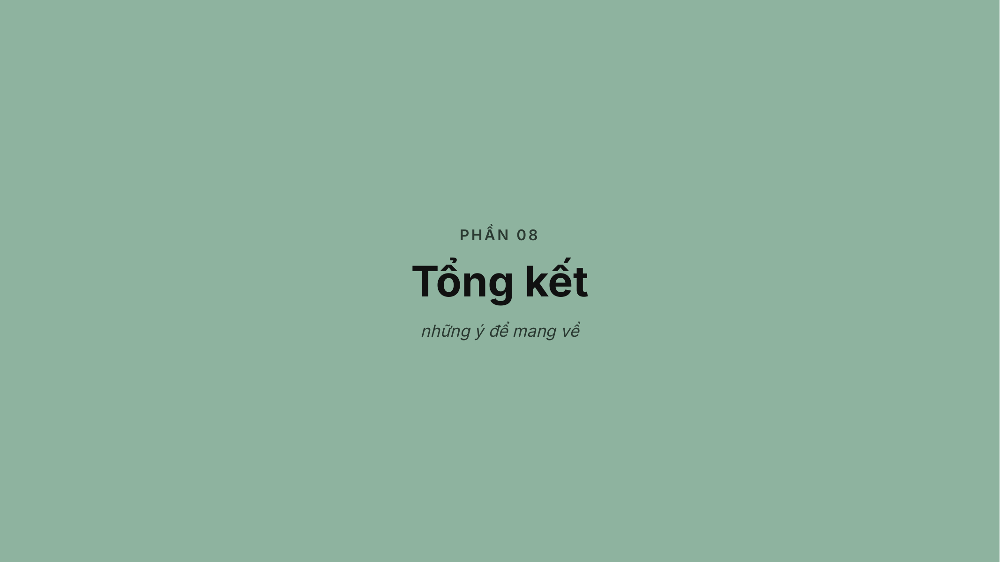

# AI IN ACTION  Day 1

> Nguồn authoritative: slide PDF. Mỗi heading `Slide N` là một source span ổn định cho citation và chunking.

<!-- chiron-source-span: {"source_span_id":"8e99a023-a97f-5b5c-b62d-58f6631e2f80","locator":{"kind":"page","page":1,"label":"Slide 1","section_title":"AI IN ACTION  Day 1","extraction_method":"pdf-text-layer"},"checksum":"4a2ccf36fd34d8a9579842c762ec55dbb6fed6ac2aa2206418609945dab1a318"} -->

## Slide 1 - AI IN ACTION  Day 1

AI & LLM Foundation Bạn đang dùng AI mỗi ngày — nhưng thực sự bên trong nó đang làm gì? Instructor: Mai Anh Nguyen Blue

---

<!-- chiron-source-span: {"source_span_id":"331dca74-b434-56e2-813c-7cf05eb5c64a","locator":{"kind":"page","page":2,"label":"Slide 2","section_title":"Mai Anh Nguyen Blue","extraction_method":"pdf-text-layer"},"checksum":"2df162e9af6dccf0edea574d9a679683e2f9867160d719d80c944060df777ecc"} -->

## Slide 2 - Mai Anh Nguyen Blue

Generalist Product Builder Linkedin | Facebook Instructor

- 2026 FPT Long Châu PM · Healthcare Product)

- 2025 Thongtincuuho.org Co-founder)

- 2025 FPT Software AI Center PM · AI Agent)

- 2021  2025 Xantus PM · On-chain Analytics, AI Agent)

- 2016  2021 DYNO, Kalapa PM · OCR, eKYC, Credit Scoring)

---

<!-- chiron-source-span: {"source_span_id":"0ca6bdb5-61ae-56a1-8ba3-ead2835d6777","locator":{"kind":"page","page":3,"label":"Slide 3","section_title":"AI IN ACTION  Day 1","extraction_method":"pdf-text-layer"},"checksum":"28a6b83cab03ffb0977c16798ceb3e884784096593535b324d97900e984869e1"} -->

## Slide 3 - AI IN ACTION  Day 1

Agenda

- Bức tranh AI & các tầng của AI

- Lịch sử AI 70 năm

- Bên trong LLM: cơ chế vận hành

- Từ LLM đến AI Agent

- Landscape: model hôm nay & cuộc đua hiện tại

- Chọn model & chi phí token

- Gọi API lần đầu

- Tổng kết — những ý để mang về
AI & LLM Foundation Từ "nghe AI" đến "gọi AI" trong một ngày

---

<!-- chiron-source-span: {"source_span_id":"afb6ecf1-2c15-5766-a70d-357eaed1ca01","locator":{"kind":"page","page":4,"label":"Slide 4","section_title":"1 Hiểu được","extraction_method":"pdf-text-layer"},"checksum":"c4b363a2548b3161ccab784f925a564628b32b7c2f32d9d0ebc804471c017107"} -->

## Slide 4 - 1 Hiểu được

Giải thích được LLM hoạt động thế nào — bằng trực giác, không cần công thức 2 Nắm được Token, context, chi phí, độ trễ liên hệ với nhau ra sao 3 Gọi được Lần gọi API đầu tiên — và hiểu cấu trúc của một lần gọi model 4 Build được Một chatbot dòng lệnh đơn giản có streaming — sản phẩm của chính bạn Hôm nay mình đi từ "nghe AI" đến "gọi AI"

### Cuối ngày này, mỗi bạn sẽ ra về với 4 thứ
Không cần nền toán. Chỉ cần tò mò và một chiếc máy tính.

---

<!-- chiron-source-span: {"source_span_id":"eaf15789-3f7e-5ab3-9554-834d7e12b15e","locator":{"kind":"page","page":5,"label":"Slide 5","section_title":"P H Ầ N 0 1","extraction_method":"pdf-text-layer"},"checksum":"bd19a4b4417fc5099f1ee5eb3d119e8cda81e5aed63a81d9c7366ae4b209184e"} -->

## Slide 5 - P H Ầ N 0 1

Bức tranh AI AI, machine learning, LLM nằm ở đâu trong cùng một hệ?

---

<!-- chiron-source-span: {"source_span_id":"93ef7a64-9902-5404-a9e6-be165cf6117b","locator":{"kind":"page","page":6,"label":"Slide 6","section_title":"AI, ML, Deep Learning, GenAI, LLM — nằm ở đâu trong cùng một hệ?","extraction_method":"pdf-text-layer"},"checksum":"caa30963eb0ec0c5f142d57ab9a08d54e7f55bb35fcb29e2719575dad6dc884e"} -->

## Slide 6 - AI, ML, Deep Learning, GenAI, LLM — nằm ở đâu trong cùng một hệ?

AI — chiếc ô lớn nhất: mọi hệ thống có yếu tố “thông minhˮ. Machine learning — học từ dữ liệu thay vì viết luật tay. Deep learning — mạng nơ-ron nhiều tầng tự học đặc trưng. Generative AI — sinh nội dung mới: văn bản, ảnh, code. LLM — model nền chuyên ngôn ngữ, tim của làn sóng hiện nay. ARTIFICIAL INTELLIGENCE MACHINE LEARNING DEEP LEARNING GENERATIVE AI LLM GPT · Claude · Kimi kể cả hệ luật tay, robot… lọc spam · gợi ý phim nhận diện ảnh · giọng nói văn bản · ảnh · code từ rộng đến hẹp LLM không phải toàn bộ AI — nhưng nó là tầng nền của gần hết trải nghiệm AI bạn dùng hôm nay

---

<!-- chiron-source-span: {"source_span_id":"17981155-7940-5432-91fa-8d760afde37b","locator":{"kind":"page","page":7,"label":"Slide 7","section_title":"Discriminative AI","extraction_method":"pdf-text-layer"},"checksum":"f06dd6c5dd14744708b6861e4988a07e6799883aab3b83f42116feaa6a65aacf"} -->

## Slide 7 - Discriminative AI

Giỏi phân loại, dự đoán: lọc spam, phát hiện gian lận, nhận diện ảnh. Input → một nhãn, một con số Generative AI Sinh ra thứ mới: văn bản, ảnh, code. ChatGPT, Claude, Midjourney. Prompt → nội dung mới Agentic AI

### Nhận mục tiêu rồi tự làm nhiều bước
lập kế hoạch, dùng công cụ, hành động. Goal → Plan → Action Ba nhóm AI chính: phân loại · sinh nội dung · hành động LLM là engine chung của cả Generative lẫn Agentic — cuối buổi sáng mình sẽ thấy agent khác LLM ở đâu Hành trình khóa học: LLM Foundation → Agent → Multi-Agent → Deploy → Evaluate

---

<!-- chiron-source-span: {"source_span_id":"17237d03-de2a-563d-9c81-34de77e9536d","locator":{"kind":"page","page":8,"label":"Slide 8","section_title":"P H Ầ N 0 2","extraction_method":"pdf-text-layer"},"checksum":"78b494cefe5bb022eb57c073d9e92d9df856a27cf1dbf704ecc6039a6cb012ec"} -->

## Slide 8 - P H Ầ N 0 2

Lịch sử AI 70 năm của những lần chạm trần và đổi nền tảng

---

<!-- chiron-source-span: {"source_span_id":"9d7e5210-c0fd-5d12-9c69-6ae140a1ce1f","locator":{"kind":"page","page":9,"label":"Slide 9","section_title":"Lịch sử AI 70 năm","extraction_method":"pdf-text-layer"},"checksum":"de3f1953eaa43e9902166619122fdcf744f8e3f2f91e1f148d3f489882483c93"} -->

## Slide 9 - Lịch sử AI 70 năm

Khai sinh, lời hứa đầu tiên 2 lần mùa đông, cách tiếp cận chạm trần Từ model đơn lẻ sang system có khả năng hành động như agent

---

<!-- chiron-source-span: {"source_span_id":"2cb0087e-165c-5678-b8e4-6b093957656f","locator":{"kind":"page","page":10,"label":"Slide 10","section_title":"1956: Dartmouth Workshop","extraction_method":"pdf-text-layer"},"checksum":"48dcc9122ae820772fde7137ecb1933fa9752dd5039b4cc31da93689f763b8b1"} -->

## Slide 10 - 1956: Dartmouth Workshop

"Artificial Intelligence" ra đời với ý tưởng: nếu trí thông minh có thể được mô tả đủ rõ, thì máy móc cũng có thể mô phỏng lại nó.

---

<!-- chiron-source-span: {"source_span_id":"faae9378-713f-5350-9361-b0efab0e1598","locator":{"kind":"page","page":11,"label":"Slide 11","section_title":"1969: Perceptrons","extraction_method":"pdf-text-layer"},"checksum":"5006a2fd0fc8394b75f06cb3a63c707b11e32f7d13c6c6839c44d95718795fab"} -->

## Slide 11 - 1969: Perceptrons

### Các hướng đi lần lượt chạm trần
Hướng symbolic (dạy máy bằng luật/quy tắc): bắt đầu đuối trước thế giới quá nhiều ngữ cảnh Hướng Perceptron (thay vì viết hết luật, mình có thể cho máy học từ ví dụ) cũng gặp vấn đề vì quá đơn giản

---

<!-- chiron-source-span: {"source_span_id":"8eeea142-f36c-5421-bb6a-efae91dd3eeb","locator":{"kind":"page","page":12,"label":"Slide 12","section_title":"1973: Báo cáo Lighthill — cú hích kết thúc kỳ lạc quan đầu","extraction_method":"pdf-text-layer"},"checksum":"b9c59a86ff86bddfbf2bfb7450326f6e33172dda3049e74adad7f0d2d181b074"} -->

## Slide 12 - 1973: Báo cáo Lighthill — cú hích kết thúc kỳ lạc quan đầu

Chính phủ Anh nhờ James Lighthill đánh giá lại toàn ngành AI. Ông kết luận thẳng: những gì AI làm được đi quá xa so với lời hứa. Nguồn tiền đổ vào AI ở Anh và Mỹ bị cắt mạnh → mở màn mùa đông AI lần thứ nhất. Lighthill, J. 1973, “Artificial Intelligence: A General Surveyˮ, Science Research Council — chilton-computing.org.uk

---

<!-- chiron-source-span: {"source_span_id":"0d0414e5-1c3c-546b-860c-b67727e3cecc","locator":{"kind":"page","page":13,"label":"Slide 13","section_title":"Bài toán nhỏ — trông khá thông minh ✓","extraction_method":"pdf-text-layer"},"checksum":"9a2e42f8f7f1e23497c9213f6deff1b0e7ea72a57f7397db1fe5b9893abb9862"} -->

## Slide 13 - Bài toán nhỏ — trông khá thông minh ✓

Ít nhánh, máy duyệt hết được → kết quả trông “thông minhˮ. Thế giới thật — mỗi bước sinh ra quá nhiều nhánh B Ù N G N Ổ TỔ H Ợ P Mùa đông AI lần 1: 1974-1980

---

<!-- chiron-source-span: {"source_span_id":"fd5782d4-012f-5cbe-aadd-0105324eb48b","locator":{"kind":"page","page":14,"label":"Slide 14","section_title":"1980: Hệ chuyên gia (expert system)","extraction_method":"pdf-text-layer"},"checksum":"ca98031d00123585fa387f5262d80696df78e8bdf1bb9c704aa8853d1689b167"} -->

## Slide 14 - 1980: Hệ chuyên gia (expert system)

Đặt lại vấn đề: "Nếu AI chỉ giải thật tốt một loại bài toán chuyên môn hẹp thì sao?"

- Sự ra đời của expert systems
AI đổi chiến lược: thôi theo đuổi trí tuệ tổng quát và tập trung giải thật tốt một miền hẹp bằng cách mã hóa tri thức chuyên gia thành luật

---

<!-- chiron-source-span: {"source_span_id":"737ce067-1bf6-5a4b-8ae6-d74c125a07c6","locator":{"kind":"page","page":15,"label":"Slide 15","section_title":"Mùa đông AI lần 2","extraction_method":"pdf-text-layer"},"checksum":"216fb003d7cdae6f75b5d0858c781f96bd7974427a20959326a88bdaa952d861"} -->

## Slide 15 - Mùa đông AI lần 2

Expert systems từng tạo ra giá trị thật, nhưng càng mở rộng thì càng lộ trần: tri thức phải nhập bằng tay, luật càng nhiều càng khó cập nhật, và hệ thống khó đứng vững trước ngoại lệ mới.

- Mùa đông AI lần 2

---

<!-- chiron-source-span: {"source_span_id":"ed975983-5632-574b-af5e-903ae3ea4abd","locator":{"kind":"page","page":16,"label":"Slide 16","section_title":"Sự ra đời của Deep Learning","extraction_method":"pdf-text-layer"},"checksum":"98e67616811a1313871b51e41f805af716c03714556d12907055705bc786baa1"} -->

## Slide 16 - Sự ra đời của Deep Learning

### Sau mùa đông lần hai, câu hỏi của cả ngành đổi hẳn
"Nếu không thể viết hết tri thức thế giới vào máy, thì có thể để máy tự học nó từ dữ liệu không?"

---

<!-- chiron-source-span: {"source_span_id":"bec943d9-4dc9-51d5-900e-cf6042652369","locator":{"kind":"page","page":17,"label":"Slide 17","section_title":"2009: Fei-Fei Li và ImageNet — cuộc cách mạng của dữ liệu","extraction_method":"pdf-text-layer"},"checksum":"319236a86406ad4b7a52383747f6630785a5558cf447014cc24c803305ee20a4"} -->

## Slide 17 - 2009: Fei-Fei Li và ImageNet — cuộc cách mạng của dữ liệu

Trong khi cả ngành chạy theo thuật toán thông minh hơn, Fei-Fei Li chọn con đường khác: xây bộ dữ liệu lớn hơn — 14 triệu ảnh được gán nhãn tay, hơn 20.000 loại vật. Ba năm sau, chính bộ dữ liệu đó là sân khấu cho cú nổ AlexNet 2012 → bài học định hình cả kỷ nguyên: đôi khi dữ liệu tốt hơn đánh bại thuật toán khôn hơn. Deng, J. et al. 2009, “ImageNet: A Large-Scale Hierarchical Image Databaseˮ, CVPR — doi.org/10.1109/CVPR.2009.5206848 · Fei-Fei Li, TED 2015 — ted.com

---

<!-- chiron-source-span: {"source_span_id":"810d5e57-9b53-5355-8da0-84332cbdda05","locator":{"kind":"page","page":18,"label":"Slide 18","section_title":"Deep Learning khác Machine Learning truyền thống ở chỗ nào?","extraction_method":"pdf-text-layer"},"checksum":"1ec8df68087125b652e8a08cc792ba27d1fa7a072af4b57b1cb6d6cfc236c454"} -->

## Slide 18 - Deep Learning khác Machine Learning truyền thống ở chỗ nào?

Không cần con người thiết kế đặc trưng bằng tay — mạng sâu TỰ học đặc trưng từ dữ liệu thô, từ đơn giản đến phức tạp

---

<!-- chiron-source-span: {"source_span_id":"d0371f05-a8d3-555d-a6b3-9f1aefc078bd","locator":{"kind":"page","page":19,"label":"Slide 19","section_title":"ImageNet","extraction_method":"pdf-text-layer"},"checksum":"4134f86c667b0f28bc417bb510d0844f4c80c372c74c006a7d866ee610734c91"} -->

## Slide 19 - ImageNet

2012: AlexNet AlexNet chiến thắng ở ImageNet Large Scale Visual Recognition Challenge ImageNet cho mô hình ăn một lượng dữ liệu chưa từng có ở thời điểm đó. Kiến trúc sâu cho phép học dần từ cạnh, hình, bộ phận, rồi đến đối tượng. GPU cung cấp đủ năng lực tính toán để quá trình huấn luyện trở nên khả thi.

---

<!-- chiron-source-span: {"source_span_id":"96890e05-3815-5374-b419-67d1a145bf50","locator":{"kind":"page","page":20,"label":"Slide 20","section_title":"2016: AlphaGo","extraction_method":"pdf-text-layer"},"checksum":"fbb50980f5f12426cbc7793e6446c8cbf455953939de87b6db61debb8c46ed2a"} -->

## Slide 20 - 2016: AlphaGo

AlphaGo và nước đi số 37 Ban đầu nó học từ khoảng 150.000 ván cờ của chuyên gia con người để có trực giác khởi đầu

- Tạo ra nhiều bản sao của AlphaGo và để chúng tự chơi với chính mình hàng triệu lần

- Hệ thống không chỉ học từ những gì con người đã biết, mà còn tự mở rộng không gian chiến lược
bằng cách khám phá những nước đi chưa từng được thử trước đó.

---

<!-- chiron-source-span: {"source_span_id":"e3d86bca-6a54-5dff-b5b4-9ea3710ccc37","locator":{"kind":"page","page":21,"label":"Slide 21","section_title":"Nút thắt của RNN: đọc hết rồi mới nói — từng bước một","extraction_method":"pdf-text-layer"},"checksum":"68ee6730600243c180cfcd425da02f2a4bc056565ff53120bd59303cb4bbc28a"} -->

## Slide 21 - Nút thắt của RNN: đọc hết rồi mới nói — từng bước một

① ② ③ ④ ⑤ ⑥ 知 识 就 是 力 量 đọc lần lượt từng chữ nén cả câu vào MỘT vector CỔ CHAI DECODER sinh từng từ một Knowledge is power ① ② ③ ① Câu càng dài → càng quên chữ đầu cá to chữ đầu “mờˮ dần trong vector duy nhất — như người cố nhớ một câu rất dài bằng trí nhớ ngắn hạn Hôm qua tôi đi chợ mua được một con ② Từng bước một → chậm, khó mở rộng 1 → 2 → 3 → … → 100 ⏱ muốn chữ thứ 100 phải chờ đủ 99 bước trước — không song song được, khó scale lên model lớn 1 vector “ý câuˮ Transformer thắng không phải vì phép màu — nó tháo đúng nút thắt này: cho mọi từ nhìn nhau cùng lúc Sutskever et al. 2014, “Sequence to Sequence Learning with Neural Networksˮ · Wu et al. 2016, Google Neural Machine Translation — arxiv.org/abs/1609.08144

---

<!-- chiron-source-span: {"source_span_id":"e59cbde3-ebd6-5078-b4e4-027936b55cbe","locator":{"kind":"page","page":22,"label":"Slide 22","section_title":"2017: Transformer","extraction_method":"pdf-text-layer"},"checksum":"875b9906dbce8f15192672710cb497afda5ebdd1873ffb8c60e97c0627fce3eb"} -->

## Slide 22 - 2017: Transformer

Transformer là bước ngoặt vì nó cho mô hình hiểu ngôn ngữ theo cách linh hoạt hơn: mỗi từ có thể nhìn sang những từ quan trọng khác trong cả câu, thay vì chỉ đi tuần tự từng bước → trở thành nền móng kỹ thuật cho GPT, BERT và toàn bộ làn sóng LLM sau đó.

---

<!-- chiron-source-span: {"source_span_id":"1531699b-e8b3-5f9d-b017-4bc36aa582c4","locator":{"kind":"page","page":23,"label":"Slide 23","section_title":"2022: ChatGPT","extraction_method":"pdf-text-layer"},"checksum":"c4f109256d1a1bcbb8f967ad9743f3507d892d0c52319a422a56a7fb6afa1b32"} -->

## Slide 23 - 2022: ChatGPT

ChatGPT xuất hiện như một trải nghiệm đại chúng Lần đầu tiên rất đông người dùng phổ thông có thể trực tiếp chạm vào một mô hình ngôn ngữ mạnh, thông qua một giao diện đơn giản đến mức ai cũng hiểu cách dùng

---

<!-- chiron-source-span: {"source_span_id":"520aef4e-f2d7-5629-ae1c-2cd50745d6db","locator":{"kind":"page","page":24,"label":"Slide 24","section_title":"Trước khi ChatGPT bùng nổ, nghiên cứu mô hình","extraction_method":"pdf-text-layer"},"checksum":"4f98222777b09455a35edb73fa6a49c70119d80f9b9b7ad5c3b100d596b6298a"} -->

## Slide 24 - Trước khi ChatGPT bùng nổ, nghiên cứu mô hình

ngôn ngữ phân thành rất nhiều nhánh ChatGPT xuất hiện, chứng minh hiệu quả → trong tâm của toàn ngành bắt đầu dồn về cùng một trục

---

<!-- chiron-source-span: {"source_span_id":"51daaa52-90a0-5cb4-9d48-af118fda6a2f","locator":{"kind":"page","page":25,"label":"Slide 25","section_title":"P H Ầ N 0 3","extraction_method":"pdf-text-layer"},"checksum":"75763d8e32c648bc037648ddf05cae210b30815a72f1f7cea05c6dd306ede879"} -->

## Slide 25 - P H Ầ N 0 3

Bên trong LLM từ vòng lặp đoán token đến giới hạn của model

---

<!-- chiron-source-span: {"source_span_id":"375ae1e4-4fb0-5b8d-810b-1908bd6be42b","locator":{"kind":"page","page":26,"label":"Slide 26","section_title":"Bên trong LLM — bản đồ 5 chặng của buổi sáng","extraction_method":"pdf-text-layer"},"checksum":"6a25d0b08cd46c2e4f0f39a320319c3960c61bf3f73287b1b8bc60b07d9f6264"} -->

## Slide 26 - Bên trong LLM — bản đồ 5 chặng của buổi sáng

Nếu giữa đường thấy lạc — quay lại bản đồ này. Mỗi chặng chỉ có một câu chốt duy nhất. Cỗ máy đoán token LLM là gì · xác suất · vòng lặp · token · context Attention cách model nhìn ngữ cảnh · multi-head · ứng dụng Model được tạo ra tham số · training · RLHF Model có “hiểuˮ không? tranh luận · thí nghiệm Othello- GPT Giới hạn & sống chung cutoff · hallucination · học vẹt · cách chạm vào Thần chú xuyên suốt: “Model chỉ đoán token tiếp theo — mọi thứ khác là hệ quả.ˮ 3A 3B 3C 3D 3E

---

<!-- chiron-source-span: {"source_span_id":"f7adc8d4-cdc0-5b71-8a4d-bf25c14a40c6","locator":{"kind":"page","page":27,"label":"Slide 27","section_title":"1 model nền","extraction_method":"pdf-text-layer"},"checksum":"1a25cd0befa12b7f7c7194df59d5e8fb34cb058a45576431e106044564815324"} -->

## Slide 27 - 1 model nền

LLM 💬 Chatbot 📝 Tóm tắt tài liệu 💻 Viết code 🌐 Dịch & phân tích ⟵ LLM là gì? — một bộ não nền, không phải một chatbot LLM Large Language Model) là một mô hình ngôn ngữ rất lớn, thường dựa trên kiến trúc Transformer, được luyện trên hàng nghìn tỷ mảnh chữ để học cách đoán mảnh chữ tiếp theo trong ngữ cảnh. Nhờ được luyện đủ rộng, nó trở thành một nền chung: thay vì mỗi việc train một model riêng, cùng một model làm được rất nhiều việc. Chatbot chỉ là một dạng sản phẩm đóng gói quanh bộ não đó — lớp áo bên ngoài. LLM = bộ não ngôn ngữ dùng chung cho mọi việc — sản phẩm bạn thấy chỉ là lớp áo bên ngoài Model hiện nay chủ yếu là kiến trúc decoder-only GPT, Claude, Gemini, Kimi), nhiều model dùng MoE; sau pre-training còn các bước căn chỉnh SFT, RLHF/DPO) và luyện suy luận (reasoning training, từ 2025.

---

<!-- chiron-source-span: {"source_span_id":"255d6905-1b49-5ab1-8682-b312fb76dedb","locator":{"kind":"page","page":28,"label":"Slide 28","section_title":"Bên trong Transformer: đầu ra luôn là một phân bố xác suất","extraction_method":"pdf-text-layer"},"checksum":"3ff5d8d1c469fd76b037cff15eb5b433e71969cd8dd091b50ef373fb30db1d59"} -->

## Slide 28 - Bên trong Transformer: đầu ra luôn là một phân bố xác suất

Với mọi ngữ cảnh, model chấm điểm MỌI từ trong từ vựng — “landˮ 22%, “forestˮ 9%… — rồi chọn theo xác suất đó Transformers, the tech behind LLMs - 3Blue1Brown

---

<!-- chiron-source-span: {"source_span_id":"7f1254d8-4973-5ea4-b1cb-99f3a97f779c","locator":{"kind":"page","page":29,"label":"Slide 29","section_title":"Sinh văn bản = đoán → nối vào câu → đoán tiếp","extraction_method":"pdf-text-layer"},"checksum":"5988d4dfa205ce4723500b51a2f9a42cbdb51e49b33251a5276269217b145ddc"} -->

## Slide 29 - Sinh văn bản = đoán → nối vào câu → đoán tiếp

Mỗi token mới được nối vào ngữ cảnh, rồi model chạy lại từ đầu — vòng lặp predict → append → rerun Transformers, the tech behind LLMs - 3Blue1Brown

---

<!-- chiron-source-span: {"source_span_id":"c9d2afd4-6e1f-5529-8a58-c406c4c6d8b6","locator":{"kind":"page","page":30,"label":"Slide 30","section_title":"Token: model không đọc \"từ\", model đọc mảnh chữ","extraction_method":"pdf-text-layer"},"checksum":"8156ea236a2187d8d5129e2c93e04078af746368ff45ee70740e4e10aae57210"} -->

## Slide 30 - Token: model không đọc "từ", model đọc mảnh chữ

Model không nhìn từ nguyên vẹn. Nó cắt văn bản thành các mảnh nhỏ gọi là token: có từ là một mảnh, có từ vỡ ba bốn mảnh, cả dấu câu và khoảng trắng cũng là mảnh. Ví dụ: "Hello world" ≈ 2 token, nhưng "Xin chào" có thể tới 34 token. Tiếng Việt, code, JSON tốn token hơn tiếng Anh thường — vì dấu thanh, ký tự đặc biệt và cấu trúc bị cắt nhỏ ra. Mọi thứ model làm đều quy ra token — và mỗi token đều có giá. Nhớ điều này khi sang phần chi phí. Thử trực tiếp: platform.openai.com/tokenizer · Số token chính xác phụ thuộc tokenizer của từng model.

---

<!-- chiron-source-span: {"source_span_id":"fbef4043-c991-5985-8c8e-cc0e58f6f9ec","locator":{"kind":"page","page":31,"label":"Slide 31","section_title":"Context: bàn làm việc có hạn của model","extraction_method":"pdf-text-layer"},"checksum":"849f5c70f171b6066b21ccc7adbb2459b2e7ee52436359aef28a9e93167ceadc"} -->

## Slide 31 - Context: bàn làm việc có hạn của model

Mỗi lần trả lời, model chỉ nhìn được một lượng chữ có

### hạn — gọi là context. Hãy hình dung một bàn làm việc
mọi thứ muốn model "thấy" phải bày lên bàn. Quy đổi: 128K token ≈ một cuốn sách 300 trang; 1M token ≈ 45 cuốn sách trên bàn cùng lúc. Bàn đầy quá thì đồ ở giữa bàn dễ bị bỏ sót — đặt điều quan trọng ở giữa một prompt rất dài, model có thể "quên" mất. Context càng dài càng tốn tiền và càng chậm — bàn rộng không có nghĩa là dùng tốt Hiện tượng “quên phần giữaˮ: Liu et al. 2023, “Lost in the Middleˮ — arxiv.org/abs/2307.03172. Model thế hệ mới đã cải thiện đáng kể nhưng chưa hết hẳn.

---

<!-- chiron-source-span: {"source_span_id":"7ffc6ba3-be68-534f-91e8-3e50e20da8ae","locator":{"kind":"page","page":32,"label":"Slide 32","section_title":"Attention: mỗi từ được “nhìn sangˮ những từ quan trọng khác","extraction_method":"pdf-text-layer"},"checksum":"8585c995f211ad417ba6e56b008915a5e64efe25797e7b2a067bf8562db9199a"} -->

## Slide 32 - Attention: mỗi từ được “nhìn sangˮ những từ quan trọng khác

### Thay vì đọc tuần tự từng chữ, cơ chế attention cho phép mỗi token
Chủ động “quay đầuˮ nhìn lại các token trước đó trong câu Chấm điểm mức độ liên quan của từng token đối với nghĩa của mình Khóa nghĩa theo ngữ cảnh — “nóˮ là quyển sách hay cái túi, tùy theo nó chú ý vào từ nào Đây chính là chữ T trong GPT — và là lý do model hiểu ngữ cảnh tốt hơn hẳn các thế hệ trước Video minh họa: Attention in transformers, step-by-step - 3Blue1Brown

---

<!-- chiron-source-span: {"source_span_id":"cb3ee467-de08-563e-9f8e-d5b5eead1571","locator":{"kind":"page","page":33,"label":"Slide 33","section_title":"Minh họa khái niệm: token \"nó\" cần \"chú ý\" (attention) tới token nào để hiểu đúng nghĩa?","extraction_method":"pdf-text-layer"},"checksum":"c663034cc3dd92397a8c6d63fbcc81e57df67bf1b421093e349456606f491d14"} -->

## Slide 33 - Minh họa khái niệm: token "nó" cần "chú ý" (attention) tới token nào để hiểu đúng nghĩa?

0.05 0.04 0.32 0.28 0.06 0.10 0.08 Lan bỏ quyển sách vào túi vì nó quá dày "Lan bỏ quyển sách vào túi vì nó quá dày" — muốn biết "nó" = quyển sách hay cái túi, mô hình so khớp "nó" với TẤT CẢ token trước đó, không chỉ token liền kề. Cung càng dày/đậm = trọng số attention càng cao (ở đây: hướng mạnh về "quyển"+"sách", không phải "túi").

---

<!-- chiron-source-span: {"source_span_id":"3fcaf1d1-8ea6-5f3d-8e3b-3e12cb92c6db","locator":{"kind":"page","page":34,"label":"Slide 34","section_title":"Nhìn lân cận hay nhìn toàn cảnh?","extraction_method":"pdf-text-layer"},"checksum":"a7553b48c85379fa876c2f87aa76d0eda3906ccb79170052faa23895ca219edb"} -->

## Slide 34 - Nhìn lân cận hay nhìn toàn cảnh?

Convolution — cửa sổ nhỏ quanh mỗi từ cửa sổ = 3 từ “nóˮ muốn hiểu nghĩa thì phải nhìn tới “quyển/sáchˮ — nhưng chúng nằm ngoài cửa sổ → mối liên hệ xa bị cắt. Attention — mọi từ đều trong tầm nhìn “nóˮ nhìn lại toàn bộ câu và tự chọn từ quan trọng — nét đậm ở “quyểnˮ, “sáchˮ nghĩa là chú ý mạnh vào đó. Lan bỏ quyển sách vào túi vì nó

- 
Lan bỏ quyển sách vào túi vì nó Cửa sổ nhỏ thì nhanh nhưng mù xa — attention đổi tốc độ lấy khả năng giữ ngữ cảnh dài, và đó là bước ngoặt Ẩn dụ so sánh từ bài nói của Łukasz Kaiser OpenAI, đồng tác giả “Attention Is All You Needˮ)

---

<!-- chiron-source-span: {"source_span_id":"5a19eef8-7f6f-5505-b7d4-2cdd658755bf","locator":{"kind":"page","page":35,"label":"Slide 35","section_title":"Multi-head: cùng một câu, nhiều con mắt chuyên môn nhìn song song","extraction_method":"pdf-text-layer"},"checksum":"01a4043dcf36ee6b35f9739c05505e331c9c55f06e167870ba3e1dbde0203e1c"} -->

## Slide 35 - Multi-head: cùng một câu, nhiều con mắt chuyên môn nhìn song song

Attention không chỉ có một "con mắt". Model có nhiều con

### mắt chuyên môn nhìn cùng một câu một lúc
👁 Con mắt đại từ — lo việc "nó" là con mèo hay cái bàn. 👁 Con mắt không gian — lo việc cái gì nằm trên cái gì. 👁 Con mắt cú pháp — lo nhịp câu, dấu câu, khoảng cách. Mỗi con mắt nhìn một khía cạnh, rồi model tổng hợp lại thành hiểu biết đầy đủ hơn về câu. Một con mắt nhìn được một góc — nhiều con mắt cùng nhìn mới thành "hiểu ngữ cảnh" Multi-head attention — Vaswani et al. 2017 — arxiv.org/abs/1706.03762

---

<!-- chiron-source-span: {"source_span_id":"0dff18f1-bbf8-5f4d-980b-3715a75d5371","locator":{"kind":"page","page":36,"label":"Slide 36","section_title":"1 Đặt điều quan trọng đầu – cuối","extraction_method":"pdf-text-layer"},"checksum":"38f476080518862ac626c5c6a33af78b63b4eb4e7b149f658769b903db630094"} -->

## Slide 36 - 1 Đặt điều quan trọng đầu – cuối

Đầu và cuối prompt được chú ý nhiều nhất; đồ ở giữa dễ bị bỏ sót — yêu cầu quan trọng đừng chôn giữa. 2 Giữ bàn làm việc sạch Context rác = attention rác. Khi chat dài, tóm tắt lại thay vì kéo theo mọi thứ; khi vibe code, đưa đúng file liên quan, không dán cả repo. 3 Cho tra sổ thay vì bắt nhớ Tài liệu dài: lấy đoạn liên quan nhét vào context RAG) thay vì trông chờ model nhớ hết hoặc nhét cả cuốn. Hiểu attention để dùng AI hiệu quả: quản context = quản sự chú ý Attention có hạn và có "điểm mù". Vì vậy, cách bạn bày context quyết định model chú ý vào đâu: Agent mạnh không phải vì context khổng lồ — mà vì nó có tools để lấy đúng thứ vào bàn làm việc đúng lúc

---

<!-- chiron-source-span: {"source_span_id":"3d95e9f5-0b36-5778-9a78-1db937d1f236","locator":{"kind":"page","page":37,"label":"Slide 37","section_title":"2020  GPT3","extraction_method":"pdf-text-layer"},"checksum":"731de96079d42b17dbbb103eb537c58fa39464e8c48f6c4a43ebade214120d80"} -->

## Slide 37 - 2020  GPT3

175 tỷ một "bác sĩ đa năng" — mọi token đều đi qua toàn bộ khớp nối (dense) 2026  Kimi K3 2.800 tỷ một "bệnh viện đa khoa" — mỗi token chỉ gọi vài chuyên gia MoE compute / dữ liệu (thang log) → test loss ↓ Luật chơi 20202024: cứ thêm compute + dữ liệu là model khôn lên một cách dự đoán được (scaling law, Kaplan et al. 2020 Tham số (parameter): những "khớp nối" model học được Sau khi luyện xong, những gì model "biết" nằm trong các con số cố định bên trong gọi là tham số — hãy hình dung như khớp nối thần kinh: luyện càng kỹ, các khớp nối càng được siết đúng. Tham số không phải thứ bạn chỉnh khi dùng model — nó được đóng gói sẵn trong "bộ não" (file weights). Bạn chỉ chỉnh được context và các núm vặn lúc gọi (như temperature). Nhiều tham số ≠ tốn hơn tuyến tính — nhờ MoE, bệnh viện lớn gấp 16 lần mà chi phí mỗi ca khám gần như không đổi MoE Shazeer et al. 2017 — arxiv.org/abs/1701.06538 · Kimi K3 16/7/2026 2.8 nghìn tỷ tham số MoE — k3-kimi.com

---

<!-- chiron-source-span: {"source_span_id":"85d5e3bf-aa72-5933-8f79-b534433a6c50","locator":{"kind":"page","page":38,"label":"Slide 38","section_title":"LLM được tạo ra như thế nào? — đọc nhiều, được chỉ, được uốn nắn, luyện đề","extraction_method":"pdf-text-layer"},"checksum":"285c8fb900a05e5f76509e532324654d8d977301ffd4a4cb2b07aabaedc03999"} -->

## Slide 38 - LLM được tạo ra như thế nào? — đọc nhiều, được chỉ, được uốn nắn, luyện đề

① Pre-training — "đọc cả thư viện": học tiếng nói và kiến thức từ hàng nghìn tỷ token. ② SFT — "được chỉ cách trả lời": học theo ví dụ mẫu để ra dáng trợ lý. ③ RLHF/DPO — "được uốn nắn": học theo phản hồi con người, an toàn và dễ chịu hơn. ④ Luyện suy luận — "giải đề tự chấm" (từ 2025 luyện toán/code có đáp án kiểm chứng được → model biết làm nháp trước khi trả lời. Đọc vạn cuốn sách chưa chắc biết trả lời phỏng vấn — đó là lý do cần bước ②, ③, ④ Ouyang et al. 2022, InstructGPT — arxiv.org/abs/2203.02155 · Rafailov et al. 2023, DPO — arxiv.org/abs/2305.18290 · RLVR RL with verifiable rewards.

---

<!-- chiron-source-span: {"source_span_id":"48aa9e08-c4f6-5149-8870-6253afd688bf","locator":{"kind":"page","page":39,"label":"Slide 39","section_title":"RLHF: ba bước uốn cỗ máy đoán token thành trợ lý biết nghe lời","extraction_method":"pdf-text-layer"},"checksum":"7332187e810cc896c9755e9a94f1839699b01b16d64c5b0b5273eb8731946568"} -->

## Slide 39 - RLHF: ba bước uốn cỗ máy đoán token thành trợ lý biết nghe lời

① Model viết nhiều câu trả lời «Cùng một câu hỏi» ↓ LLM Trả lời A Trả lời B Trả lời C Trả lời D ② Người chấm xếp hạng Trả lời B 1 Trả lời D 2 Trả lời A 3 Trả lời C 4 ↓ REWARD MODEL máy chấm điểm thay người ③ Huấn luyện theo điểm LLM ↓ câu trả lời vừa viết ↓ điểm: 9.2 / 10tăng xác suất câu ghi điểm cao lặp lại hàng nghìn lần → model dần “biết nghe lờiˮ Cỗ máy đoán token + điểm xếp hạng của con người → trợ lý helpful · harmless · honest Ouyang et al. 2022, “Training language models to follow instructions with human feedbackˮ InstructGPT — arxiv.org/abs/2203.02155 · DPO (cách đơn giản hơn, 2023 — arxiv.org/abs/2305.18290

---

<!-- chiron-source-span: {"source_span_id":"8b37dcf6-0c92-542e-ba23-8dee8f6b8c2d","locator":{"kind":"page","page":40,"label":"Slide 40","section_title":"1 Mô hình thế giới bên trong?","extraction_method":"pdf-text-layer"},"checksum":"c0388d3faca9482bea485768a439c88c8c5aaf82c73b049d7dff4b0ab9a09b10"} -->

## Slide 40 - 1 Mô hình thế giới bên trong?

? nén thế giới thành biểu diễn có cấu trúc 2 Nôn lại dữ liệu huấn luyện? chỉ ghép các mẫu chữ theo xác suất LLM có thực sự “hiểuˮ — hay chỉ là vẹt thống kê? Chỉ đoán token tiếp theo thôi — vậy sao trông giống đang hiểu mình nói gì? Tranh luận từ Turing 1950, “Computing Machinery and Intelligenceˮ, Mind · “Stochastic parrotsˮ: Bender, Gebru, McMillan-Major & Shmitchell 2021, FAccTʼ21 · Hình minh họa: Martin Wattenberg Harvard)

---

<!-- chiron-source-span: {"source_span_id":"04cf2ecd-e17a-5e21-80b1-e02e9d61090c","locator":{"kind":"page","page":41,"label":"Slide 41","section_title":"Đầu vào duy nhất: chuỗi token biên bản ván cờ","extraction_method":"pdf-text-layer"},"checksum":"065c3b5f04950e6aa604f74eef211876db64d07939f4b44bd9d2a26f0c4584fe"} -->

## Slide 41 - Đầu vào duy nhất: chuỗi token biên bản ván cờ

C4 C3 D3 C5 D6 F4 B4 C6 B5 B3 B6 E3 C2 A4 A5 A6 D2? Ba trạng thái bàn cờ thật mà con người nhìn được — còn model thì không bao giờ thấy. Thí nghiệm Othello-GPT: dạy cỗ máy đoán chữ chơi cờ

- Không được dạy luật chơi

- Không hề thấy bàn cờ 88

- Không biết quân trắng–đen — chỉ thấy chuỗi ký tự
Câu hỏi: đoán được nước đi tiếp theo không? — chỉ từ chuỗi ký tự đó thôi Li, Hopkins, Bau, Viégas, Pfister & Wattenberg 2023, “Emergent World Representations: Exploring a Sequence Model Trained on a Synthetic Taskˮ, ICLR 2023 Oral · arXiv:2210.13382

---

<!-- chiron-source-span: {"source_span_id":"cd7ae40d-a503-5444-8204-6cbea68102fd","locator":{"kind":"page","page":42,"label":"Slide 42","section_title":"Muốn đi hợp lệ, nó buộc phải tự dựng lại bàn cờ trong đầu","extraction_method":"pdf-text-layer"},"checksum":"63fca00c1b422ae893e9417850eac877d0444f165d4ea7864c1c794c0c455ad1"} -->

## Slide 42 - Muốn đi hợp lệ, nó buộc phải tự dựng lại bàn cờ trong đầu

ĐẦU VÀO DUY NHẤT C4 C3 D3 C5 D6 F4 B4 C6 B5 B3 B6 E3 C2 A4 A5 A6 D2? chuỗi token biên bản ván cờ — không luật chơi, không bàn cờ, không quân trắng–đen

- 
BÊN TRONG NÃO MODEL một "bàn cờ ẩn" tự hình thành — không ai dạy

- 
ĐẦU RA F5

- nước đi hợp lệ
tỷ lệ đi sai luật chỉ 0.01% đi hợp lệ ⇒ phải biết ô nào trắng, ô nào đen, ô nào trống Không ai cho nó xem bàn cờ — để đoán đúng token tiếp theo, cỗ máy tự xây một mô hình thế giới bên trong

---

<!-- chiron-source-span: {"source_span_id":"e1c8d601-3d79-51ef-ad1b-764c4d12c1ce","locator":{"kind":"page","page":43,"label":"Slide 43","section_title":"1 Que thử đọc được toàn bộ bàn cờ","extraction_method":"pdf-text-layer"},"checksum":"73a2884856a5158242b5f1a7a3ffb3701cd07ba6e8bfb5e9c1fa36c4c6a2a99f"} -->

## Slide 43 - 1 Que thử đọc được toàn bộ bàn cờ

Từ activation bên trong, probe đọc ra trạng thái từng ô — chính xác vượt xa mức ngẫu nhiên, và càng giữa ván càng chính xác. 2 Lật một quân trong "đầu" nó → nước đi đổi theo Khi can thiệp lật màu một quân cờ trong biểu diễn bên trong, các nước đi hợp lệ model dự đoán đổi theo đúng luật — tức nó thật sự dùng bàn cờ đó để chơi. Mở hộp đen kiểm chứng: bàn cờ có thật trong não model Nhóm nghiên cứu gắn 64 "que thử" (probe) vào bên trong model — mỗi que hỏi một ô: "ô này đang trắng, đen, hay trống?" Model chỉ đoán token tiếp theo — nhưng để đoán giỏi, nó tự xây một mô hình thế giới bên trong Li et al. 2023, ICLR 2023 Oral — arXiv:2210.13382 · Bản đọc dễ hơn: thegradient.pub/othello

---

<!-- chiron-source-span: {"source_span_id":"ec0514de-4813-579f-98c0-30f00b411583","locator":{"kind":"page","page":44,"label":"Slide 44","section_title":"Bong bóng thời gian","extraction_method":"pdf-text-layer"},"checksum":"e32bf552e490f937b085c99db16bb780d6a3e5054cc97fbd60a4a8e44bcfe082"} -->

## Slide 44 - Bong bóng thời gian

Model bị "đóng băng" tại ngày ngừng đọc. Chuyện sau đó nó không biết — trừ khi bạn cung cấp thêm (knowledge cutoff). Nói chắc như đúng rồi Model tối ưu cho câu nghe hợp lý, không phải tra sự thật — nên có thể tự tin mà sai (hallucination). Bàn làm việc có hạn Context có trần; quá dài vừa tốn tiền vừa dễ bỏ sót thông tin ở giữa. "Why does it work? We don't know — a lot here are intuitions, not theorems or truths." — Łukasz Kaiser, đồng tác giả "Attention Is All You Need" OpenAI Giới hạn bẩm sinh: học giả trong bong bóng Đây không phải lỗi tạm thời — đó là bản chất của cỗ máy đoán token. Vì vậy ta cần prompt tốt, context sạch, tra sổ RAG, tools, và luôn kiểm chứng. “Biết nhiềuˮ khác “làm đượcˮ: dữ liệu mới và hành động thật cần tools/retrieval/workflow — nền của các ngày sau.

---

<!-- chiron-source-span: {"source_span_id":"972cc026-7b0a-5d45-b8fe-e12df21fbf8c","locator":{"kind":"page","page":45,"label":"Slide 45","section_title":"1 Phân loại spam","extraction_method":"pdf-text-layer"},"checksum":"5b719e355c558c494c79abdbb4b55087eb83d03d8c88507c60c07b6454f51a69"} -->

## Slide 45 - 1 Phân loại spam

### Model thực chất đã học
“đếm số hyperlink trong emailˮ Email sạch nhưng nhiều link → vẫn bị gán spam 2 Câu chủ quan vs khách quan

### Model thực chất đã học
“có phải câu trích từ film review khôngˮ Ăn gian bằng nguồn gốc câu, không phải nội dung câu 3 Suy luận ngôn ngữ MNLI

### Model thực chất đã học
“câu có động từ phủ địnhˮ Đổi cấu trúc dữ liệu test là điểm tụt ngay Ba “đường tắtˮ (spurious cues) trên do chính LLM tự động phát hiện và mô tả bằng ngôn ngữ tự nhiên — trên quy mô 675 bài toán thật của benchmark OpenD5. Vì sao model vẫn sai: nó rất giỏi học vẹt đường tắt Benchmark cao ≠ model hiểu đúng thứ bạn tưởng — luôn test trên dữ liệu của chính mình Zhong, Snell, Klein & Steinhardt 2022, “Describing Differences between Text Distributions with Natural Languageˮ, ICML 2022 · Zhong et al. 2023, “Goal Driven Discovery of Distributional Differences via Language Descriptionsˮ OpenD5, NeurIPS 2023

---

<!-- chiron-source-span: {"source_span_id":"aa75c0cd-b518-5d53-b2fb-75d0e089678a","locator":{"kind":"page","page":46,"label":"Slide 46","section_title":"Model không chỉ mô hình hóa thế giới — nó mô hình hóa cả BẠN","extraction_method":"pdf-text-layer"},"checksum":"d65423e8b78b6d700c6922bf97a4190098c1da2e940c93eb0d5f2a2fce581e54"} -->

## Slide 46 - Model không chỉ mô hình hóa thế giới — nó mô hình hóa cả BẠN

ChatGPT nói tiếng Bồ Đào Nha với Fernanda Viégas: đầu hội thoại nó dùng động từ giống đực ("ajudá-lo"). Ngay khi bà nhắc đến chiếc váy (vestido), câu sau model chuyển sang tính từ giống cái ("segura") — nó đã ngầm đoán giới tính người dùng. Không ai bảo nó làm vậy. Từ cách bạn viết, model tự dựng một "hồ sơ" về bạn — và hồ sơ đó ảnh hưởng câu trả lời. Cách bạn viết prompt cũng đang nói cho model biết bạn là ai — đó là lý do persona và ngữ cảnh trong prompt rất đáng giá Quan sát của Fernanda Viégas, kể trong bài nói “Models Within Modelsˮ — Martin Wattenberg Harvard) · Liên hệ: Andreas 2022, “Language Models as Agent Modelsˮ — arxiv.org/abs/2212.01681

---

<!-- chiron-source-span: {"source_span_id":"ae808395-0707-5635-a7a1-52593b9aebec","locator":{"kind":"page","page":47,"label":"Slide 47","section_title":"Bốn cách chạm vào LLM: tiện bao nhiêu, kiểm soát bấy nhiêu","extraction_method":"pdf-text-layer"},"checksum":"6495a1c92bed67b33887af53c83de5e43b9b27173bb8515516222fbe771b16ac"} -->

## Slide 47 - Bốn cách chạm vào LLM: tiện bao nhiêu, kiểm soát bấy nhiêu

khởi động nhanh, tiện dùng → mức kiểm soát & tùy biến → đánh đổi dọc theo đư ờng chéo nà y Chat app ChatGPT · Claude · Kimi nhanh nhất, không cần codeCoding assistant Cursor · Copilot AI ngồi trong IDE API gọi model bằng code ★ hôm nay học cái này Self- host open-weight · Kimi K3 · Llama kiểm soát dữ liệu tuyệt đối Cùng một bộ não nền, bốn mức quyền truy cập — mức truy cập quyết định bạn tùy biến được tới đâu

---

<!-- chiron-source-span: {"source_span_id":"4275a860-e1f8-5d4c-8a3f-f2749e77332c","locator":{"kind":"page","page":48,"label":"Slide 48","section_title":"Nghịch để tin: tự tay bóc GPT-2 trong trình duyệt","extraction_method":"pdf-text-layer"},"checksum":"f6b6bce79fd5091a85047f7ecfdfcc8700aacb774fde5ab8a05f57dd3fb166a6"} -->

## Slide 48 - Nghịch để tin: tự tay bóc GPT-2 trong trình duyệt

### Mở Transformer Explainer (nhóm 23 bạn một máy, đã tải sẵn), rồi làm 3 việc
① Gõ một câu, xem nó bị cắt thành token thế nào. ② Vặn temperature từ 0 lên cao, chạy lại vài lần, nhìn bảng xác suất đổi ra sao. ③ Mở attention map, bấm vào một token, xem nó "đang nhìn" những token nào.

### Hai câu chốt để mang về
"Temperature đổi cách model CHỌN CHỮ — chứ không đổi kiến thức model có" · "Attention map cho thấy model NHÌN VÀO ĐÂU — chứ không chứng minh model hiểu" poloclub.github.io/transformer-explainer · Paper: arxiv.org/abs/2408.01919 · GPT2 small là model minh họa kiến trúc, không phải model mới nhất. Attention map cho thấy tương quan, không chứng minh nhân quả.

---

<!-- chiron-source-span: {"source_span_id":"29e0ce7c-a74b-59a0-976b-4367fd59dfb7","locator":{"kind":"page","page":49,"label":"Slide 49","section_title":"P H Ầ N 0 4","extraction_method":"pdf-text-layer"},"checksum":"94af5edda3576f3ac28c29e244e6a5314a03076989b87571cfdca565467f6c93"} -->

## Slide 49 - P H Ầ N 0 4

Từ LLM đến AI Agent đặt bộ não vào vòng làm việc có mục tiêu và hành động

---

<!-- chiron-source-span: {"source_span_id":"8cc2b03d-938e-57d5-aede-6bc615ede7f9","locator":{"kind":"page","page":50,"label":"Slide 50","section_title":"Bài toán: \"Có 5 quả bóng tennis. Mua thêm 2 hộp, mỗi hộp 3 quả. Hỏi tổng cộng có bao nhiêu quả?\"","extraction_method":"pdf-text-layer"},"checksum":"a6df18e9107369b69f6969c8eb9b9e96e452948a343a66b543d233d2c479ea62"} -->

## Slide 50 - Bài toán: "Có 5 quả bóng tennis. Mua thêm 2 hộp, mỗi hộp 3 quả. Hỏi tổng cộng có bao nhiêu quả?"

Không có nháp — trả lời ngay

### Model đọc câu hỏi → bật ra đáp án ngay
"Đáp án là 27 quả."

- SAI
Có giấy nháp — "hãy nghĩ từng bước" "Bắt đầu có 5 quả. Mỗi hộp 3 quả × 2 hộp = 6 quả. 5 + 6 = 11. Đáp án là 11 quả."

- ĐÚNG
Chain-of-Thought: chỉ thêm "giấy nháp", từ sai thành đúng Cùng một model, cùng một câu hỏi — cho nó được viết nháp từng bước, bản chất suy luận lộ ra Wei et al. 2022, “Chain-of-Thought Prompting Elicits Reasoning in Large Language Modelsˮ — arxiv.org/abs/2201.11903 · Đây là mầm của các reasoning model (o1, R1...) và của test-time compute ở các slide sau.

---

<!-- chiron-source-span: {"source_span_id":"e0aa09ce-a754-5f3b-874e-982ed7842512","locator":{"kind":"page","page":51,"label":"Slide 51","section_title":"LLM đứng một mình chưa làm được gì nhiều","extraction_method":"pdf-text-layer"},"checksum":"459b88e1ee43ccd9ee550d59ce7fd4fc8660cfc933089f4af44b1d6e18d53dd8"} -->

## Slide 51 - LLM đứng một mình chưa làm được gì nhiều

Prompt tĩnh — một lượt hỏi đáp Prompt ↓ LLM ↓ Response

- Không dữ liệu mới

- Không hành động ngoài đời

- Không nhớ gì sau câu trả lời
LỚP ADAPTATION LLM bộ não Context dữ liệu của mình Tools search · API · database Memory sổ tay ghi nhớ Guardrails lan can an toàn Eval tự chấm lại chính mình Sản phẩm AI thật = bộ não LLM + hệ thống bao quanh — phần khó thường nằm ở hệ thống

---

<!-- chiron-source-span: {"source_span_id":"4555335f-fc2f-51c9-926e-5f0ebfbacf58","locator":{"kind":"page","page":52,"label":"Slide 52","section_title":"Từ LLM đến agent: bốn mức độ — mỗi bậc thêm một năng lực","extraction_method":"pdf-text-layer"},"checksum":"dbd1673ea92146719efe89875b94ab80d53d8f0f2915b7fb4dc55c936ccb69f5"} -->

## Slide 52 - Từ LLM đến agent: bốn mức độ — mỗi bậc thêm một năng lực

LEVEL 0 Bộ não suy luận LLM trần — không công cụ, không dữ liệu mới LEVEL 1 Có kết nối + tools: search web, đọc database, gọi API — vượt khỏi bong bóng thời gian LEVEL 2 Biết lập kế hoạch + tự chia mục tiêu thành nhiều bước, dùng nhiều tool nối tiếp, tự kiểm tra kết quả từng bước LEVEL 3 Đội agent phối hợp + nhiều agent chuyên biệt chia việc như một đội ngũ (multi- agent) mức tự chủ & tác động thật tăng dần → Agent không phải “một loại model khácˮ — đó là LLM được đặt vào vòng làm việc có mục tiêu và hành động

---

<!-- chiron-source-span: {"source_span_id":"70740621-7902-5278-b9e5-fde85a58b1d6","locator":{"kind":"page","page":53,"label":"Slide 53","section_title":"Giải phẫu một agent: 5 bộ phận là một vòng lặp","extraction_method":"pdf-text-layer"},"checksum":"1cbf451b8e9bca988d47771d6a39a7905760e6241e480bec20a13abcdceb5f40"} -->

## Slide 53 - Giải phẫu một agent: 5 bộ phận là một vòng lặp

vòng lặp agent ① Goal mục tiêu cần đạt ② Reasoning bộ não LLM chia bước ③ Tools search · API · database · code ④ Action hành động ra đời thật Memory sổ tay ghi nhớ các bước Agent = Goal + Reasoning + Tools + Memory + Action — chạy thành vòng lặp cho tới khi xong việc quan sát kết quả → lặp lại ghi / đọc

---

<!-- chiron-source-span: {"source_span_id":"98683729-f75f-59f5-81c5-491430473342","locator":{"kind":"page","page":54,"label":"Slide 54","section_title":"Voyager: agent tự xây thư viện kỹ năng, rồi sống bằng tái dùng","extraction_method":"pdf-text-layer"},"checksum":"e3e56292ed78bda0299f64d744252b16da714c0df11ba796d65138fcc577f2e0"} -->

## Slide 54 - Voyager: agent tự xây thư viện kỹ năng, rồi sống bằng tái dùng

📚 THƯ VIỆN KỸ NĂNG — lớn dần theo thời gian Mine Wood Log Craft Sword Craft Furnace Build Shelter Hunt Cow … tự thêm liên tục Task mới: «chế tạo bàn chế tác»

- truy xuất top-5 skill liên
quan → làm nhanh hơn, ít sai hơn ✅ đạt → cất vào thư viện GPT4 · bộ não Viết code kỹ năng mới Chạy trong Minecraft có feedback thật Pass / Fail? fail → sửa, làm lại Agent giỏi không chỉ vì bộ não to — vì nó tích lũy kỹ năng thành thư viện và tái sử dụng Wang et al. 2023, “Voyager: An Open-Ended Embodied Agent with Large Language Modelsˮ — arxiv.org/abs/2305.16291

---

<!-- chiron-source-span: {"source_span_id":"4f8f585b-3220-55cc-bfcf-269f2ae8ffb6","locator":{"kind":"page","page":55,"label":"Slide 55","section_title":"P H Ầ N 0 5","extraction_method":"pdf-text-layer"},"checksum":"e66c69cf033d05bda3cad439d0fa5fa465e1efecd4d5a10daf58bea4621427ee"} -->

## Slide 55 - P H Ầ N 0 5

Landscape: model hôm nay giá rơi, năng lực hội tụ, và cuộc đua đang diễn ra

---

<!-- chiron-source-span: {"source_span_id":"cff50460-5b3c-5c90-89a2-a1bb31e6a1df","locator":{"kind":"page","page":56,"label":"Slide 56","section_title":"2022 đến nay: tốc độ ra model tăng chóng mặt","extraction_method":"pdf-text-layer"},"checksum":"fad23746757773a583db697e9a36aff392b375f5ce10b5bf642c85925918c427"} -->

## Slide 56 - 2022 đến nay: tốc độ ra model tăng chóng mặt

Mỗi năm có hàng chục model đáng chú ý — đừng học thuộc tên, hãy học quỹ đạo

---

<!-- chiron-source-span: {"source_span_id":"2869e009-0a88-5282-b675-b5f965d03fce","locator":{"kind":"page","page":57,"label":"Slide 57","section_title":"Cùng một mức năng lực, giá rơi khoảng 10 lần mỗi năm","extraction_method":"pdf-text-layer"},"checksum":"0208568e80c468c724f2ee03f3363d12fe62c0f593d027d00c8437dc3624c40d"} -->

## Slide 57 - Cùng một mức năng lực, giá rơi khoảng 10 lần mỗi năm

Việc năm ngoái phải dùng model đắt nhất — năm nay model rẻ đã làm được Tổng hợp từ bảng giá các nhà cung cấp, 20232026.

---

<!-- chiron-source-span: {"source_span_id":"8febee83-5774-541a-9100-3f69d85b921e","locator":{"kind":"page","page":58,"label":"Slide 58","section_title":"Năng lực hội tụ — và model mở đang bắt kịp model đóng","extraction_method":"pdf-text-layer"},"checksum":"0b95c632a5dddb5e9954f37c9816a60252b98dc6f613588bef2d363f82e1e0cb"} -->

## Slide 58 - Năng lực hội tụ — và model mở đang bắt kịp model đóng

Không còn một model bỏ xa phần còn lại — chọn model là bài toán phương pháp, không phải bài toán nhớ tên Sắc thái mới: AI Index ghi nhận frontier hội tụ nhưng khoảng cách mở-đóng hơi nới lại 2025 — hai.stanford.edu/ai-index

---

<!-- chiron-source-span: {"source_span_id":"2691770d-66eb-5e34-a070-785c5c83d6bb","locator":{"kind":"page","page":59,"label":"Slide 59","section_title":"Từ model đơn lẻ sang hệ thống biết hành động","extraction_method":"pdf-text-layer"},"checksum":"f7cb8fb37a61266169fa06b795d0169477b8ab31c2ed664722b540796f591cc8"} -->

## Slide 59 - Từ model đơn lẻ sang hệ thống biết hành động

Làn sóng hiện tại không phải "model nào mạnh hơn" — mà là system nào dùng model khôn hơn

---

<!-- chiron-source-span: {"source_span_id":"e60dc7cd-c22f-545d-b805-c1940ed030d2","locator":{"kind":"page","page":60,"label":"Slide 60","section_title":"33% → 81% chỉ trong 20 tháng — và đang chạm trần bão hòa quanh 80%: benchmark này sắp “hết khóˮ để phân biệt model","extraction_method":"pdf-text-layer"},"checksum":"c1108be1cf39d3b34a5dac3624cdbd1c21b8bc74d6cbcd53991d298d78811252"} -->

## Slide 60 - 33% → 81% chỉ trong 20 tháng — và đang chạm trần bão hòa quanh 80%: benchmark này sắp “hết khóˮ để phân biệt model

Nguồn: SWE-bench Verified = 500 issue GitHub thật, con người đã lọc · điểm công bố chính thức bởi Anthropic (pass@1) · swebench.com — 33.4% 6/2024 → 49.0% 10/2024 → 62.3%  72.7%  77.2%  80.9% → 81% 2/2026

---

<!-- chiron-source-span: {"source_span_id":"9b1beae7-15b1-5fb1-8896-1013707d061a","locator":{"kind":"page","page":61,"label":"Slide 61","section_title":"Cái gì ĐI LÊN","extraction_method":"pdf-text-layer"},"checksum":"0aff95bbda91bdebe1a80ff519eaf3cba9c1102f409f21a1193af62d4d1cad91"} -->

## Slide 61 - Cái gì ĐI LÊN

👁 Cách đánh số ghế khôn hơn RoPE — model nhớ được câu dài mà không lẫn. 📓 Cuốn sổ ghi chú dùng chung GQA/MLA — đọc context dài rẻ đi nhiều lần. 🏥 Bệnh viện đa khoa MoE — 175 tỷ → 2.800 tỷ tham số, mỗi ca chỉ gọi vài chuyên gia. 📚 Bàn làm việc — từ 23 trang 2K) tới 45 cuốn sách 1M token). Cái gì CHẠM TRẦN → trận đua chuyển hướng 📕 Đọc hết sách trong thư viện 2024 model đã đọc gần hết văn bản công khai của nhân loại ("data wall") → "to hơn + đọc nhiều hơn" không còn thắng chắc. ✍ Trận đua mới ① — luyện đề tự chấm RLVR toán có đáp số, code có test → model biết suy luận. 🧠 Trận đua mới ② — được nghĩ kỹ (test-time compute): cùng một model, cho nháp và thời gian thì khôn hơn hẳn. Kiến trúc từ GPT-3 đến nay: cỗ máy vẫn vậy, cách nuôi đã đổi Lõi Transformer không đổi từ 2017 — như động cơ đốt trong: piston vẫn là piston, nhưng mọi thứ xung quanh được tối ưu điên cuồng. Cuộc cách mạng không phải thay động cơ — mà là: nén dữ liệu hiệu quả hơn · luyện bằng bài tập tự chấm · cho model thời gian để nghĩ Tìm hiểu thêm: RoPE · GQA/MLA · MoE · RLVR · test-time compute — knightli.com — LLM Architecture Evolution 20232026 · S. Raschka — The Big LLM Architecture Comparison

---

<!-- chiron-source-span: {"source_span_id":"db18f18d-3b56-5b01-80e8-ce3cf13722c9","locator":{"kind":"page","page":62,"label":"Slide 62","section_title":"Claude Fable 5 — mạnh nhất,","extraction_method":"pdf-text-layer"},"checksum":"ed592e5dfd5797a688bc43d151380e2d83fb9abf04832204271bf3d8a43c1974"} -->

## Slide 62 - Claude Fable 5 — mạnh nhất,

nhưng bị khóa Anthropic ra model tầng mới 9/6/2026, vượt mọi benchmark — 3 ngày sau bị Mỹ export- control tạm khóa toàn cầu; bản không giới hạn chỉ cấp cho đội cyberdefense. Model khả dụng mạnh nhất hiện là Opus 4.8.

- Bài học: phụ thuộc một nhà cung cấp là
một rủi ro. GPT5.6 — tự chia tầng cho bạn OpenAI 26/6/2026) ra 3 tầng rõ rệt: Sol (flagship, reasoning tối đa), Terra (ngang GPT5.5, rẻ một nửa), Luna (nhanh-rẻ).

- Bài học: chính vendor cũng đang dạy mình
"chọn tầng theo việc" — đúng framework ở slide sau. Kimi K3 — model mở ngang frontier Moonshot 16/7/2026 2.800 tỷ tham số MoE, context 1M, open-weight, giá chỉ $3/$15 — lần đầu một model mở chơi ngang tốp đầu. Báo chí gọi "cú sốc DeepSeek mới", nhu cầu quá tải cả GPU.

- Bài học: mở đã bắt kịp đóng thật — self-
host không còn là chơi riêng. Cuộc đua hiện tại (7/2026): ba câu chuyện đáng nhớ Bản đồ này sẽ cũ trong vài tháng — thứ bền là cách đọc bản đồ: ai mạnh, ai rẻ, ai mở, ai bị khóa Tính đến tháng 7/2026 · Fable 5 · GPT5.6 · Kimi K3

---

<!-- chiron-source-span: {"source_span_id":"d636db46-ce72-5d6d-bd07-10f12fea3736","locator":{"kind":"page","page":63,"label":"Slide 63","section_title":"📄 văn bản → token 🖼 ảnh → token 🎧 audio → token","extraction_method":"pdf-text-layer"},"checksum":"40ca54e6784b3c5c17533051794e855935ceff16c6baa328b7e7d322205dac25"} -->

## Slide 63 - 📄 văn bản → token 🖼 ảnh → token 🎧 audio → token

Từ language model đến multimodal: "token" không chỉ là chữ Mọi thứ bạn vừa học — token, context, attention — không chỉ dùng cho chữ viết. Hãy nhớ lại "bàn làm việc" của model: ngày xưa nó chỉ bày được chữ. Giờ người ta cắt ảnh thành những mảnh nhỏ, cắt tiếng thành những đoạn ngắn — rồi gọi chúng là "token" y như mảnh chữ, và bày lên đúng cái bàn đó. Bộ não bên trong không đổi — vẫn là cỗ máy đoán token tiếp theo. Chỉ khác là giờ nó "nhìn" được hình, "nghe" được tiếng: nên model hôm nay Fable 5, Kimi K3, Gemini) đọc được ảnh, PDF có biểu đồ, audio, cả video. Cùng một cỗ máy đoán-token — đồ đầu vào đã vượt ra ngoài văn bản

---

<!-- chiron-source-span: {"source_span_id":"46225006-74b6-5947-940c-0d88a982178f","locator":{"kind":"page","page":64,"label":"Slide 64","section_title":"P H Ầ N 0 6","extraction_method":"pdf-text-layer"},"checksum":"6e352c236c23c63b29692ce225e491c9b31d7b80a9a66642b8688d47538929b6"} -->

## Slide 64 - P H Ầ N 0 6

Chọn model & chi phí token framework chọn tầng và token economy

---

<!-- chiron-source-span: {"source_span_id":"5102fc7d-7084-5d5a-9746-620725e73e49","locator":{"kind":"page","page":65,"label":"Slide 65","section_title":"Chọn model theo TẦNG, không chọn theo tên","extraction_method":"pdf-text-layer"},"checksum":"0a2698222c084c46ba8fd07aa9c2c3687fc78660b0bfb37076592b3b5af0437e"} -->

## Slide 65 - Chọn model theo TẦNG, không chọn theo tên

VIỆC CỦA BẠN TẦNG MODEL

### Hai lỗi đối xứng

- việc đơn giản mà gọi frontier → phí tiền

- việc khó mà cố dùng rẻ → kết quả tệ
Việc đơn giản, khối lượng lớn phân loại · trích xuất · tóm tắt ngắn Việc hàng ngày viết · code · phân tích công việc · automation Việc khó nhất suy luận nhiều bước · code phức tạp · tài liệu dài · độ tin cậy cao Việc cần kiểm soát dữ liệu nhạy cảm · chi phí ở quy mô lớn TẦNG 1 — FRONTIER ĐÓNG Fable 5 · GPT5.6 Sol · Opus 4.8 đắt nhất — chỉ trả cho việc thật sự khó TẦNG 2 — RẺ MÀ MẠNH Sonnet 4.6 · Terra · Gemini 3.1 Pro · Kimi K3 · Haiku · Flash giải quyết đa số việc hằng ngày ★ MẶC ĐỊNH THỬ TẦNG NÀY TRƯỚC TẦNG 3 — SELF-HOST / SIÊU RẺ Kimi K3 open-weight · DeepSeek · Qwen khi cần kiểm soát dữ liệu hoặc chi phí quy mô lớn Bắt đầu từ model đủ tốt và đủ rẻ — chỉ nâng tầng khi kết quả thực sự chặn use case

---

<!-- chiron-source-span: {"source_span_id":"5c99c719-c750-5342-919d-afc5578d3bb1","locator":{"kind":"page","page":66,"label":"Slide 66","section_title":"Ba trục làm model “giỏi hơnˮ — tham số chỉ là MỘT trong ba","extraction_method":"pdf-text-layer"},"checksum":"1022524d9bafa943d2158a4d07662fac3f2a1f4e1ee30ff5aa0bf737ffc887de"} -->

## Slide 66 - Ba trục làm model “giỏi hơnˮ — tham số chỉ là MỘT trong ba

Trục 1  Pretraining scale Cùng ngân sách tính toán Chinchilla, 2022 model nào thắng? MTNLG 530B Gopher 280B GPT3 175B Chinchilla 70B ← ÍT tham số nhất mà THẮNG cả 3 Vì được nuôi bằng dữ liệu tương xứng đúng tỉ lệ — to không bằng cân đối. Trục 2  Post-training CÙNG 175 tỷ tham số, chỉ khác: có RLHF hay không InstructGPT, 2022 Cùng một bộ não — chỉ khác cách uốn nắn mà người dùng ưa hẳn. Trục 3  Test-time / agentic compute CÙNG một model Claude Opus 4.8 — chỉ đổi bộ đề / harness Đổi cách cho model “được nghĩ kỹˮ (agentic harness) → lệch tới 19 điểm cùng một model. Nguồn: Hoffmann et al. 2022 Chinchilla) · Ouyang et al. 2022 InstructGPT · SWE-bench, Claude Opus 4.8 vendor-reported GPT3 175B (chỉ pretrain) InstructGPT 175B (cùng size + RLHF 15% 85% % người đánh giá ưa thích hơn SWE-bench Pro (đề đa-file, khó) SWE-bench Verified (đề 1-file, bão hòa) 69.2% 88.6% % bài giải đúng Model “giỏi hơnˮ không chỉ vì to hơn — còn vì cân đối hơn · được uốn nắn hơn · được nghĩ kỹ hơn

---

<!-- chiron-source-span: {"source_span_id":"7c6598c9-c9de-5d2f-8675-55825c701d88","locator":{"kind":"page","page":67,"label":"Slide 67","section_title":"Mixture of Experts: tăng tham số mà không tăng chi phí tính toán","extraction_method":"pdf-text-layer"},"checksum":"edfa7453f0d098468a493177b3b82c677fe8343fa208011ecdb8fb17f84c232d"} -->

## Slide 67 - Mixture of Experts: tăng tham số mà không tăng chi phí tính toán

Mỗi token chỉ đi qua vài “chuyên giaˮ (ví dụ 2/8 → tổng tham số rất lớn nhưng chi phí mỗi token gần như model nhỏ

---

<!-- chiron-source-span: {"source_span_id":"7776db8c-3596-56c9-a1c5-1080c40e0419","locator":{"kind":"page","page":68,"label":"Slide 68","section_title":"Token có giá: vé vào rẻ, vé ra đắt gấp 3–5 lần","extraction_method":"pdf-text-layer"},"checksum":"825f828304d9810a912dd9da0b0264cf056dff59ff53dec70337d42e1ed4e4e9"} -->

## Slide 68 - Token có giá: vé vào rẻ, vé ra đắt gấp 3–5 lần

VÉ VÀO — INPUT 1

### chữ BẠN gửi đi
prompt · system instruction · context · lịch sử chat rẻ — model chỉ cần đọc VÉ RA — OUTPUT 35 chữ MODEL viết ra — nó phải tự sinh từng mảnh một, vừa chậm vừa tốn đắt — model phải “vắt ócˮ H ÓA Đ Ơ N — 1 L Ầ N G Ọ I A P I input 1.150 tok × $3 / 1M $0.00345 output 200 tok × $15 / 1M $0.00300 TỔNG ≈ $0.0065 số liệu ví dụ — giá thật tùy model & nhà cung cấp Đọc mục usage trong mỗi response — đó là hóa đơn chi tiết giúp bạn kiểm soát chi phí từ ngày đầu. Input tokens + Output tokens = Chi phí mỗi lần gọi — kiểm soát output là núm vặn lớn nhất

---

<!-- chiron-source-span: {"source_span_id":"7d1e2fe2-b373-55e8-9740-489c8f02ef3e","locator":{"kind":"page","page":69,"label":"Slide 69","section_title":"Prompt dài = hóa đơn dài — mọi thứ cộng dồn mỗi lần gọi","extraction_method":"pdf-text-layer"},"checksum":"c41c6994504a05679612d1afd47ab0524997eedb14da52c1f364733b643c79fe"} -->

## Slide 69 - Prompt dài = hóa đơn dài — mọi thứ cộng dồn mỗi lần gọi

system prompt + context: TRẢ TIỀN LẠI MỖI LẦN GỌI Lần gọi thứ nhất 50 300 800 200 = 1.350 tok câu hỏi user system prompt (lặp lại mỗi lần! context tra sổ RAG output Lần gọi thứ mười — history đã phình ra 50 300 history tích lũy 1.200 800 200 = 2.550 tok mỗi lượt chat cũ được gửi lại toàn bộ → càng chat càng đắt Tối ưu chi phí = tối ưu prompt + context — tóm tắt lại thay vì kéo theo cả lịch sử

---

<!-- chiron-source-span: {"source_span_id":"74a5792c-ac85-5b1a-8d4c-c22e77903092","locator":{"kind":"page","page":70,"label":"Slide 70","section_title":"Nhiều token hơn = vừa chậm hơn, vừa đắt hơn","extraction_method":"pdf-text-layer"},"checksum":"c3ad01a763fb612103db95be6a360c1a36889e2d4dddea40d0590951725ce602"} -->

## Slide 70 - Nhiều token hơn = vừa chậm hơn, vừa đắt hơn

Một núm vặn, hai hệ quả context dài hơn output dài hơn model lớn hơn Cả hai cùng quy về một thứ: số token model phải đọc và sinh ra — đó là “một núm vặnˮ. Ví dụ tiền thật — chatbot 1.000 lượt/ngày 1.350 tok × 1.000 lượt × 30 ngày ≈ 40 triệu token/tháng Cùng một việc đủ tốt, giá 3/2026 — chọn sai tầng là trả đắt gấp 4 lần mỗi tháng. Slide chọn tầng vừa rồi không phải lý thuyết — nó là tiền thật. token trong một lần gọi → chi phí $ độ trễ ( ⏱ ) $36 $135 Haiku Sonnet gấp 4 lần Cái gì làm chậm cũng làm đắt → tối ưu cả hai cùng lúc bằng cách tiết kiệm token

---

<!-- chiron-source-span: {"source_span_id":"d745497b-d36f-5bbe-b6c6-fd7c27a80ff6","locator":{"kind":"page","page":71,"label":"Slide 71","section_title":"Cùng một prompt — ba model, ba phong cách trả lời","extraction_method":"pdf-text-layer"},"checksum":"77f37d399b6dd066fbd5a12dc979710269c92844a91275f81a7050623127eb9d"} -->

## Slide 71 - Cùng một prompt — ba model, ba phong cách trả lời

💬 Prompt: “Tóm tắt báo cáo tài chính Q1 trong 3 bullet và nêu 1 rủi ro chính.ˮ Claude consulting style Tóm tắt Q1

1. Doanh thu: 12% nhờ kênh online

2. Chi phí vận hành: 8% sau tinh gọn

3. Dòng tiền: cải thiện, đủ 6 tháng vận hành Rủi ro chính: tồn kho tăng 20% — cần phương án xử lý trong Q2. Mạch lạc, thiên cấu trúc → hợp phân tích, viết tài liệu dài GPT ngắn gọn · tự nhiên

- Q1 khá ổn: doanh thu 12%, chi phí 8%, dòng
tiền dương.

- Điểm sáng lớn nhất là kênh online.

- Rủi ro chính: tồn kho 20%, nên xả bớt trong Q2.
Nói gọn: ổn — nhưng coi chừng kho hàng. 👍 Tự nhiên, linh hoạt → hợp app/chat đa dụng, hệ sinh thái lớn Gemini / Kimi mạnh context dài

### Đối chiếu 40 trang báo cáo + 3 file đính kèm

- DT 12%; online chiếm 61% tổng DT

- Chi phí 8% nhờ tinh gọn 2 kho

- Dòng tiền dương, đủ 6 tháng
Rủi ro chính: tồn kho 20% — vượt ngưỡng an toàn (mục 7.2. Bám nhiều tài liệu → hợp workflow nhiều file, cửa sổ 1M token Bài tập về nhà: lấy một prompt trong công việc của bạn, chạy thử trên 23 model, so sánh. Phong cách thay đổi theo thế hệ model. Chọn model không chỉ là chọn giá và điểm số — còn là chọn phong cách

---

<!-- chiron-source-span: {"source_span_id":"516c278f-055f-5235-8c69-f994942fb1c8","locator":{"kind":"page","page":72,"label":"Slide 72","section_title":"1 Model học vẹt đường tắt","extraction_method":"pdf-text-layer"},"checksum":"316848fe842d19041a2b4903da7003ea968e92360c1f803c97afd0cef00b049f"} -->

## Slide 72 - 1 Model học vẹt đường tắt

Điểm cao có thể nhờ ăn gian dữ liệu (spurious cues) — như slide "học vẹt" vừa rồi. 2 Đề thi bị bão hòa SWE-bench Verified: 33% → 81% trong 20 tháng → sắp "hết khó" để phân biệt model, phải ra đề mới SWE-bench Pro). 3 Học tủ đề (benchmaxxing) Model có thể được luyện đúng dạng đề để ăn điểm — điểm tăng không hẳn năng lực tăng. Ví dụ profile không phẳng 2023 GPT4 đỗ Bar exam (kỳ thi luật sư Mỹ) ở top 10% — nhưng Codeforces (thi lập trình thi đấu) dưới 5%. Điểm cao ở kỳ thi này không nói gì về kỳ thi khác. Benchmark có đáng tin không? — tin vừa thôi Benchmark là tín hiệu, không phải bằng chứng. Chỉ có một bài test đáng tin hoàn toàn: việc của chính bạn, trên dữ liệu của chính bạn. Nguồn: swebench.com · Zhong et al. 2022, ICML · Stanford AI Index.

---

<!-- chiron-source-span: {"source_span_id":"56b481d2-1bd2-51af-82c8-fe7442885698","locator":{"kind":"page","page":73,"label":"Slide 73","section_title":"P H Ầ N 07","extraction_method":"pdf-text-layer"},"checksum":"418a4fa5cd85d44b3a9f4a1037a5cf18da567f82cbbda2498a53c66e56a12a15"} -->

## Slide 73 - P H Ầ N 07

Gọi API lần đầu điều khiển một vòng next-token từ xa

---

<!-- chiron-source-span: {"source_span_id":"4eb0fd55-8fce-544b-b3cf-5a8cc6756002","locator":{"kind":"page","page":74,"label":"Slide 74","section_title":"① Prompt","extraction_method":"pdf-text-layer"},"checksum":"a2b85ee26a196343f2f1a1604e473be6d836477689d6432ad8d1d032172f33d0"} -->

## Slide 74 - ① Prompt

system + user + context

- ② API call
gửi request tới provider

- ③ Token stream
model sinh từng mảnh

- ④ Response
nội dung + usage + lý do dừng Một lần gọi API diễn ra thế nào? Gọi API = điều khiển một vòng next-token từ xa — không phép màu, đúng cơ chế mình vừa học Mỗi API call luôn có 3 thứ phải kiểm soát cùng lúc: chất lượng — độ trễ — chi phí.

---

<!-- chiron-source-span: {"source_span_id":"723726fb-6351-50a2-9f7b-fdb7821cc38f","locator":{"kind":"page","page":75,"label":"Slide 75","section_title":"Giải phẫu một prompt: bốn lớp xếp chồng","extraction_method":"pdf-text-layer"},"checksum":"0205c6dc8c128dd69b309396a791f76aa046029999231e9f6da5b20fdbaa9388"} -->

## Slide 75 - Giải phẫu một prompt: bốn lớp xếp chồng

LỚP 1 System instruction “Lời dặn đầu caˮ: model là ai, cư xử thế nào, không được làm gì «Bạn là trợ lý y khoa, trả lời ngắn gọn, không chẩn đoán…» LỚP 2 User input Câu hỏi / yêu cầu của người dùng trong lượt này «Tóm tắt báo cáo Q1 giúp mình» LỚP 3 Context bổ sung Tài liệu, lịch sử chat, dữ liệu tra sổ — phần bày lên “bàn làm việcˮ «[đính kèm: bao_cao_q1.pdf — 3 đoạn liên quan]» LỚP 4 Output mong muốn Dạng kết quả: gạch đầu dòng? bảng? JSON? dài bao nhiêu? «3 bullet + 1 rủi ro chính, tiếng Việt» 1 PROMPT  4 PHẦN Viết rõ cả 4 lớp = đã làm tốt một nửa “prompt engineeringˮ — phần còn lại là các ngày sau

---

<!-- chiron-source-span: {"source_span_id":"01549e4c-1a11-5b2e-8db0-3259d6e73437","locator":{"kind":"page","page":76,"label":"Slide 76","section_title":"Giải phẫu một API call: gói thư gửi và gói thư về","extraction_method":"pdf-text-layer"},"checksum":"fa9f71f28a14f3c373024c327279dedf37d705ff32826ea78f0111dd35636310"} -->

## Slide 76 - Giải phẫu một API call: gói thư gửi và gói thư về

💻 MÁY BẠN → 📤 gói thư GỬI → ☁ SERVER PROVIDER → 📥 gói thư VỀ → 💻 MÁY BẠN REQUEST — gói thư gửi đi POST api.openai.com/v1/chat/completions

```text
{
```
"model": "gpt-5.6-terra", 1 "messages": [ 2 { "role": "system", "content": "Bạn là trợ lý tài chính, trả lời ngắn gọn." }, { "role": "user", "content": "Tóm tắt báo cáo Q1: 3 bullet + 1 rủi ro." } ], "max_tokens": 500, 3 "temperature": 0 4 } 1 tên model — “số tổng đàiˮ · 2 3 vai trò: system / user / assistant 3 trần độ dài trả lời · 4 độ “liềuˮ 0 = ổn định) RESPONSE — gói thư nhận về

```text
{
"choices": [{
"message": { "role": "assistant",
```
"content": "• Doanh thu Q1 +12%…\n• Chi phí -8%… \n• Rủi ro: tồn kho +20%." }, 5 "finish_reason": "stop" 6 }], "usage": { 7 "prompt_tokens": 1150, // vé vào "completion_tokens": 200, // vé ra "total_tokens": 1350 } } 5 câu trả lời ở choices[0.message.content 6 stop = tự kết thúc | length = hết hạn mức | tool_calls · 7 hóa đơn chi tiết Đọc usage mỗi lần gọi — đừng để cuối tháng mới giật mình nhìn hóa đơn platform.openai.com/docs · docs.anthropic.com

---

<!-- chiron-source-span: {"source_span_id":"8b1dc012-1725-5f65-8220-a97fc9ffe681","locator":{"kind":"page","page":77,"label":"Slide 77","section_title":"Hai núm vặn chọn từ: temperature & top_p","extraction_method":"pdf-text-layer"},"checksum":"84b6924c372152d7e20c1d730c5225600a935eb6382a2a4943e7ea4261b392a5"} -->

## Slide 77 - Hai núm vặn chọn từ: temperature & top_p

temperature — “núm vặn độ liềuˮ Cùng một câu: “Một tách ___ˮ — bảng xác suất đổi theo T T  0 cà phê trà mưa sao luôn chọn từ chắc nhất

- ổn định, lặp lại, hợp
code & phân tích T  1 cà phê trà mưa sao cân bằng tự nhiên — vẫn ưu tiên từ hợp lý T  2 cà phê trà mưa sao phân bố phẳng ra → đa dạng, “phiêuˮ, dễ lạc đề top_p — “chỉ xem top đầu bảngˮ (p = 0.9 ① Bảng xác suất gốc cà phê trà mưa sao giữ nhóm cộng dồn ≥ 90% cắt & chuẩn hóa lại

- 
② Bảng mới cà phê trà mưa “saoˮ (đuôi dài xác suất thấp) bị loại khỏi lựa chọn — model chỉ còn chọn trong nhóm đáng tin. Thường chỉ vặn một trong hai: temperature hoặc top_p. Lưu ý quan trọng: hai núm này không làm model thông minh hơn — chỉ đổi cách chọn từ, không thêm tri thức. Mặc định an toàn: temperature = 0 cho việc cần ổn định — chỉ tăng khi thật sự cần đa dạng

---

<!-- chiron-source-span: {"source_span_id":"71a4b330-9c61-5ecc-906b-8d35732e8306","locator":{"kind":"page","page":78,"label":"Slide 78","section_title":"Chatbot = vòng lặp + trí nhớ; streaming = nhả chữ từng mảnh","extraction_method":"pdf-text-layer"},"checksum":"ce5b9cb5395b6715593ac2df0433e387367c7741e56a3171685308f6ea919682"} -->

## Slide 78 - Chatbot = vòng lặp + trí nhớ; streaming = nhả chữ từng mảnh

“Trí nhớˮ của chatbot đến từ đâu? user: “kể chuyện cười” ↓ ① nối vào history HISTORY — MÌNH TỰ GIỮ system: bạn là bot vui user: kể chuyện cười assistant: con gà qua đường… user: câu nữa ← lượt mới

- 
② gửi TOÀN BỘ history MODEL stateless ③ trả lời → nối tiếp vào history Streaming — next-token nhìn tận mắt chatbot — streaming Hôm nay mình học về token ▌ ← chữ hiện dần từng mảnh, ngay khi model sinh ra Đây chính là bản chất next-token: model đoán → nhả một mảnh

- đoán tiếp. Giao diện “đang gõˮ chỉ là lộ trình của vòng lặp.
Model không nhớ gì giữa hai lần gọi — “trí nhớˮ là do MÌNH gửi lại history mỗi lần

---

<!-- chiron-source-span: {"source_span_id":"9854a548-9808-5f85-a38f-ea892136e185","locator":{"kind":"page","page":79,"label":"Slide 79","section_title":"OpenAI vs Anthropic — cú pháp tương đương","extraction_method":"pdf-text-layer"},"checksum":"51db7fc021c1314f05090f9d4ae9e85a29041c1ecb98dce946487cd0dccd532a"} -->

## Slide 79 - OpenAI vs Anthropic — cú pháp tương đương

Cùng một logic: gửi messages, nhận content + usage. Khác tên

### hàm và cách bóc kết quả
OpenAI: client.chat.completions.create(...) → .choices[0].message.content Anthropic: client.messages.create(...) → .content[0].text Self-host (open-weight)

### Tải "bộ não" mở Kimi K3, Qwen, Llama) về chạy trên máy mình

- dữ liệu không rời khỏi tay bạn

- không trả tiền theo token

- tự lo GPU, vận hành, cập nhật
Đổi base_url (số tổng đài) là code gọi API chuyển sang model tự host gần như nguyên vẹn. Hai "số tổng đài" lớn — và khi nào tự nuôi model tại nhà API không chỉ là cách gọi model — đó là mức quyền truy cập bạn có với model đó

---

<!-- chiron-source-span: {"source_span_id":"efabe1c9-8af8-5124-974b-ec5429e3ffef","locator":{"kind":"page","page":80,"label":"Slide 80","section_title":"P H Ầ N 0 8","extraction_method":"ocr-tesseract-vie+eng","page_image":"../../assets/page-images/4d7a3838c585/page-0080.png","visual_fallback":true},"checksum":"ae94575971540d8ba815239223d801058b6ab7d3667d0c8fc3980ab3ae22b07d"} -->

## Slide 80 - P H Ầ N 0 8

Tổng kết những ý để mang về



> Trang này được giữ dưới dạng ảnh vì text layer/OCR không đủ để biểu diễn nội dung trực quan.

---

<!-- chiron-source-span: {"source_span_id":"5cffa409-59d6-52c8-b58d-632d9f1935ce","locator":{"kind":"page","page":81,"label":"Slide 81","section_title":"Key takeaways — 5 ý để mang về","extraction_method":"pdf-text-layer"},"checksum":"ebbfc4e6a52a7de9d5ef4db1e94bb42754688eff2ef1e50ec32000dcad7b802f"} -->

## Slide 81 - Key takeaways — 5 ý để mang về

1. LLM = cỗ máy Transformer đoán token tiếp theo từ context — mọi thứ khác là hệ quả.

2. Từ cỗ máy đoán chữ thành trợ lý: pre-training → SFT → căn chỉnh → luyện đề tự chấm & được nghĩ kỹ.

3. Model có giới hạn bẩm sinh: bong bóng thời gian, nói chắc như đúng rồi, bàn làm việc có hạn — nên đừng tin benchmark, hãy tự test.

4. Chọn model theo tầng theo việc, kiểm soát 3 núm: chất lượng — độ trễ — chi phí.

5. Gọi API là điều khiển một vòng next-token từ xa — kèm một mức quyền truy cập nhất định vào model.

---

<!-- chiron-source-span: {"source_span_id":"62b91708-beb0-5ca1-adfa-dfad5a9aa62b","locator":{"kind":"page","page":82,"label":"Slide 82","section_title":"T R Ả LỜ I CÂU H Ỏ I Đ ẦU N GÀY","extraction_method":"pdf-text-layer"},"checksum":"9f407264456106f11fac1ac694540a8ae48e702c2e93d4790fb81c28e08f8d30"} -->

## Slide 82 - T R Ả LỜ I CÂU H Ỏ I Đ ẦU N GÀY

"Bên trong AI đang làm gì?" — một vòng lặp đoán token, được nuôi bằng dữ liệu, đang chờ bạn điều khiển. Buổi chiều nay, bạn sẽ trả lời câu hỏi đó bằng hành động: gọi API đầu tiên và build chatbot của chính mình. Một lời nhắc nhỏ mang theo: dữ liệu là mạch sống của model nhưng cũng là phần kém minh bạch nhất. Model nền là điểm đòn bẩy lớn — và cũng có thể là điểm lỗi lan xuống mọi ứng dụng. Evaluation, guardrails và system design không bao giờ là phần phụ. Sáng nay bạn đã hiểu AI đang làm gì. Chiều nay — điều khiển nó bằng chính tay bạn.

---

<!-- chiron-source-span: {"source_span_id":"4b79cff3-ca6b-5f0b-addd-878d13b36113","locator":{"kind":"page","page":83,"label":"Slide 83","section_title":"Appendix — xem & đọc thêm sau buổi học","extraction_method":"pdf-text-layer"},"checksum":"9ae727d0fa45382466066b3ac6403de4f36bb6749614e5ce39bd59cb49caee2e"} -->

## Slide 83 - Appendix — xem & đọc thêm sau buổi học

🎬 Nên xem & chơi trước (khuyên bắt đầu từ đây) 3Blue1Brown — Transformers, the tech behind LLMs · video giải thích Transformer bằng hình động dễ hiểu nhất hiện nay — youtube.com/watch? v=wjZofJX0v4M 3Blue1Brown — Attention in transformers, step-by-step · phần tiếp theo, đi sâu vào attention — youtube.com/watch?v=eMlx5fFNoYc Transformer Explainer · chạy GPT2 ngay trong trình duyệt: tự chỉnh temperature, xem next-token probs và attention map — poloclub.github.io/transformer-explainer Karpathy — nanoGPT & State of GPT · người giải thích lại mọi thứ này bằng code chạy được — github.com/karpathy/nanoGPT · youtube 📄 Paper nền tảng Attention Is All You Need Vaswani et al., 2017 · paper khai sinh Transformer — chữ T trong GPT — arxiv.org/abs/1706.03762 InstructGPT Ouyang et al., 2022 · vì sao ChatGPT biết nghe lời — arxiv.org/abs/2203.02155 · DPO 2023 — arxiv.org/abs/2305.18290 Emergent World Representations Li et al., ICLR 2023 · Othello-GPT — bằng chứng model tự xây world model — arxiv.org/abs/2210.13382 · bản đọc dễ hơn: The Gradient On the Dangers of Stochastic Parrots Bender et al., FAccT 2021 · phía phản biện nổi tiếng — doi.org/10.1145/3442188.3445922 🔬 Đào sâu thêm Probe & can thiệp Othello-GPT — Nanda et al. 2023 · Diffusion model "thấy" thế giới từ step 1 — arxiv.org/abs/2306.05720 · Dynamometer car — Viégas & Wattenberg 2023 Dùng LLM để hiểu LLM Steinhardt, BAIR — arxiv.org/abs/2302.14233 · bài nói · Gán nhãn attention head CLIP — arxiv.org/abs/2310.05916 · Representation Engineering / ITI — arxiv.org/abs/2306.03341 · arxiv.org/abs/2310.01405 📊 Số liệu & bảng giá 7/2026 Bảng model & giá 7/2026 Fable 5 $10/$50 (tạm khóa export-control) · GPT5.6 Sol/Terra/Luna · Opus 4.8 $5/$25 · Sonnet 4.6 $3/$15 · Haiku 4.5 $0.8/$4 · Gemini 3.1 Pro $2/$12 · Kimi K3 $3/$15 open-weight · DeepSeek V3 API siêu rẻ) Stanford AI Index — hai.stanford.edu/ai-index · SWE-bench — swebench.com · Giá API — openai.com/api/pricing · anthropic.com/pricing · AI 2027 — ai- 2027 com (kịch bản gây tranh luận — đọc phản biện)
