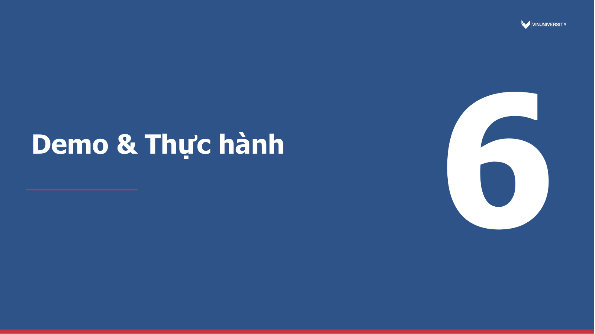

# GraphRAG & Knowledge Graphs

> Nguồn authoritative: slide PDF. Mỗi heading `Slide N` là một source span ổn định cho citation và chunking.

<!-- chiron-source-span: {"source_span_id":"80c3771b-7fbc-58d6-b0ba-78ac0a54bb6c","locator":{"kind":"page","page":1,"label":"Slide 1","section_title":"GraphRAG & Knowledge Graphs","extraction_method":"pdf-text-layer"},"checksum":"69c5d0e9ee4fd73686e9da803f7204f9b435308e25f85409856ef0d066aec66e"} -->

## Slide 1 - GraphRAG & Knowledge Graphs

AICB-P2T3 · Ngày 19 · Chương 4 — Agent Nâng Cao Giảng viên: Ngô Thanh Tùng VinUniversity · Phase 2 · Track 3 · Tuần 4

---

<!-- chiron-source-span: {"source_span_id":"9300860a-9e33-5674-9309-e91cb03afe68","locator":{"kind":"page","page":2,"label":"Slide 2","section_title":"HÃY SUY NGHĨ...","extraction_method":"pdf-text-layer"},"checksum":"6e5ca766b079d6ab336cbb74156be1d6003b2f3a42e7762f943c41956f1edc0b"} -->

## Slide 2 - HÃY SUY NGHĨ...

? “Khi user hỏi về mối quan hệ giữa 5 entities — flat RAG trả lời sai, GraphRAG trả lời đúng — tại sao?” Giữ câu hỏi này trong đầu suốt buổi học hôm nay

---

<!-- chiron-source-span: {"source_span_id":"320bdf15-d404-55cb-ad46-0342928ffbaf","locator":{"kind":"page","page":3,"label":"Slide 3","section_title":"Agenda","extraction_method":"pdf-text-layer"},"checksum":"1915162e876e698bc528f7e54ae53b7a597a09b62637a8d8036be3b0ef5b5009"} -->

## Slide 3 - Agenda

1. Vấn đề của RAG: Khi Vector Search thất bại

2. Nền tảng về Knowledge Graph (KG)

3. Pipeline GraphRAG Tiêu chuẩn

4. Kiến trúc SOTA (Microsoft GraphRAG, LightRAG)

5. Chiến lược Doanh nghiệp & ROI (Tỷ suất hoàn vốn)

6. Thực hành (Lab): Xây dựng GraphRAG Agent Giảng viên (VinUni) AICB · Ngày 19 Tuần 4 1 / 18

---

<!-- chiron-source-span: {"source_span_id":"5d00486f-73bc-5506-87e0-cf60230b10d0","locator":{"kind":"page","page":4,"label":"Slide 4","section_title":"Khi nào Flat RAG thất bại?","extraction_method":"pdf-text-layer"},"checksum":"48830873c617e8222283de49996cc78d4e27f914265a3e44ff6c0631114c2eb7"} -->

## Slide 4 - Khi nào Flat RAG thất bại?

1 Giới hạn của vector search khi cần suy luận quan hệ

---

<!-- chiron-source-span: {"source_span_id":"3763ec9f-574d-5aea-97b7-101841118612","locator":{"kind":"page","page":5,"label":"Slide 5","section_title":"Bài toán: Relational QA mà Vector RAG không trả lời được","extraction_method":"pdf-text-layer"},"checksum":"7c7a0e03ae7a3b07c4662f6b3a5d03819d25357ef519b6e20179a316db31ceb1"} -->

## Slide 5 - Bài toán: Relational QA mà Vector RAG không trả lời được

“AI companies co-founded by ex-Google?”

### Chunk
“OpenAI...”

### Chunk
“DeepMind...”

### Trả lời
hallucinate Thiếu link giữa entities!

### 3 loại query Flat RAG struggle

1. Multi-hop relational: “A liên kết B qua C”

2. Global thematic: “Tổng quan chủ đề X trong corpus”

3. Cross-document: “So sánh policy A với B” Lưu ý: Vector RAG tìm câu giống nhau. Nhưng quan hệ giữa entities nằm ở cấu trúc, không phải ở embedding similarity.

---

<!-- chiron-source-span: {"source_span_id":"9989ff61-206c-5752-b5c2-07e9da4be58b","locator":{"kind":"page","page":6,"label":"Slide 6","section_title":"Câu hỏi dẫn dắt (The Hook)","extraction_method":"pdf-text-layer"},"checksum":"70853e6f79423bb6407af112386b51680bde0520b8e4933f6416c092acfbe0af"} -->

## Slide 6 - Câu hỏi dẫn dắt (The Hook)

“Những startup AI nào được đồng sáng lập bởi các cựu nhân viên Google, những người từng nghiên cứu về kiến trúc Transformer?” Hệ thống RAG tiêu chuẩn sẽ xử lý câu hỏi này như thế nào?

### Đòi hỏi liên kết 3 luồng thông tin
❶ Startup AI & Nhà sáng lập ❷ Lịch sử làm việc tại Google ❸ Lịch sử dự án Transformer

- Trải dài qua hàng chục tài liệu khác nhau.

---

<!-- chiron-source-span: {"source_span_id":"0df7672c-7a58-51bf-a842-3aa731abddd5","locator":{"kind":"page","page":7,"label":"Slide 7","section_title":"Câu trả lời từ Flat RAG","extraction_method":"pdf-text-layer"},"checksum":"56dc1374425917b0f190b096c53be0ef1d71d7e025375fe9714fcb0a1117f7a2"} -->

## Slide 7 - Câu trả lời từ Flat RAG

Kết quả: Sinh ra ảo giác (Hallucination) Hoặc trả lời "Tôi không có đủ thông tin" Tại sao? Flat RAG truy xuất các đoạn văn bản (chunks) có sự tương đồng về ngữ nghĩa. Nó có thể lấy ra một đoạn về Google, một đoạn về Transformer, và một đoạn về startup AI, nhưng thiếu đi mối liên kết giữa chúng. Câu hỏi Chunk A (Google) Chunk B (Transformer) Chunk C (Startup) Thiếu link giữa các entities!

---

<!-- chiron-source-span: {"source_span_id":"ac780bc9-c19b-539f-a988-1520228cafe0","locator":{"kind":"page","page":8,"label":"Slide 8","section_title":"Nguyên nhân gốc rễ: Tương đồng vs. Cấu trúc","extraction_method":"pdf-text-layer"},"checksum":"6773ff4d02cf14a9dd966df4a7e198bfdd210c91248f5832d0728e6c197e11df"} -->

## Slide 8 - Nguyên nhân gốc rễ: Tương đồng vs. Cấu trúc

Vector RAG (Flat RAG) Tìm kiếm sự tương đồng về mặt ngữ nghĩa (Semantic similarity). Nó tìm các từ và khái niệm giống nhau trong các đoạn văn bản riêng lẻ. Hạn chế  Không thể tự động duyệt qua các mối quan hệ. Giống như việc bạn tìm thấy 3 trang bách khoa toàn thư nhưng không đọc phần tham chiếu chéo.  Khi mối quan hệ trải dài qua nhiều tài liệu, Vector RAG sẽ gặp khó khăn.

---

<!-- chiron-source-span: {"source_span_id":"9f17b6b9-41e4-5d30-b048-9cf5fc6a7ad3","locator":{"kind":"page","page":9,"label":"Slide 9","section_title":"Giải pháp mang tên GraphRAG","extraction_method":"pdf-text-layer"},"checksum":"80c70014796799acb9ce878ef0d2d9399039b9d23e3a0a9768927b74df3cdbc0"} -->

## Slide 9 - Giải pháp mang tên GraphRAG

 GraphRAG Hiểu được các kết nối mang tính cấu trúc. Nó tìm kiếm trên một "mạng lưới" các mối quan hệ thay vì chỉ các đoạn văn bản.  Sự dịch chuyển mô hình Thay vì tìm "Văn bản giống nhau", chúng ta duyệt từ Node A → Node B → Node C.  Kết quả Suy luận đa bước (multi-hop) chính xác và khả năng tóm tắt toàn cục toàn bộ tập dữ liệu.

---

<!-- chiron-source-span: {"source_span_id":"9872ab56-aea6-5b43-b78e-bc633c954c88","locator":{"kind":"page","page":10,"label":"Slide 10","section_title":"Trực giác cốt lõi","extraction_method":"pdf-text-layer"},"checksum":"45240e43401e310528cab0f528169f9841e76ae089ea1df97a0c1a0c2decb2a6"} -->

## Slide 10 - Trực giác cốt lõi

Vector RAG vs GraphRAG Vector RAG = tìm câu giống nhau trong sách — như search Google. GraphRAG = hiểu mối quan hệ giữa các khái niệm — như đọc hiểu mind map. Analogy: Bạn hỏi “Ai là bạn chung của An và Bình?” Vector search tìm trang nói về An, trang nói về Bình — nhưng không link

### được. Graph search: An → bạn → Cường ← bạn ← Bình. Trả lời ngay
Cường.

---

<!-- chiron-source-span: {"source_span_id":"1ac4612e-d424-5832-8c13-7db92e50bf55","locator":{"kind":"page","page":11,"label":"Slide 11","section_title":"Bằng chứng: GraphRAG vượt trội trên relational","extraction_method":"pdf-text-layer"},"checksum":"58ee3e22e2765d8af9aa341b73b5ee84cd04eacd9c35f8b17c0afcd0b137ee0e"} -->

## Slide 11 - Bằng chứng: GraphRAG vượt trội trên relational

queries +40% Comprehensiveness vs Flat RAG 2–3× Multi-hop accuracy gain OK Flat RAG vẫn tốt cho factoid Benchmark trên community questions: GraphRAG +40% comprehensiveness. Nhưng single-doc factoid, Flat RAG nhanh hơn và rẻ hơn. Không phải lúc nào cũng cần graph.

---

<!-- chiron-source-span: {"source_span_id":"53f6805f-951c-53a6-a5a0-5e3892049c00","locator":{"kind":"page","page":12,"label":"Slide 12","section_title":"Knowledge Graph","extraction_method":"pdf-text-layer"},"checksum":"0311c275d6254539624bb0ba1ffd6589244bd361e3187a62ef5142f1b60a870d"} -->

## Slide 12 - Knowledge Graph

2 Fundamentals Nodes, Edges, Triples — nền tảng của graph-based retrieval

---

<!-- chiron-source-span: {"source_span_id":"186494b9-f8e1-5b31-a318-3af33650d363","locator":{"kind":"page","page":13,"label":"Slide 13","section_title":"Knowledge Graph — Nodes, Edges, Triples","extraction_method":"pdf-text-layer"},"checksum":"20ff0f208b54a6f1b3f5416eb1d4302456013ffb1f5b389a8e768459468c8abe"} -->

## Slide 13 - Knowledge Graph — Nodes, Edges, Triples

Sam Altman OpenAI GPT-4Microsoft Google co-founded developedinvested worked at Triple: (Sam Altman, co-founded, OpenAI) Knowledge Graph — Directed labeled graph: Entity (node) + Relation (edge) + Triple (subject–predicate–object)

- KG cho RAG: extract entities
+ relations, lưu graph DB

- Retrieval = graph traversal
thay vì chunk search

- Microsoft GraphRAG (2024):
pipeline open-source Giảng viên (VinUni) AICB · Ngày 19 Tuần 4 5 / 18

---

<!-- chiron-source-span: {"source_span_id":"ddc71fc9-fc07-591e-bf7a-cdd8a4b1844a","locator":{"kind":"page","page":14,"label":"Slide 14","section_title":"Graph Theory 101","extraction_method":"pdf-text-layer"},"checksum":"e9615856ab3e16703eb030dec977e54512397f6ee941c683d96998beb1b3e523"} -->

## Slide 14 - Graph Theory 101

Nodes (Đỉnh/Thực thể): Các thực thể trong dữ liệu Edges (Cạnh/Mối quan hệ): Kết nối giữa các nodes Properties (Thuộc tính): Metadata gắn với nodes hoặc edges Sam Altman OpenAI GPT-4 co-founded developed

- Node Property: age=38

- Edge Property: year=2015
Node Edge Giảng viên (VinUni) AICB · Ngày 19

---

<!-- chiron-source-span: {"source_span_id":"ecb1020f-bcb1-5440-bcb6-4ec039becda3","locator":{"kind":"page","page":15,"label":"Slide 15","section_title":"Bộ ba (The Triple) - Đơn vị cốt lõi","extraction_method":"pdf-text-layer"},"checksum":"43409f9148d00a6129a8fe6df05c2dc0c9f825c85a9033546ec5c663e54def46"} -->

## Slide 15 - Bộ ba (The Triple) - Đơn vị cốt lõi

Giảng viên (VinUni) AICB · Ngày 19 Knowledge Graphs được xây dựng từ các Triples (Bộ ba). Đây là nguyên tử cơ bản để cấu trúc hóa kiến thức nhân loại.  Cấu trúc: (Chủ thể) → [Vị ngữ / Mối quan hệ] → (Tân ngữ)

### Ví dụ 1
(Sam Altman) → [CEO_OF] → (OpenAI)

### Ví dụ 2
(OpenAI) → [DEVELOPED] → (GPT-4)  Hàng triệu Triples này kết nối lại tạo thành một Knowledge Graph khổng lồ.

---

<!-- chiron-source-span: {"source_span_id":"c333c225-baa5-59d1-a3f2-ab6c03e99261","locator":{"kind":"page","page":16,"label":"Slide 16","section_title":"Đồ thị có hướng (Directed) vs. Vô hướng (Undirected)","extraction_method":"pdf-text-layer"},"checksum":"418465f89e9c4184a431280952dd90ae7ff03c42e92006e9f422504d7722cb74"} -->

## Slide 16 - Đồ thị có hướng (Directed) vs. Vô hướng (Undirected)

Đồ thị có hướng Các cạnh có hướng cụ thể (đường một chiều). Person City BORN_IN Ví dụ: Chiều ngược lại không đúng. Đồ thị vô hướng Mối quan hệ hai chiều. Person A Person B KNOWS  Lưu ý cho GraphRAG: KG hầu như luôn là Đồ thị có hướng và có nhãn (Directed Labeled Graphs). Giảng viên (VinUni) AICB · Ngày 19

---

<!-- chiron-source-span: {"source_span_id":"34e73e18-46e5-504d-8730-29dd7df5150d","locator":{"kind":"page","page":17,"label":"Slide 17","section_title":"Graph Database: Property Graphs vs. RDF","extraction_method":"pdf-text-layer"},"checksum":"2bc0a057fbc6634e87e07e387d1e94c0dd90b8340c422eda616f8b7877c6d67b"} -->

## Slide 17 - Graph Database: Property Graphs vs. RDF

Property Graphs  Neo4j, FalkorDB: Nodes và edges có thể chứa nhiều siêu dữ liệu.  Hiệu năng cao cho truy xuất và ứng dụng doanh nghiệp.  Tiêu chuẩn công nghiệp cho GraphRAG. RDF  Resource Description Framework: Tiêu chuẩn học thuật cho dữ liệu liên kết mở (Wikidata).  Khó duy trì cho các hệ thống Generative AI thời gian thực. Giảng viên (VinUni) AICB · Ngày 19

---

<!-- chiron-source-span: {"source_span_id":"6829e087-7419-59ce-a996-6eeba3095d15","locator":{"kind":"page","page":18,"label":"Slide 18","section_title":"Cypher: Ngôn ngữ truy vấn Graph (SQL của Graph)","extraction_method":"pdf-text-layer"},"checksum":"2e0fee66bc3ef8dbcba78007cf99d50a56c31d7f813d9ed15306d3f1a13c64eb"} -->

## Slide 18 - Cypher: Ngôn ngữ truy vấn Graph (SQL của Graph)

 Cách chúng ta truy vấn cơ sở dữ liệu đồ thị. MATCH Tìm kiếm mẫu (pattern). WHERE Lọc dữ liệu. RETURN Trả về kết quả. MATCH (p:Person)-[:CO_FOUNDED]->(c:Company) WHERE c.name = 'OpenAI' RETURN p.name Giảng viên (VinUni) AICB · Ngày 19

---

<!-- chiron-source-span: {"source_span_id":"d41f511a-27b1-5f1a-ae57-9374ac8c2242","locator":{"kind":"page","page":19,"label":"Slide 19","section_title":"The Extraction Bottleneck","extraction_method":"pdf-text-layer"},"checksum":"6bbf93b5d8c904e8e38cdec550d01229360a3677f42bf01e3eb0f1f188ee83ea"} -->

## Slide 19 - The Extraction Bottleneck

 Đồ thị không tự sinh ra. Chúng ta phải trích xuất nodes và edges từ các văn bản thô, lộn xộn.  Đây là phần khó nhất và tốn kém nhất của GraphRAG.  Garbage In = Garbage Out (GIGO - Dữ liệu rác tạo ra kết quả rác). Giảng viên (VinUni) AICB · Ngày 19

---

<!-- chiron-source-span: {"source_span_id":"712a1c33-45cb-509a-97a8-305a6a548eff","locator":{"kind":"page","page":20,"label":"Slide 20","section_title":"NER và Trích xuất Mối quan hệ (Relation Extraction)","extraction_method":"pdf-text-layer"},"checksum":"981935ee9863b1183a47b195bb1abfe89fb16d3014745a1915a57451a110a6ce"} -->

## Slide 20 - NER và Trích xuất Mối quan hệ (Relation Extraction)

 NER (Named Entity Recognition) Nhận diện "Ai", "Cái gì", "Ở đâu" (Dùng spaCy, hoặc Prompting LLM).  Relation Extraction (RE) Tìm ra cách các thực thể tương tác với nhau.  Thách thức LLM mạnh nhưng chậm và đắt khi xử lý hàng ngàn trang tài liệu; NLP truyền thống nhanh nhưng kém linh hoạt. Giảng viên (VinUni) AICB · Ngày 19

---

<!-- chiron-source-span: {"source_span_id":"615b692f-de47-5628-9a36-659bfd5f4e8d","locator":{"kind":"page","page":21,"label":"Slide 21","section_title":"Coreference Resolution","extraction_method":"pdf-text-layer"},"checksum":"d84ebaed91820c9cdb2ea9ae90fd57e8229da2a7ece0ec116398a6e870dc4083"} -->

## Slide 21 - Coreference Resolution

 Văn bản: "Sam Altman là một doanh nhân. Ông đã thành lập OpenAI." Nếu không quy chiếu "Ông" → "Sam Altman", đồ thị sẽ tạo ra một node bị cô lập tên là "Ông". Bỏ qua bước này làm mất 30-40% các mối quan hệ quan trọng trong đồ thị. Trước (Rời rạc) Sam Altman Doanh nhân Ông OpenAI Sau (Đã kết nối) Sam Altman Doanh nhân OpenAI Giảng viên (VinUni) AICB · Ngày 19

---

<!-- chiron-source-span: {"source_span_id":"e8c4b2fc-8538-5f25-9b81-f423ec8ce63a","locator":{"kind":"page","page":22,"label":"Slide 22","section_title":"Entity Disambiguation","extraction_method":"pdf-text-layer"},"checksum":"b2c729b19faf07ae71f7c8a045a4e33d0edfd238562e7c5da124b760d4ac1263"} -->

## Slide 22 - Entity Disambiguation

 Ngôn ngữ có tính mơ hồ “Apple báo cáo doanh số iPhone kỷ lục.” “Apple (quả táo) là một loại trái cây ngon.”  Disambiguation đảm bảo hệ thống tạo ra hai node riêng biệt dựa trên ngữ cảnh lúc trích xuất. Apple_Inc Apple_Fruit Giảng viên (VinUni) AICB · Ngày 19

---

<!-- chiron-source-span: {"source_span_id":"7b6e84c3-7c69-54f0-9b4c-cc97ae45cd2a","locator":{"kind":"page","page":23,"label":"Slide 23","section_title":"Entity Deduplication","extraction_method":"pdf-text-layer"},"checksum":"9d85bb7df75e8464cc4289e31a00811179ab0256474f21db26e4e7517a9fc497"} -->

## Slide 23 - Entity Deduplication

 Nhiều đoạn văn bản có thể gọi cùng một thực thể theo các cách khác nhau. VD: "OpenAI", "Open AI", "open-ai", "OAI".  Giải pháp: Thêm bước chuẩn hóa (normalization)

### Sử dụng các kỹ thuật sau để gộp chúng thành một node duy nhất

- Đối sánh chuỗi (String Matching)

- Vector similarity

- Sử dụng LLM
Giảng viên (VinUni) AICB · Ngày 19

---

<!-- chiron-source-span: {"source_span_id":"0b14fa09-7f67-55ef-b0ec-80bed62c7368","locator":{"kind":"page","page":24,"label":"Slide 24","section_title":"Giai đoạn Xây dựng Đồ thị","extraction_method":"pdf-text-layer"},"checksum":"0f7d4fd3cc021555e29f642dd5c71c39285f64dcc4d38f157a6815f014af3fe7"} -->

## Slide 24 - Giai đoạn Xây dựng Đồ thị



1. Đọc các đoạn văn bản (Chunks) Phân tích và nạp dữ liệu thô từ nguồn tài liệu. 

2. Giải quyết Đồng tham chiếu Xử lý các đại từ (He/She/It) để xác định đúng thực thể. 

3. Trích xuất Thực thể & Phân giải Nhận diện và chuẩn hóa các đối tượng trong văn bản. 

4. Trích xuất Mối quan hệ (Triples) Xây dựng các liên kết Chủ thể - Quan hệ - Đối tượng. 

5. Xóa trùng lặp và đẩy vào Neo4j Tối ưu hóa dữ liệu và lưu trữ vào cơ sở dữ liệu đồ thị. Giảng viên (VinUni) AICB · Ngày 19

---

<!-- chiron-source-span: {"source_span_id":"b38dbfb4-f3c8-5095-ab89-73d7c39876c8","locator":{"kind":"page","page":25,"label":"Slide 25","section_title":"Building Knowledge Graph — NetworkX vs Neo4j","extraction_method":"pdf-text-layer"},"checksum":"a083452b567a4b844244959d5ae4d85eec8b9c4eee6c84f2acfbef63f814c984"} -->

## Slide 25 - Building Knowledge Graph — NetworkX vs Neo4j

ACID Không Có Algorithms Có (BFS, PageRank) Full library Best for Prototype Production NetworkX Neo4j Thêm embeddings cho mỗi node + source chunk refer-

```text
Setup pip install Docker/Cloud ences → enable hybrid search
(graph + vector)Scale ∼100K nodes Millions+
```

- Bulk insert: batch thay
vì từng triple — 10× faster

- Beyond 100K: switch
Neo4j hoặc FalkorDB (Redis-based)

---

<!-- chiron-source-span: {"source_span_id":"3a731ded-dbcb-55e9-9246-7c940a811477","locator":{"kind":"page","page":26,"label":"Slide 26","section_title":"Pipeline GraphRAG Tiêu","extraction_method":"pdf-text-layer"},"checksum":"e0ba76b7a3cfdd60b06830c97ead00b5d4d7fa2120d687f90573f61342c1e6fd"} -->

## Slide 26 - Pipeline GraphRAG Tiêu

3 chuẩn Hành trình từ Câu hỏi của User đến Câu trả lời của LLM

---

<!-- chiron-source-span: {"source_span_id":"b9f0c039-9bc1-5376-90dd-81974140d0a4","locator":{"kind":"page","page":27,"label":"Slide 27","section_title":"Tổng quan Pipeline","extraction_method":"pdf-text-layer"},"checksum":"849188ec21a9dfd524ee6685c0d0c049d9943f5bac080635e94238c43cfca2c4"} -->

## Slide 27 - Tổng quan Pipeline

1. Query Processing

2. Seed Node Matching

3. Graph Traversal

4. Textualization

5. Generation  Query Processing: Trích xuất thực thể từ câu hỏi.  Seed Node Matching: Tìm các thực thể đó (node gốc) trong Graph DB.  Graph Traversal: Khám phá khu vực xung quanh các node gốc.  Textualization: Chuyển đổi dữ liệu đồ thị trở lại thành văn bản.  Generation: LLM tổng hợp câu trả lời cuối cùng. Giảng viên (VinUni) AICB · Tổng quan

---

<!-- chiron-source-span: {"source_span_id":"445fa5c4-c59a-5c8f-8e52-179b9030e594","locator":{"kind":"page","page":28,"label":"Slide 28","section_title":"Bước 1 & 2: Trích xuất & Khởi tạo Node gốc (Seed)","extraction_method":"pdf-text-layer"},"checksum":"e12a4d37e02c3e47ca158b05ff99db7ae7bea1993990a4380abb676c3639a8cd"} -->

## Slide 28 - Bước 1 & 2: Trích xuất & Khởi tạo Node gốc (Seed)

 Câu hỏi "Ai đồng sáng lập Microsoft?"  Trích xuất LLM lấy ra các thực thể quan

### trọng
[Microsoft]  Seeding (Khởi tạo) Hệ thống tìm trong Graph DB node khớp hoàn toàn hoặc có ngữ nghĩa tương đồng với "Microsoft".

- Đây là điểm xuất phát cho quá trình duyệt đồ thị.
Giảng viên (VinUni) AICB · GraphRAG

---

<!-- chiron-source-span: {"source_span_id":"439cd23a-b286-5faf-9ba5-b3bc330a2612","locator":{"kind":"page","page":29,"label":"Slide 29","section_title":"Bước 3: Duyệt Đồ thị (Breadth-First Search - BFS)","extraction_method":"pdf-text-layer"},"checksum":"63b4a5bcc33359a5504ea502c3d236f5dc5e5e77810b498875f46d4b66c31709"} -->

## Slide 29 - Bước 3: Duyệt Đồ thị (Breadth-First Search - BFS)

 Thuật toán duyệt Từ seed node, hệ thống dùng thuật toán Tìm kiếm theo chiều rộng (BFS) để lấy các nodes và edges lân cận.  Kết quả thu thập (Triples)

### Nó thu thập tất cả Triples nối với node gốc

- (Bill Gates)—[CO_FOUNDED]→(Microsoft)

- (Paul Allen)—[CO_FOUNDED]→(Microsoft)
Giảng viên (VinUni) AICB · GraphRAG

---

<!-- chiron-source-span: {"source_span_id":"e8c2b56a-d3b2-5718-917e-ad07b3042e9e","locator":{"kind":"page","page":30,"label":"Slide 30","section_title":"Độ sâu Duyệt (Traversal Depth)","extraction_method":"pdf-text-layer"},"checksum":"25ccb08c025ebdc6a57be26de11cbd5a4b6da392e32718feb96fdbe12a08c823"} -->

## Slide 30 - Độ sâu Duyệt (Traversal Depth)

 Depth = 1: Quá nông Chỉ lấy hàng xóm trực tiếp, dễ trượt mất ngữ cảnh "multi-hop".  Depth = 2: Tiêu chuẩn Khuyên dùng. Lấy hàng xóm và ngữ cảnh lân cận của chúng.  Depth = 3+: Quá nhiễu Kéo theo dữ liệu không liên quan, làm quá tải Context Window của LLM và gây ra ảo giác. Hop 1 Hop 2 Hop 3 Mô phỏng ranh giới truy vấn Giảng viên (VinUni) AICB · GraphRAG

---

<!-- chiron-source-span: {"source_span_id":"3b3329e8-a3ce-5c16-a7e4-e06c16d637bd","locator":{"kind":"page","page":31,"label":"Slide 31","section_title":"Bước 4: Văn bản hóa Đồ thị con (Textualization)","extraction_method":"pdf-text-layer"},"checksum":"bdc426389aae05f3d4cd211b2159720196cd17793cb6fc32a0a58f467f1e98c7"} -->

## Slide 31 - Bước 4: Văn bản hóa Đồ thị con (Textualization)

 Mục đích LLM không thể "đọc" trực tiếp cơ sở dữ liệu đồ thị. Chúng ta phải chuyển subgraph thu được thành một prompt văn bản.  Quá trình chuyển đổi

### RAW TRIPLES
(Bill Gates, CO_FOUNDED, Microsoft), (Paul Allen, CO_FOUNDED, Microsoft) 

### VĂN BẢN HÓA
"Các mối quan hệ sau tồn tại trong cơ sở tri thức: Bill Gates CO_FOUNDED Microsoft. Paul Allen CO_FOUNDED Microsoft." Giảng viên (VinUni) AICB · GraphRAG

---

<!-- chiron-source-span: {"source_span_id":"2a39196a-6565-5cfe-bc2c-9a105fc3798b","locator":{"kind":"page","page":32,"label":"Slide 32","section_title":"Bước 5: LLM Sinh câu trả lời","extraction_method":"pdf-text-layer"},"checksum":"4b6f5216cb84f8afbf5d2cbff6a785a6cab026beac76914b8ef79ac878df538e"} -->

## Slide 32 - Bước 5: LLM Sinh câu trả lời

 Tích hợp Context Đoạn văn bản subgraph được tiêm vào prompt của LLM để định hướng kiến thức.  System Prompt "Hãy tr ả l ời câu h ỏi c ủa ng ười dùng CH Ỉ s ử d ụng ng ữ c ảnh m ối quan h ệ đ ược cung c ấp sau đây."  Kết quả Câu trả lời cực kỳ chính xác, bám sát thực tế và miễn nhiễm với ảo giác RAG thông thường. Giảng viên (VinUni) AICB · GraphRAG

---

<!-- chiron-source-span: {"source_span_id":"7f78c51f-4732-5b44-bfc5-ec77c8eacba5","locator":{"kind":"page","page":33,"label":"Slide 33","section_title":"Hybrid Search (Sự kết hợp hoàn hảo)","extraction_method":"pdf-text-layer"},"checksum":"7bb7df1ee41ca7ce3d992d19a3ad8b739d227b32f6c0efcc1d7600b62288d8a4"} -->

## Slide 33 - Hybrid Search (Sự kết hợp hoàn hảo)

 Bổ trợ thay vì thay thế GraphRAG không nên thay thế Vector Search; nó nên đóng vai trò bổ trợ lẫn nhau.  Hybrid Search Chúng ta lưu trữ vector embeddings bên trong các node của đồ thị.  Cơ chế hoạt động Dùng Semantic Search để tìm seed node, sau đó dùng Graph Traversal để tìm quan hệ, kết hợp cả ngữ cảnh cấu trúc lẫn phi cấu trúc. Giảng viên (VinUni) AICB · GraphRAG

---

<!-- chiron-source-span: {"source_span_id":"4dcc171e-9870-523d-b8c7-1ebc0b88e4c2","locator":{"kind":"page","page":34,"label":"Slide 34","section_title":"Sơ đồ Kiến trúc Hybrid","extraction_method":"pdf-text-layer"},"checksum":"54b1d8ea184b0d2ec93a086b43f79f8e9c289f379c200b110067fdac49c1b21b"} -->

## Slide 34 - Sơ đồ Kiến trúc Hybrid

Query  Vector DB  Graph DB  LLM Context Window  Vector DB: Tìm kiếm ngữ nghĩa để truy xuất các văn bản (chunks) liên quan.  Graph DB: Duyệt đồ thị để khai thác các mối quan hệ thực thể phức tạp. Giảng viên (VinUni) AICB · GraphRAG

---

<!-- chiron-source-span: {"source_span_id":"c1728d53-3b43-5888-896e-0490a2a45239","locator":{"kind":"page","page":35,"label":"Slide 35","section_title":"Temporal Knowledge Graphs","extraction_method":"pdf-text-layer"},"checksum":"85cf80329994d049b7296a481dd33f40a4c7a23903b354b775357a9d7cbb3d7c"} -->

## Slide 35 - Temporal Knowledge Graphs

 Đồ thị thông thường là tĩnh. Nhưng thế giới thực thay đổi. "Ai là CEO của OpenAI?" (Đáp án năm 2018 khác 2024)  Giải pháp: Gắn mốc thời gian (validity dates) vào thuộc tính của các cạnh (edges). Sam Altman OpenAI CEO_OF {start: 2019, end: present}

### Ví dụ minh họa
Giảng viên (VinUni) AICB · GraphRAG

---

<!-- chiron-source-span: {"source_span_id":"3172db71-c0aa-5022-8ac6-4b00670093e3","locator":{"kind":"page","page":36,"label":"Slide 36","section_title":"Các Lỗi thường gặp (Failure Modes)","extraction_method":"pdf-text-layer"},"checksum":"615ceec214e37063921392f3436925f5dae0e46d405c35f5c11735107ce86f99"} -->

## Slide 36 - Các Lỗi thường gặp (Failure Modes)

 Super-nodes (Node quá tải) Một node như "USA" có thể có 100,000 kết nối. Duyệt nó sẽ làm sập context window.  Đồ thị rời rạc Trích xuất thất bại không nối được các subgraph. Tạo ra các "hòn đảo" dữ liệu (Disconnected Components).  Ngữ cảnh nghèo nàn Bước textualization lược bỏ quá nhiều sắc thái từ tài liệu gốc.

---

<!-- chiron-source-span: {"source_span_id":"7b72cd3a-aa6c-5896-9ceb-1eaf005a76f1","locator":{"kind":"page","page":37,"label":"Slide 37","section_title":"Best Practices","extraction_method":"pdf-text-layer"},"checksum":"0ba89246d934916e93c32887b5d33d20aa37926c85d0c71f5acd030638bf8063"} -->

## Slide 37 - Best Practices

 Luôn duy trì một con trỏ (pointer) từ Graph Node ngược về Document Chunk gốc.  Đặt giới hạn duyệt (VD: "duyệt 2 hop, nhưng tối đa 50 cạnh").  Liên tục tinh chỉnh prompt NER.

---

<!-- chiron-source-span: {"source_span_id":"fa8a147f-2390-5232-8d03-a704dfe6483f","locator":{"kind":"page","page":38,"label":"Slide 38","section_title":"Các Kiến trúc SOTA","extraction_method":"pdf-text-layer"},"checksum":"8db40884a637b0fcc004b084a78e2c77ce131ac1311cb59d440310f2f2d5b42a"} -->

## Slide 38 - Các Kiến trúc SOTA

4 (State-of-the-Art) Các ông lớn công nghệ đang scale GraphRAG như thế nào.

---

<!-- chiron-source-span: {"source_span_id":"cb9faf73-9f91-5404-8427-dd6d900928b6","locator":{"kind":"page","page":39,"label":"Slide 39","section_title":"Sự trỗi dậy của Advanced GraphRAG","extraction_method":"pdf-text-layer"},"checksum":"0eeacd17d8eea37b1dc88ffaada8c828c0d079ddd83fdf893c6f32d4f42fabf0"} -->

## Slide 39 - Sự trỗi dậy của Advanced GraphRAG

 GraphRAG cơ bản dựa trên trích xuất Triple đơn giản.  Các hệ thống SOTA hiện đại (2024+) Tập trung vào hiểu biết phân cấp (hierarchical understanding) và giảm thiểu chi phí tính toán khổng lồ khi xây dựng đồ thị quy mô lớn.

---

<!-- chiron-source-span: {"source_span_id":"e9211fea-a37a-5119-81dc-004ce30710bd","locator":{"kind":"page","page":40,"label":"Slide 40","section_title":"Microsoft GraphRAG","extraction_method":"pdf-text-layer"},"checksum":"b0df92c4da9d9c63987e91e4fdc30759e04c4d704d3b4e07abcf6c5750af2d74"} -->

## Slide 40 - Microsoft GraphRAG

 Phát hành giữa năm 2024  Thiết kế cho Sensemaking Tạo dựng ý nghĩa trên toàn bộ tập dữ liệu.  Triết lý cốt lõi

### Không chỉ để trả lời câu hỏi cụ thể, mà để hỏi hệ thống
"Tập dữ liệu này nói về bức tranh tổng thể gì?"

---

<!-- chiron-source-span: {"source_span_id":"dba5c871-d839-59f2-90b5-123fa0524d87","locator":{"kind":"page","page":41,"label":"Slide 41","section_title":"MS GraphRAG: Phát hiện Cộng đồng (Community Detection)","extraction_method":"pdf-text-layer"},"checksum":"d9abb7daded80d6cf7c277db1ce1b21d4b9becdf256b0dde2bcaa054ef378881"} -->

## Slide 41 - MS GraphRAG: Phát hiện Cộng đồng (Community Detection)

 Sử dụng Thuật toán Leiden để phát hiện các "Cộng đồng" (các cụm node liên kết chặt chẽ).  Gom nhóm thực thể thành "khu phố", tạo bản đồ phân cấp (từ vĩ mô đến vi mô). Giảng viên (VinUni) AICB · GraphRAG

---

<!-- chiron-source-span: {"source_span_id":"14456f64-66c9-5d23-a94e-27a3c5fb6d46","locator":{"kind":"page","page":42,"label":"Slide 42","section_title":"MS GraphRAG: Tóm tắt Phân cấp","extraction_method":"pdf-text-layer"},"checksum":"53030e42de5058b8e3a97323d228b7895866ecdaecfd484236e5203dabd026ac"} -->

## Slide 42 - MS GraphRAG: Tóm tắt Phân cấp

 Khi các cộng đồng hình thành, MS GraphRAG dùng LLM để tạo ra một "Bản báo cáo tóm tắt" cho từng cộng đồng ở mọi cấp độ.  Hệ thống tính toán trước (pre-compute) câu trả lời cho các câu hỏi mang tính chủ đề toàn cục. Giảng viên (VinUni) AICB · GraphRAG

---

<!-- chiron-source-span: {"source_span_id":"a481ad77-3b9a-5bc5-9ff5-19adea3e71a3","locator":{"kind":"page","page":43,"label":"Slide 43","section_title":"MS GraphRAG: Truy vấn Local vs. Global","extraction_method":"pdf-text-layer"},"checksum":"4f1c6649cd0fc36c7f4e8dc436b673126546a16718200b6f894c29a41304eb92"} -->

## Slide 43 - MS GraphRAG: Truy vấn Local vs. Global

 Local Search Cho câu hỏi cụ thể ("Ai kết nối X với Y?"). Duyệt qua các nodes.  Global Search Cho câu hỏi chủ đề ("Đâu là rủi ro chính trong các hợp đồng này?"). Đọc các Báo cáo Cộng đồng đã tạo sẵn thay vì duyệt node thô. Giảng viên (VinUni) AICB · GraphRAG

---

<!-- chiron-source-span: {"source_span_id":"15bda864-14b6-54aa-b6ef-4987aa16baf7","locator":{"kind":"page","page":44,"label":"Slide 44","section_title":"Điểm yếu của MS GraphRAG","extraction_method":"pdf-text-layer"},"checksum":"3181f44a81e4bc0dfd1d187add6571071842777305bc740541fcad380daacaba"} -->

## Slide 44 - Điểm yếu của MS GraphRAG

 ● Chi phí cực đắt: Việc tạo tóm tắt cho mọi cộng đồng trên kho dữ liệu lớn ngốn một lượng token khổng lồ trong quá trình indexing.

- Index 1 triệu token có thể tốn $10–$50+ chỉ để xây đồ thị.
 Không phù hợp cho dữ liệu thay đổi liên tục. Giảng viên (VinUni) AICB · GraphRAG

---

<!-- chiron-source-span: {"source_span_id":"b7ceb37b-a1b6-5485-b987-05a3bab02b79","locator":{"kind":"page","page":45,"label":"Slide 45","section_title":"LightRAG (Kẻ thách thức tối ưu)","extraction_method":"pdf-text-layer"},"checksum":"40c3d6b3d4d55c476637fe2c2495beb8ed6f068b3a2507d0eb3c340a661a0eb0"} -->

## Slide 45 - LightRAG (Kẻ thách thức tối ưu)

 Tối ưu hiệu năng Giải quyết vấn đề chi phí và sự cồng kềnh của MS GraphRAG.  Cải tiến cốt lõi: Truy xuất hai cấp độ (Dual-level retrieval) Trích xuất cả thực thể chi tiết lẫn khái niệm trừu tượng mà không cần tạo trước các báo cáo cộng đồng đắt đỏ. Giảng viên (VinUni) AICB · GraphRAG

---

<!-- chiron-source-span: {"source_span_id":"91daa988-9861-5daa-af53-37e1105a5cbb","locator":{"kind":"page","page":46,"label":"Slide 46","section_title":"LightRAG hoạt động ra sao","extraction_method":"pdf-text-layer"},"checksum":"ee3f69b86e0bc0e89c8426a6eab75ff949e27c31357a7b01cc708a272c0976f9"} -->

## Slide 46 - LightRAG hoạt động ra sao

 Cấu trúc Embedding đa diện Thay vì chỉ embed các chunks, LightRAG tạo vector embedding cho cả Nodes và Edges.  Truy xuất cực nhanh Dùng vector search để tìm ra nodes VÀ relationships liên quan cùng lúc, bỏ qua việc tính toán duyệt đồ thị nặng nề. Giảng viên (VinUni) AICB · GraphRAG

---

<!-- chiron-source-span: {"source_span_id":"b1569165-bb03-50e5-98e9-1bcd1603b725","locator":{"kind":"page","page":47,"label":"Slide 47","section_title":"Bảng So sánh (MS GraphRAG vs. LightRAG vs. Flat RAG)","extraction_method":"pdf-text-layer"},"checksum":"d7182bbeec26b7fc57850d8c2f139d568cf24912a8e8473f03715c7a94b4b6b9"} -->

## Slide 47 - Bảng So sánh (MS GraphRAG vs. LightRAG vs. Flat RAG)

Chi phí Index Khả năng Global Multi-hop Flat RAG  Rất Rẻ  Kém  Kém MS GraphRAG  Rất Đắt  Xuất sắc  Xuất sắc LightRAG  Trung bình  Tốt  Xuất sắc (Triển khai nhanh) Giảng viên (VinUni) AICB · GraphRAG

---

<!-- chiron-source-span: {"source_span_id":"3521d59d-62a5-577b-91de-8c43cbef3967","locator":{"kind":"page","page":48,"label":"Slide 48","section_title":"Đánh giá (Evaluation): Làm sao biết hệ thống hiệu quả?","extraction_method":"pdf-text-layer"},"checksum":"dfc78dc5ffcd4e6ea7bd5f0bb2d248913a42f31f118712ef4b92f7685f076971"} -->

## Slide 48 - Đánh giá (Evaluation): Làm sao biết hệ thống hiệu quả?

 Đo lường RAG truyền thống đã khó, đo lường GraphRAG còn khó hơn vì bạn không chỉ đánh giá khả năng trích xuất văn bản mà còn phải đánh giá khả năng suy luận trên cấu trúc đồ thị.  Tính toàn diện Câu trả lời có giải quyết trọn vẹn và đầy đủ câu hỏi không?  Tính đa dạng Thông tin cung cấp có phong phú và đa chiều không?  Tính chính xác Mức độ tin cậy của các sự kiện được nêu ra. Giảng viên (VinUni) AICB · GraphRAG

---

<!-- chiron-source-span: {"source_span_id":"76d649bd-bb80-5e32-ad1d-dacd66bc63e3","locator":{"kind":"page","page":49,"label":"Slide 49","section_title":"Benchmarks cho Multi-hop Reasoning","extraction_method":"pdf-text-layer"},"checksum":"121ecb2a29505ea381cd3fdc9e01739ce69c8a0583278125ed8e8be684f4ff7f"} -->

## Slide 49 - Benchmarks cho Multi-hop Reasoning



### Phải benchmark trên các tập dữ liệu thiết kế riêng cho suy luận multi-hop (VD
HotpotQA, 2WikiMultihopQA).  GraphRAG luôn cho thấy độ chính xác cao gấp 2-3 lần so với Flat RAG trên các tập này. Giảng viên (VinUni) AICB · GraphRAG

---

<!-- chiron-source-span: {"source_span_id":"06c9ace6-c681-5152-b522-98f45f0129f5","locator":{"kind":"page","page":50,"label":"Slide 50","section_title":"Chiến lược Doanh","extraction_method":"pdf-text-layer"},"checksum":"c7a797c8466a90f39d1ac0c89730b84b412a8cd09e2681642c22baad7e6e09db"} -->

## Slide 50 - Chiến lược Doanh

5 nghiệp & ROI Cách chứng minh giá trị của GraphRAG với stakeholder

---

<!-- chiron-source-span: {"source_span_id":"e46df8b0-9886-5ef7-ac83-82147b9b99fb","locator":{"kind":"page","page":51,"label":"Slide 51","section_title":"Thực tế về Chi phí: Indexing vs. Querying","extraction_method":"pdf-text-layer"},"checksum":"6777c84d84112569674da90d37f8223b714c1ae83b226d5e495c8f3a2f5f1b37"} -->

## Slide 51 - Thực tế về Chi phí: Indexing vs. Querying

 Flat RAG

- Rẻ khi xây dựng

- Rẻ khi truy vấn
 GraphRAG

- Rất đắt khi xây dựng (vì LLM trích
xuất triples)

- Truy vấn khá rẻ và cực kỳ chính xác
 Rule of thumb Đừng dùng GraphRAG cho các tài liệu dùng một lần. Hãy dùng nó cho tri thức cốt lõi của doanh nghiệp.

---

<!-- chiron-source-span: {"source_span_id":"60860da7-7181-58ea-bee6-8ebbaac15b41","locator":{"kind":"page","page":52,"label":"Slide 52","section_title":"Decision Framework: Khi nào dùng Flat RAG","extraction_method":"pdf-text-layer"},"checksum":"1507d04f06a693a497695403179fa1bdf2c0e6fbe91ff07279d34824b1d12885"} -->

## Slide 52 - Decision Framework: Khi nào dùng Flat RAG

 Flat RAG Optimization

- Tra cứu tài liệu IT Support (Factoid lookup).

- Chatbot chăm sóc khách hàng cơ bản.

- Tra cứu quy định nhân sự đơn lẻ.
 Nếu đáp án nằm rõ ràng trong 1 đoạn văn, hãy dùng Flat RAG.

---

<!-- chiron-source-span: {"source_span_id":"188b6236-8d2e-5798-9190-8c0d979c332b","locator":{"kind":"page","page":53,"label":"Slide 53","section_title":"Decision Framework: Khi nào nâng cấp lên GraphRAG","extraction_method":"pdf-text-layer"},"checksum":"e283422e7350a04f63b231bc6b89d65d0b27f7bee7edbcc84044a0a11a4aee16"} -->

## Slide 53 - Decision Framework: Khi nào nâng cấp lên GraphRAG

 GraphRAG Upgrade Criteria

- Điều tra báo chí / Phân tích tình báo.

- Đánh giá tài liệu y khoa chuyên sâu.

- Thẩm định pháp lý (Legal discovery) phức tạp.
 Nếu câu trả lời cần việc tổng hợp thông tin từ nhiều tài liệu khác nhau, hãy dùng GraphRAG.

---

<!-- chiron-source-span: {"source_span_id":"691615f6-72eb-577d-b83c-28b95efe5b02","locator":{"kind":"page","page":54,"label":"Slide 54","section_title":"Vector RAG vs GraphRAG — So sánh trực quan","extraction_method":"pdf-text-layer"},"checksum":"06d06fc463d8c879e27dc54b5ebddd76feec94bcb1033a18018a5c399273b6f4"} -->

## Slide 54 - Vector RAG vs GraphRAG — So sánh trực quan

Vector RAG Query Chunk A Chunk B Chunk C Chunk D Chunk E Top-K similarity GraphRAG Q A B C D E Graph traversal (2 hops) Single-doc factoid → Flat RAG. Multi-entity relations → GraphRAG. Thematic overview → GraphRAG global. Hybrid: detect query type rồi route tương ứng.

---

<!-- chiron-source-span: {"source_span_id":"99a434e6-939a-5807-8542-0cb5c0ace2f1","locator":{"kind":"page","page":55,"label":"Slide 55","section_title":"Use Case 1: Pháp lý & Tuân thủ (Legal & Compliance)","extraction_method":"pdf-text-layer"},"checksum":"a8f1057dd8b37f5378978af7e6c45004e59ce6a836824fe7efdb2411b81ad7b5"} -->

## Slide 55 - Use Case 1: Pháp lý & Tuân thủ (Legal & Compliance)

 Lập bản đồ phụ thuộc hợp đồng  Cho phép luật sư thấy ngay lập tức sự thay đổi của một quy định vĩ mô sẽ tác động đến từng hợp đồng vendor nhỏ lẻ như thế nào. Hợp đồng Tổng thể ĐIỀU CHỈNH Phụ lục A

---

<!-- chiron-source-span: {"source_span_id":"33770b0a-6636-5bee-a821-6a6a92c0453d","locator":{"kind":"page","page":56,"label":"Slide 56","section_title":"Use Case 2: Nhân sự & Lập bản đồ Tổ chức","extraction_method":"pdf-text-layer"},"checksum":"63a211d7ddcba21ab8c1e07e3d2748e80771b1bd928672a1b8c88246a288e241"} -->

## Slide 56 - Use Case 2: Nhân sự & Lập bản đồ Tổ chức

 Tạo ra "Bộ não" nội bộ cho công ty  Kết nối tri thức phân tán để tìm đúng người, đúng việc thông qua các mối quan hệ thực tế trong dự án và kỹ năng. Nhân viên [CÓ_KỸ_NĂNG] Python [THAM_GIA] Dự án X

### Câu hỏi truy vấn
"Tìm cho tôi người biết Python và từng làm một dự án tương tự Dự án X."

---

<!-- chiron-source-span: {"source_span_id":"ae009289-6a32-55f2-9de6-163045fb915d","locator":{"kind":"page","page":57,"label":"Slide 57","section_title":"Use Case 3: Rủi ro Chuỗi cung ứng (Supply Chain)","extraction_method":"pdf-text-layer"},"checksum":"446ec6d690f1430596551a3085d4ab700f812967fbc6a2775751a0da2388a165"} -->

## Slide 57 - Use Case 3: Rủi ro Chuỗi cung ứng (Supply Chain)

 Ánh xạ thế giới vật lý  Graph Traversal giúp xác định ngay lập tức các điểm nghẽn và tác động dây chuyền khi một mắt xích trong chuỗi cung ứng gặp sự cố. Nhà cung cấp A [CUNG_CẤP] Linh kiện B [LẮP_RÁP] Sản phẩm C

### Câu hỏi
"Nếu Nhà cung cấp A ngừng hoạt động, sản phẩm nào bị trễ?"

---

<!-- chiron-source-span: {"source_span_id":"08027e9c-af58-5134-bc51-273dd6b6d9c9","locator":{"kind":"page","page":58,"label":"Slide 58","section_title":"Demo & Thực hành","extraction_method":"pdf-text-layer-sparse","page_image":"../../assets/page-images/dadd9f13580e/page-0058.png","visual_fallback":true},"checksum":"cbc7eacf4a262be37e1cc4c82d4a9b2f85430cc9905d8d4ac1a4050a4aa3e7ae"} -->

## Slide 58 - Demo & Thực hành

6



> Trang này được giữ dưới dạng ảnh vì text layer/OCR không đủ để biểu diễn nội dung trực quan.

---

<!-- chiron-source-span: {"source_span_id":"5889619e-6544-5ae8-8c35-faefce482d43","locator":{"kind":"page","page":59,"label":"Slide 59","section_title":"GraphRAG trên Tech Company Corpus","extraction_method":"pdf-text-layer"},"checksum":"ea988c6bd1a2a71253e9a4092497b3f8d3e697366410c9f0383b813e13d9f7e7"} -->

## Slide 59 - GraphRAG trên Tech Company Corpus

1. Corpus: 100 Wikipedia articles AI companies, extract entities → Neo4j graph

2. Query 1 (flat RAG OK): “What is OpenAI?” — cả hai pipeline đúng

3. Query 2 (multi-hop): “AI companies co-founded by former Google employees” — flat RAG hallucinate, GraphRAG đúng

4. Visualization: Neo4j Browser hiển thị subgraph, highlight answer nodes

---

<!-- chiron-source-span: {"source_span_id":"ad71004c-59a0-5a3c-9aaf-68be928696f2","locator":{"kind":"page","page":60,"label":"Slide 60","section_title":"Lab #19","extraction_method":"pdf-text-layer"},"checksum":"e0445e9a42fdda7977c378da3f6c9f2eed259ea0de9a0a60ab673de328f069f2"} -->

## Slide 60 - Lab #19

Mục tiêu: Build Knowledge Graph + GraphRAG agent, multi-hop accuracy vượt flat RAG + 20% Deliverable: Knowledge graph visualization + GraphRAG benchmark report (multi-hop accuracy, latency, cost) Thời gian: 2 giờ

---

<!-- chiron-source-span: {"source_span_id":"b24718e6-9c9a-5863-a470-d1992ff78547","locator":{"kind":"page","page":61,"label":"Slide 61","section_title":"Lab 19 — Các bước thực hành","extraction_method":"pdf-text-layer"},"checksum":"26a9e530b64526ea6f68ebc35eaaab2e566c8aad148959ac1e96fdf7adad0a88"} -->

## Slide 61 - Lab 19 — Các bước thực hành

1. Entity extraction: Dùng LLM-based NER trên domain corpus, output triples (subject, predicate, object)

2. Build graph: Load triples vào NetworkX (hoặc Neo4j), thêm embeddings cho nodes

3. GraphRAG retrieval: Implement query → seed nodes → BFS traversal

- subgraph-to-text → LLM generate

4. Benchmark: So sánh GraphRAG vs Flat RAG trên 20 multi-hop questions — đo accuracy, latency, cost GitHub repo + Neo4j/NetworkX visualization + benchmark report: bảng accuracy, phân tích failure modes

---

<!-- chiron-source-span: {"source_span_id":"862c1ccb-95bb-54c7-ad28-16fbca7621f9","locator":{"kind":"page","page":62,"label":"Slide 62","section_title":"Tổng kết — Key Takeaways","extraction_method":"pdf-text-layer"},"checksum":"3df0b036816273879f695ec080ecb0edddf9677e8798b56878cb89ff74cef362"} -->

## Slide 62 - Tổng kết — Key Takeaways

Những ý chính cần nhớ sau buổi học hôm nay 1 Knowledge graphs enable multi-hop reasoning mà flat RAG không làm được — dùng cho relational queries 2 Entity extraction quality là bottleneck — invest NER + coreference resolution trước khi build graph 3 “Graph quality beats Graph size” — 1000 high-quality triples beats 100K noisy ones 4 GraphRAG pipeline là production-ready starting point — customize entity extraction cho domain của bạn Giảng viên (VinUni) AICB · Ngày 19 Tuần 4 17 / 18

---

<!-- chiron-source-span: {"source_span_id":"5c37b1f3-ecf1-551d-9e34-21d6c1848851","locator":{"kind":"page","page":63,"label":"Slide 63","section_title":"Tiếp theo & Bài tập","extraction_method":"pdf-text-layer"},"checksum":"39190fa884242e0479af75698c07c3e32a0ced62ed2b9eff56643465532f0f71"} -->

## Slide 63 - Tiếp theo & Bài tập

Ngày 20: Multi-Agent Systems “Single agent mạnh, tiếp theo scale lên Multi-Agent — supervi-sor, debate, parallel”

- Hoàn thành Lab
19: GraphRAG agent + benchmark report

- Đọc: Anthropic “Building
Effective Agents” (2024) Giảng viên (VinUni) AICB · Ngày 19 Tuần 4 18 / 18

---

<!-- chiron-source-span: {"source_span_id":"1c4a04d7-4bbb-5842-8bec-254be0b4d1c8","locator":{"kind":"page","page":64,"label":"Slide 64","section_title":"Hỏi & Đáp","extraction_method":"pdf-text-layer"},"checksum":"ba143c7fc7572e4fb7111e1580cfaa618594c8cd446d73e4ab4791f77c4d1042"} -->

## Slide 64 - Hỏi & Đáp

Khi nào nên dùng GraphRAG thay Flat RAG? Hybrid approach có đáng đầu tư không?

---

<!-- chiron-source-span: {"source_span_id":"2b6675fe-6d4e-56ae-aafb-a3859183b76f","locator":{"kind":"page","page":65,"label":"Slide 65","section_title":"Cảm ơn!","extraction_method":"pdf-text-layer"},"checksum":"debe60e68269b693398cd1b3541f20bf52c8f91b96b2894f7db2c9e021a9c0ee"} -->

## Slide 65 - Cảm ơn!

AICB-P2T3 · Ngày 19 · GraphRAG & Knowledge Graphs github.com/vinuni-aicb Liên hệ: instructor@vinuni.edu.vn
